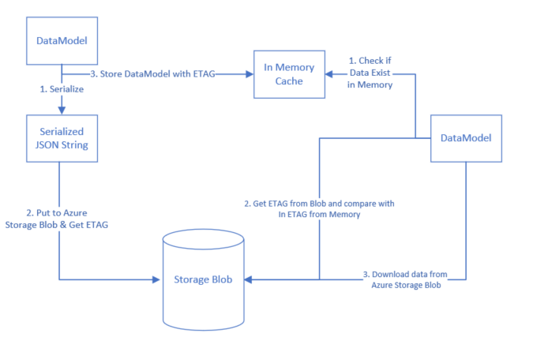

## Introduction: Azure Storage Blob
Azure Storage Blob is an Azure Storage offering that allows you to store GigaBytes of data in from hundreds to billions of objects in hot, cool, or archive tiers, depending on how often data access is needed. Store any type of unstructured data—images, videos, audio, documents and more—easily and cost-effectively.
Reference: https://azure.microsoft.com/en-in/services/storage/blobs/

In the latest offering it comes with **strong consistency, geo redundant storage, multiple blob types (Block Blob vs Page Blob vs Append Blob)**. There is also option to update portion of blobs thus making it bandwidth efficient if used as such. Azure guarantees `99.99% up-time` and have support for reading from secondary region in case of failure (Eventual consistency).

## The problem
These features make it a strong candidate for storing serialized Machine Learning Models if you have models per tenant. But, if the application is READ + WRITE heavy and the size of objects are large it can lead to a variety of issues, primarily:

### Large I/O calls
If the size of objects that are persisted and read from the blob is large, the process will spend decent amount of time and network bandwidth in uploading and downloading data respectively from blob.

{:width="750px"}<br>
<span class="image-caption">_Figure: Service Level Agreement (SLA) guarantees on uploading and downloading blobs._</span>

If not properly implemented this could lead to low throughput and large overall processing time. If you are dealing with a 100 Mb serialized file – it could take upto `200 seconds` (worst case!).

### OutOfMemory Exceptions (OOM)
JSON is very popular schema for serializing objects for persistence and transport. There are a variety of libraries available for serializing and de-serializing objects in `.net`. However, when dealing with really large objects you can encounter out of memory issues.

#### Primary causes:
The Common Language Runtime (CLR) cannot allocate enough contiguous memory to successfully perform an operation. This exception can be thrown by any property assignment or method call that requires a memory allocation. Following cases are popular reasons for OOM exceptions:

 - **Your app runs as a `32-bit process`**: 32-bit processes can allocate a maximum of `2GB` of virtual user-mode memory on `32-bit` systems, and `4GB` of virtual user-mode memory on `64-bit` systems. This can make it more difficult for the common language runtime to allocate sufficient contiguous memory when a large allocation is needed. In contrast, **`64-bit` processes can allocate up to `8TB` of virtual memory**. This kind of issues are particularly popular when testing code in debug environment in local system.
 - **Lack of available memory due to memory leaks**: Although the garbage collector is able to free memory allocated to managed types, it does not manage memory allocated to unmanaged resources such as operating system handles (including handles to files, memory-mapped files, pipes, registry keys, and wait handles) and memory blocks allocated directly by Windows API calls or by calls to memory allocation functions such as malloc.
 - **You are repeatedly concatenating large strings**: Because strings are immutable, each string concatenation operation creates a new string. The impact for small strings, or for a small number of concatenation operations, is negligible. But for large strings or a very large number of concatenation operations, string concatenation can lead to a large number of memory allocations and memory fragmentation, poor performance, and possibly OutOfMemoryExceptionexceptions.
 - And many more: [MSDN Detailed Documentation on OOM Exception](https://msdn.microsoft.com/en-us/library/system.outofmemoryexception(v=vs.110).aspx).

## Solutions
{:width="750px"}<br>
<span class="image-caption">_Figure: The Goal – Efficiency & Throughput_</span>

So far I have experimented with following ways to improve efficiency and throughput of the system using Azure Storage Blob:

### JSON Serialization & De-serialization libraries
A lot of libraries are available in `.net` to deal with JSON format – primarily serialization and de-serialization. `JSON.Net` is the most popular package available. While it comes with a lot of features it’s not necessarily the fastest library out there. However, you need to ensure if other libraries works best for you. Based on performance tests I did results looked like this:

{:width="500px"}<br>
<span class="image-caption">_Figure: Performance of different JSON libraries in .Net_</span>

[Sample Code for this test](https://github.com/mebjas/DotNetTests/tree/master/JSONSerializationDesrialization) is available on Github. However, the difference is not much given the richness of features that comes with `JSON.Net`.

### Compression – Lower I/O more CPU
The amount of time to download / upload data to blob can be considered proportional to the size of object in question. Thus, a machine will spend decent amount of time in I/O if the size of objects are large. Generally, the flow is:

```cmd
# Saving the model
.Net Objects > Serialized to JSON String > Upload to blob

# Reading the model
Download from Blob > Deserialize the JSON String > .Net Objects
```

Now if the size of object is large, compression can come in really handy. For JSON Strings GZIP can give as good as 10:1 compression ratio. This can help reduce I/O time and increase CPU cycles – thus increase the throughput and efficiency of the system.

#### Code example
**Saving the model: you can zip and upload data to blob without double serialization**
```csharp
public void UploadDataModel(DataModel model)
{
    MemoryStream stream = new MemoryStream();
    using (var sw = new StreamWriter(stream))
    using (JsonWriter writer = new JsonTextWriter(sw))
    {
        var serializer = new JsonSerializer();
        serializer.Serialize(writer, model);
        sw.Flush();
        stream.Position = 0;

        using (var mso = new MemoryStream())
        {
            using (var gs = new GZipStream(mso, CompressionMode.Compress))
            {
                CopyTo(stream, gs);
            }

            mso.Flush();
            byte[] data = mso.ToArray();
            CloudBlockBlob blockBlob = cloudBlobContainer.GetBlockBlobReference(blobName);
            blockBlob.UploadFromByteArray(data, 0, data.Length);
        }
    }
}

void CopyTo(Stream src, Stream dest)
{
    byte[] bytes = new byte[4096];
    int cnt;
    while ((cnt = src.Read(bytes, 0, bytes.Length)) != 0)
    {
        dest.Write(bytes, 0, cnt);
    }
}
```

**Downloading the model: you can unzip and download data from blob without double de-serialization**
```csharp
public DataModel BlobToMemoryStream(string blobName)
{
    CloudBlockBlob blockBlob = cloudBlobContainer.GetBlockBlobReference(blobName);
    using (MemoryStream ms = new MemoryStream())
    {
        blockBlob.DownloadToStream(ms);
        ms.Seek(0, SeekOrigin.Begin);
        ms.Flush();
        ms.Position = 0;
        byte[] data = ms.ToArray();
        
        using (var msi = new MemoryStream(data))
        using (var mso = new MemoryStream())
        {
            using (var gs = new GZipStream(msi, CompressionMode.Decompress))
            {
                CopyTo(gs, mso);
            }

            string jsonString = Encoding.UTF8.GetString(mso.ToArray());
            msi.Dispose();
            return JsonConvert.DeserializeObject<DataModel>(jsonString);
        }
    }
}

void CopyTo(Stream src, Stream dest)
{
    byte[] bytes = new byte[4096];
    int cnt;
    while ((cnt = src.Read(bytes, 0, bytes.Length)) != 0)
    {
        dest.Write(bytes, 0, cnt);
    }
}
```

#### Caveat of this approach
The steps involved in this can be very costly with respect to CPU time and thus the overall processing time if the objects are really large. This is however caused by lot of redundant information in the serialized string data. Thus can be solved by writing a custom serializer that serialized data to `byte array` and an opposite deserializer. This would **decrease the size of serialized data and compression time drastically** but could be **difficult to maintain** as compared to simply using some standard serialization approach.

### Caching – In Memory Private caching
If you are working with same data again and again you can reduce the no of time you have download the data from Azure Storage Blob by implementing a simple in memory cache. However, this has it’s own set of limitations – it can come in handy if the size of the objects can grow really large and your system can handle concurrency.

In this post I’ll share how to use in memory cache but note that for highly distributed systems with multiple nodes shared caches could be a good solution in many cases – but is out of scope of this article. The flow for In Memory Caching would be something like this:

{:width="750px"}<br>
<span class="image-caption">_Figure: Abstract Architecture for In Memory caching_</span>

[MemoryCache Class](https://msdn.microsoft.com/en-us/library/system.runtime.caching.memorycache(v=vs.110).aspx) is available in .Net & can be leverage for this purpose. Memory cache provides abstraction to store data in named caches in memory. It supports couple of features on top of that like:

1. Support for different eviction policies.
2. Callbacks on eviction
3. Restrictions on percentage of total memory or absolute memory usage.
4. Option to store data as .Net objects in Memory
There is a [very good read here](https://msdn.microsoft.com/en-us/library/system.runtime.caching.memorycache(v=vs.110).aspx), if you are interested in learning more.

#### Pros
1. Improve efficiency by reducing I/O involved with downloading data from Azure Storage Blob.
2. Leverage available memory with virtual machines.

#### Cons
1. Can lead to Out of Memory exceptions if not handled appropriately.
1. Data still need to be persisted to blob storage as cache is volatile in nature.
1. In case of multiple worker roles or nodes – the cache miss could be much greater than cache hit; It might not be as useful.

All that said, using private cache can come in really handy if coupled with partitioned queues available with Service Bus queues.

### Streaming – work with streams
Most naive approach to working with Blobs could be:
```cmd
# Saving to blob
DataModel > Serialization to JSON String > convert to bytes []
    > Zip to byte[] > Serialize > Upload to blob as string

# Reading from blob
Download from blob to string > Deserialize to byte[] 
    > Unzip to byte [] > Deserialize to JSON String
    > DataModel
```

Yes, the last serialization is an overhead but it’s possibly a general approach. This can be made more optimized like this:

```cmd
# Saving to blob
DataModel > JSONWriter > MemoryStream > GZipStream 
    > Upload byte [] to blob

# Reading from blob
Download byte[] from blob > GZipStream > MemoryStream
    > JSONWriter > DataModel
```
This can help resolve multiple serialization, de-serialization and OOM issues.

### MD5 Checks – remove redundant integrity checks
Azure Storage Blob uses MD5 hash check for checking the integrity of data. This is done at different levels; In case of PUT operations – the MD5 is computed at the client and checked at the service and vice versa in case of GET operations. However, this is not needed if you enforce HTTPS only transport mechanism – which can be done in Azure Storage Blob. If HTTPS only is enabled then MD5 check is a redundant integrity check. It can be done in following way:

```csharp
//// Upload data to blob
public void UploadData(DataModel data, string blobName) {
  BlobRequestOptions blobRequestOption = new BlobRequestOptions()
  {
      DisableContentMD5Validation = false
  };
            
  //// define cloudBlobContainer above
  CloudBlockBlob blockBlob = cloudBlobContainer.GetBlockBlobReference(blobName);
  blockBlob.UploadText(
      JsonConvert.SerializeObject(data),
      options: blobRequestOption);
}

//// Upload data to blob
public DataModel DownloadData(string blobName) {
  BlobRequestOptions blobRequestOption = new BlobRequestOptions()
  {
      DisableContentMD5Validation = false
  };
            
  //// define cloudBlobContainer above
  CloudBlockBlob blockBlob = cloudBlobContainer.GetBlockBlobReference(blobName);
  string data = blockBlob.DownloadText(options: blobRequestOption);
  return JsonConvert.DeserializeObject<DataModel>(data);
}
```

### Protocol Buffer?
I haven’t done much research on this topic but a top level reading suggests promising results. Following article may help further, I’ll perform some experiments and share the results:

 - [https://auth0.com/blog/beating-json-performance-with-protobuf/](https://auth0.com/blog/beating-json-performance-with-protobuf/)
 - [A decent stack-overflow read on this](https://stackoverflow.com/questions/36477423/serializing-a-very-large-list-of-items-into-azure-blob-storage-using-c-sharp?utm_medium=organic&utm_source=google_rich_qa&utm_campaign=google_rich_qa)


## References
1. [StackOverflow question](https://stackoverflow.com/questions/49613999/how-to-serialize-a-large-object-zip-it-and-upload-to-azure-storage-blob-in-effi)
2. If you are consuming a type that uses unmanaged resources, you should be sure to call its [IDisposable.Dispose](https://msdn.microsoft.com/en-us/library/system.idisposable.dispose(v=vs.110).aspx) method when you have finished using it.
 