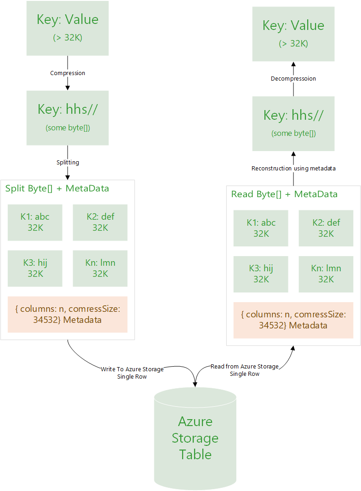

## Introduction
Azure Storage Table is Azure’s NoSQL offering to store large number of data (upto peta bytes) in a table (tables have rows and columns). It provides indexing on two keys namely partition key and row key which allows you to retrieve data efficiently. No other columns are indexed, but that’s expected behavior. Azure Storage is dirt cheap – it costs like `$0.07 per GB / month` for locally redundant storage model. It promotes creating multiple redundant copies of the data so that you don’t need foreign keys or so anymore. Not requiring any schema upfront gives this flexibility.

## Problem
**Azure Storage Table was not created by God, it was created by folks like us (much smarter though)**. It has limitations on size of a single row (1 MB), size of a single column (64KB), number of columns per row (255) and so on. While I don’t really know why some of them exist – they just do.

One of them that really tickled me off recently was a limitation of 64K size of cell size. On top of that, if it’s a `string type` it supports only `32K characters`.  They have documented this in some mystical way I couldn’t understand much. 

> A UTF-16-encoded value. String values may be up to 64 KB in size. Note that the maximum number of characters supported is about 32 K or less.

Reference: [MSDN Article  Understanding the Table Service Data Model](https://docs.microsoft.com/en-us/rest/api/storageservices/Understanding-the-Table-Service-Data-Model?redirectedfrom=MSDN#tables-entities-and-properties)

{:width="300px"} 
With a bhushshshs!

## The solution
Now if you have a requirement of storing data as rows referenced by a Partition Key and Row Key, and want to store data larger that 32K in a single column – you can do one of these:

### 1. Put data to blob and link to table bla bla bla
This is what everyone else would tell you:
> Put data in a blob, and put blob details in a cell.

I dont like this option – I hate the cost of making another network calls. It adds latency, it reduces my availability numbers, adds more dependency and thus more scope of failure. And if that is not enough – this happens with both Read and Write operation. I don’t like this approach, I won’t follow it unless I have no other option.

### 2. The smarter way
Well, lets compress the data, split it into multiple chunks of `32K columns`, construct a metadata with information just enough to reconstruct this data when reading and put it all to a single row. 
 - Single network call
 - Lower latency
 - Lower chances of failure. 
 
You can find reference to my code implementation below. Following diagram explains this simple concept in a fancy way, which I know is not really required.

{:width="750px"} 
_Figure: Reference design to compress, split, store, retrieve, reconstruct, decompress and yeyy!_

#### But what if data is bigger than 1 mb?
> But Minhaz, my data is bigger than 1MB even after compression? Now what?

**– Some random guy**

Oh, in that case maybe option one. Maybe don’t reveal my worries to the manager. Or, maybe take the approach mentioned in point two and extend it to rows and leverage Bulk Read and Bulk Write APIs of Azure Storage Table. That would be cool!

It’s just, whenever possible avoid multiple network (or API) calls. And yes I am aware of all async paradigms – I’d still say, resources are always limited. 

## Summary
If you intend to store data like `1.5MB` in size in Azure Storage Table in a single column, you can use option two. One of the scenario is for those who want to use Azure Storage Table as key value pair.

## References
1. Implementation on 
Github - [mebjas/AzureStorageTableLargeDataWriter](https://github.com/mebjas/AzureStorageTableLargeDataWriter/blob/master/AzureStorageTableLargeDataWriter/StorageTableWriter.cs)
2. [Extend Table Storage Property Limit (Azure Feedback)](https://feedback.azure.com/forums/217298-storage/suggestions/1623951-extend-table-storage-property-limit)
3. Currently, Azure Tables only support 255 properties (columns) on a single entity (row) and a max row size of 1MB. This should be greatly extended (e.g. 10x+), particularly since Azure does not offer Join query support.
4. Limit to the column size in azure table : [Stack Overflow](https://stackoverflow.com/questions/44840195/limit-to-the-column-size-in-azure-table)
5. [Some alternative approaches](https://medium.com/@madhufuture/azure-table-storage-column-size-limitations-and-alternative-approach-for-storing-large-data-9279eb301c7b)