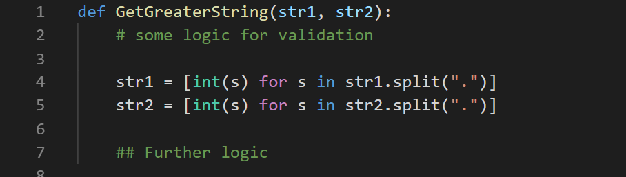
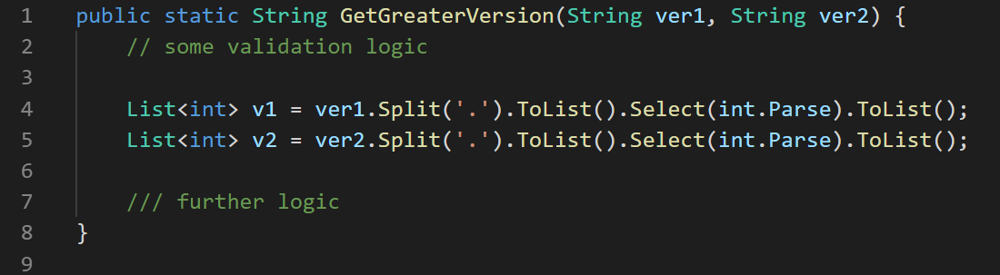
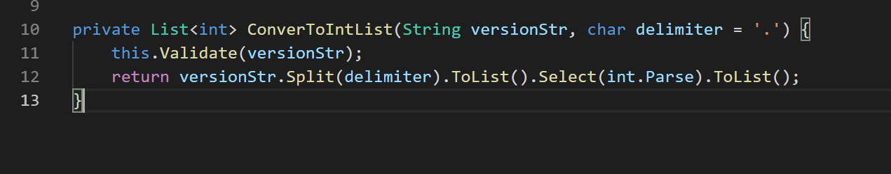

While I was working with Microsoft, I had opportunity to take around 10 – 20 coding or design interviews (candidates with 1 – 12 years of experience). There was this one thing that I felt was too common, which would lead to bad impression and potential rejection – it’s that the candidate attempts to solve every part of the question rather than focusing on what is important. This is particularly prevalent amongst candidates who chose C / C++ as programming language of choice. And, this was common irrespective of years of experience.

Here’s an example – [165 – Compare version numbers](https://leetcode.com/problems/compare-version-numbers/)

> Given two version numbers for example “1.4.5” and “1.3.6” return the greater one

Now, this is a fairly simple question when first looked at – however, it has some ambiguity that you need to resolve. But yes that’s not the focus of this post. When I present this question, before the candidate is about to start coding – I explicitly mention:

> Please feel free to use as much abstraction as needed, if there is something particular I am interested in I’ll dig into it.

Of course with this sober simple face.

{:width="500px"} 

Now, amongst other possible approach the one that is most general is to split the string on “.” as a delimiter and convert the values to integer and then compare left to right, assuming the given value is a valid version number. I have seen many spend time on the first sub problem
> splitting and converting to integer.

In my experience I have seen folks attempt it as follows:

{:width="750px"} 
_So far only one person chose to go with Python – and the kind of syntaxes that are available makes it super easy to deal with these kinda things._

{:width="750px"} 
_A DotNet person may go around this way._

{:width="750px"} 
_And this is how majority of folks using C++ have dealt with the question. Many of them seemed to struggle to correctly implement this sub logic._

**Now as an Interviewer** - This gives me a very bad first impression. When I give a question to a candidate, amongst other things I am judging how it’d be like to have:

1. The candidate in my team working on a project along with me.
2. Doing my code reviews
3. Pushing code to production which we maintain.
4. Have high level discussions with this person

I’d want the other person to talk important things and dig as needed – more like use as much abstraction as needed. This may be subjective, but this is how I may answer things and would expect similar approach from an experienced candidate.

{:width="750px"} 
_Python: As an interviewer this shows me that the candidate modularise well, can focus on important part of discussion. And if needed, I can ask them to implement the `Validate()` method – if the time permits, thus resulting in a clean modular code at the end of interview. It’s a WIN._

{:width="750px"} 
_C#: I’d expect a simple private method that takes care of the sub problems. The implementation is also not necessary in the first approach._

{:width="750px"} 
_C++: This is how I expect candidates to go ahead with his question. There is no need to implement the `ConverToIntVector()` method in the first approach._

## Summary
The major idea I wish to share here is for candidates to focus on problem at hand and not try to solve all the sub problems unless explicitly asked. **There is a limited time at hand to show your best**.

If you feel this is too subjective opinion, share it over comments – I’d like to learn and grow further as an interviewer myself.

