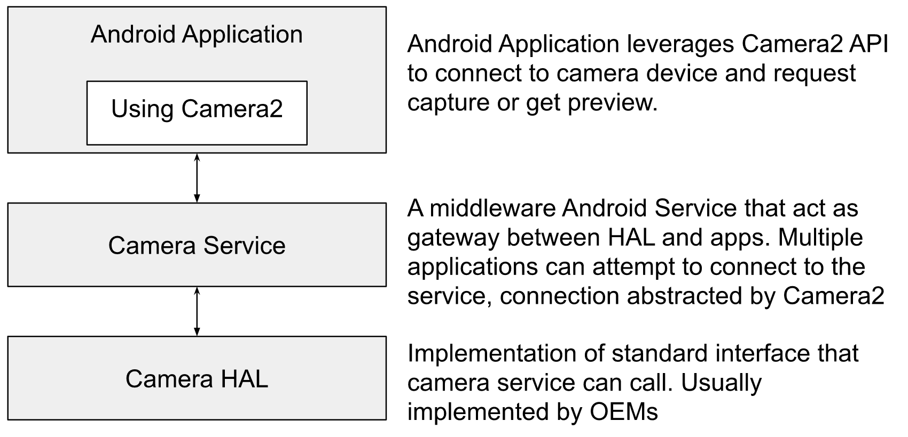
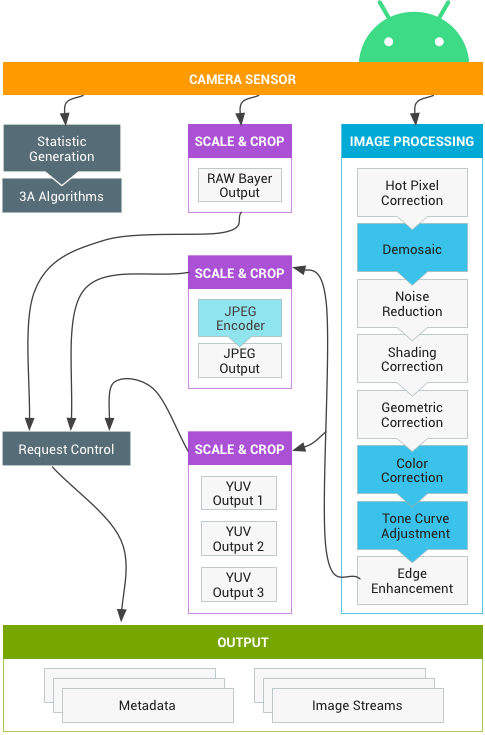
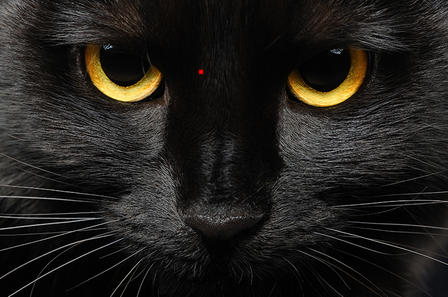
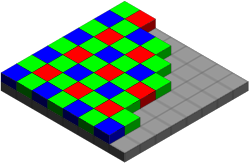
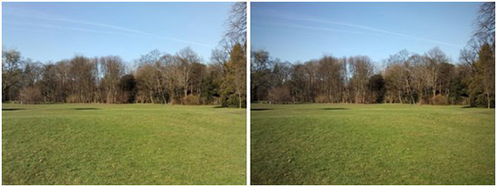
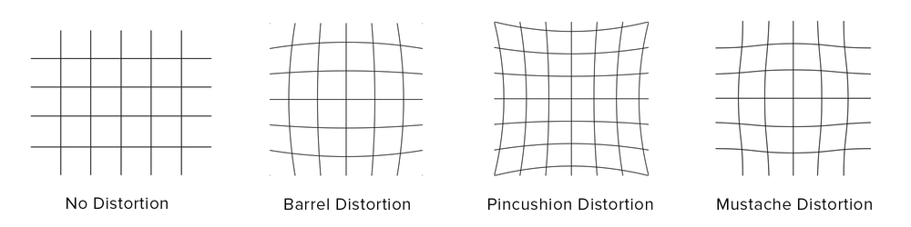
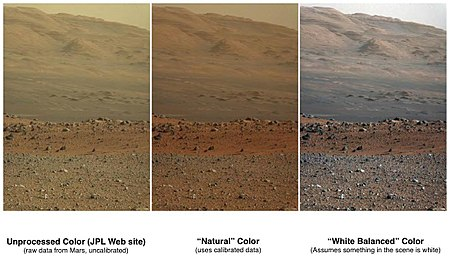
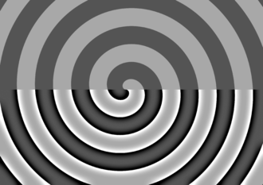

<!-- NOTE: this article will have assets under post 11 -->

## Introduction
Towards the end of last decade `camera` has emerged as one of the key factors that contribute towards smartphone sales and different manufacturers are trying to stay at the top of the throne. While everyone loves using a camera - the set of things that happens in a different layer of the hardware and software stack of Android Camera is not very popular knowledge. The design, implementation, and usage of these systems govern metrics like `image quality` and `camera performance (latency, throughput, etc)`. In this post, I'll be describing various algorithms implemented in the android camera subsystem that is consistent across OEMs which are used to produce stunning images that we capture from camera applications.

### Legends
 - HAL: Hardware Access Layer
 - ISP: Image Signal Processor
 - DSP: Digital Signal Processor
 - 3A: Auto Exposure, Auto Focus, Auto White-Balance
 - OEM: Original Equipment Manufacturers
 - JPEG: Compressed image format - [Wikipedia](https://en.wikipedia.org/wiki/JPEG)
 - YUV: An uncompressed image format - [Wikipedia](https://en.wikipedia.org/wiki/YUV)

## Android Camera Stack
{:width="750px"} 
_Figure: Top-level view of Android Camera Stack_

In this article, I have focussed on image processing algorithms that are implemented at the HAL level.

## Camera Subsystem in Android
As per [source.android.com](https://source.android.com/devices/camera) on Android Camera:
> Android's camera hardware abstraction layer (HAL) connects the higher-level camera framework APIs in Camera 2 to your underlying camera driver and hardware. __The camera subsystem includes implementations for camera pipeline components__ while __the camera HAL provides interfaces__ for use in implementing your version of these components.

The camera subsystem includes the implementation of fundamental image processing algorithms that converts `RAW Bayer output` from the camera sensor to a full-fledged image that can be consumed by applications and users. In another article, I have attempted to explain - [Android camera hardware architecture](https://blog.minhazav.dev/android-camera-hardware-explained/).

{:width="500px"} 
_Figure: Camera Pipeline as per Android Source_

### Camera Sensor and RAW output
As described in [this post](https://blog.minhazav.dev/android-camera-hardware-explained/#sensor) the output of the camera sensor only contains information on one color per pixel as compared to three colors (RGB) per pixel we intuitively assume.

{:width="500px"} 
_Figure: Output from the camera sensor._

The output from camera sensors is preserved in a format called RAW. The RAW image is often called digital negatives. A RAW image can only be consumed by specialized image viewing tools but is popular amongst photographers as it preserves the image as it was captured by Camera without losing information.

The image output from HAL is consumed by applications and most OEMs add support for JPEG and YUV image as output from the camera, while some additional support for returning RAW image directly as well. You can think of YUV as a processed image that is ready to be consumed. While JPEG is a compressed image format that represents a compressed version of the processed image.

### Image Processing done in Camera Subsystem

#### Hot pixel correction
 {:width="500px"}  
 _Figure: Image with incorrect red pixel ([Image via Shutterstock](http://www.shutterstock.com/pic-84216661/stock-photo-closeup-portrait-of-a-halloween-black-cat.html?src=M6Qs_EDxVIIVJ36sl_5sqQ-1-1))._

Every sensor has pixels that do not react linearly to incident light. Often, these pixels appear brighter and especially in dark images, they disturb as colored dots. This could easily happen if any pixel in the sensor array produces an incorrect result due to overheating or other hardware issues.

##### Detection
A bad pixel (a superset of a hot pixel) can be defined as a pixel that does not behave as expected, producing anomalous values and therefore, no valuable information. While many advanced methods exist, in naive terms the way to detect hot pixels is to check if a pixel is analogous w.r.t it’s neighborhood.

##### Correction
Hot pixel correction is usually done with the nearest neighbor interpolation techniques. The most naive algorithm would be to take an average of all 8 neighbors (for non corner pixels) and apply it.

#### Demosaic
 {:width="500px"}  
 _Figure: Image as captured by the sensor (Right) and Image produced after processing (Left)._

> **Did you know almost 2/3 of the image you see is made up?**

As mentioned in [this article](https://blog.minhazav.dev/android-camera-hardware-explained/#isp-image-signal-processor) - the CMOS sensors doesn't sense RED, BLUE and GREEN for each pixel. The sensor senses one of these colors per pixel (usually 2 Green, 1 Red and 1 Blue in 4-pixel group) and the rest of the image is guessed programmatically in the ISP. The input to the algorithm is called RAW Bayer Image.

{:width="400px"} 
_Figure: The Bayer arrangement of color filters on the pixel array of an image sensor. Each two-by-two cell contains two green, one blue, and one red filter._

The reconstruction of the image from the Bayer image is called `demosaicing`. It's done using a different type of [multivariate interpolation](https://en.wikipedia.org/wiki/Multivariate_interpolation) techniques. To dig more into different types of algorithms present today - refer to [this Wikipedia](https://en.wikipedia.org/wiki/Demosaicing) article.

#### Noise reduction
{:width="400px"}  
_Figure: Image with noise._

Image noise is a random variation in brightness or color in the produced image and is usually an aspect of electronic noise. It can be produced due to errors in the camera sensor. The image noise can be of following types or more:
 - [Gaussian Noise](https://en.wikipedia.org/wiki/Gaussian_noise)
 - [Salt and Pepper Noise](https://en.wikipedia.org/wiki/Salt-and-pepper_noise)
 - [Shot Noise](https://en.wikipedia.org/wiki/Shot_noise)
 - Quantization Noise
 - [Read more on Wikipedia](https://en.wikipedia.org/wiki/Image_noise)

##### Causes of noise
 - In low light conditions the shutter speed, aperture or ISO (sensor's sensitivity) is increased to get higher exposure. On most cameras, slower shutter speeds lead to increased salt-and-pepper noise.
 - The size of the image sensor, or effective light collection area per pixel sensor, is the largest determinant of signal levels that determine signal-to-noise ratio and hence apparent noise levels.
 - Sensor heating - the temperature can also affect the amount of noise produced by an image sensor due to leakage.
 > **Would your camera be more noisy in Summer as compared to winters?**

##### Noise Reduction (NR) techniques
Noise reduction is a difficult problem and there is no sure shot algorithm that can deterministically fix any kind of noise. Noise identification and applying fix for that kind of noise can be one technique. For example, for Gaussian noise one may want to apply a simple filter that applies average operation on certain convolution for each pixel.

It’s noteworthy that noise reduction is usually done separately for the `luma` and `chroma` components of the image. NR is done more aggressively on `chroma` as most people find chrome noise more objectionable than luma noise. These days technique involving capturing multiple frames in short succession and merging them is also used for NR particularly in low light conditions.

#### Shading correction
{:width="500px"}  
_Figure: (Right) Image with vignetting from the sensor and (Left) after applying lens shading correction._

An image capture using the camera involves:
 - The object in real space
 - Illumination (one or more sources)
 - The camera sensor

This process often leads to situations where the captured image exhibits significant shading across the field of view. For example, an image might be:
 - bright in the center and decrease in brightness as one goes to the edge of the field of view.
 - darker on the left side and lighter on the right side

The shading might be caused by non-uniform illumination, non-uniform camera sensitivity, or even dirt and dust on glass (lens) surfaces. In general, this shading effect is undesirable. Eliminating it is frequently necessary for subsequent processing and especially when image analysis or image understanding is the final goal.

##### Shading correction techniques
  - `Lowpass filtering`: One way is again to use a smoothening filter but of a larger size, usually larger than the potential size of objects in the field of view. The smoothened version act as an estimate of the background of the image. It is then subtracted from the original image to remove shading effects.
  - `Apriori estimates`: Calibrating the camera with test images for shading correction is another way. This way a fixed filter is estimated for a given sensor and applied for each image.

There are more ways like `omomorphic filtering`, `Morphological filtering`, etc that are popularly used. The details and their math are out of the scope of this article.    

#### Geometric correction
{:width="400px"}  
_Figure: Image before geometric correction._

In photography, distortion is generally referred to as an optical aberration that deforms and bends physically straight lines and makes them appear curvy in images, which is why such distortion is also commonly referred to as `curvilinear`. This is caused by how the light is bent by the lens. Three common types of optical distortions are:
 - `Barrel Distortion` - When straight lines are curved inwards in the shape of a barrel.
 - `Pincushion Distortion` - Straight lines are curved outwards from the center. This type of distortion is shown in the figure above.
 - `Mustache Distortion` - A combination of both barrel and pincushion distortion.

{:width="500px"}  
_Figure: Different types of geometric distortions._

[This article by photographylife.com](https://photographylife.com/what-is-distortion) describes in great detail different kinds of distortions (including Perspective distortion).

##### Geometric Correction techniques
This can be fixed to a great deal by calibrating the camera against standard test images, generating filters and applying it on runtime for each image.

#### Color correction
  
_Figure: Comparison of color versions (raw, natural, white balance) of Mount Sharp (Aeolis Mons) on Mars - [Wikipedia](https://en.wikipedia.org/wiki/Color_balance)._

White balance is applied to compensate for color differences caused by different light sources. This is done to bring the image as close as possible to how the objects in the image are perceived by the human eye. White balance is a type of color correction technique.

 > In photography and image processing color correction is the global adjustment of the intensities of color (typically RBG). An important goal of this adjustment is to render specific colors – particularly neutral colors – correctly. 

Different types of color correction include `gray balance`, `white balance` or `neutral balance`.

#### Tone Curve adjustment
> Tone mapping is a technique used in image processing and computer graphics to map one set of colors to another to approximate the appearance of high-dynamic-range images in a medium that has a more limited dynamic range.

The camera sensor (the device that captures image) and the output device like the phone screen may have support for a different set of colors. They may have different dynamic ranges. Tone mapping is a step where the colors are transformed to accommodate the dynamic range of the latter device.

#### Edge enhancement
 
_Figure: edge enhancement applied to the lower part of the image - [Wikipedia](https://en.wikipedia.org/wiki/Edge_enhancement)._

> Edge enhancement is an image processing filter that enhances the edge contrast of an image or video in an attempt to improve its apparent sharpness. The filter works by identifying sharp edge boundaries in the image, such as the edge between a subject and a background of a contrasting color, and increasing the image contrast in the area immediately around the edge.

Edge enhancement is done to improve the edge contrast of an image or video. This is done to compensate for the image blurring caused by lens, aperture or sensor. Along with other steps mentioned above this step is peformed efficiently on ISP.

Usually, edge enhancement can introduce more noise. To mitigate that another minor NR step is done as part of edge enhancement techniques.

## What after these low-level steps?

After applying these steps (or more as implemented by HAL of different OEMs) RAW image can be converted to YUV. YUV images are usually large with `1.5 Bytes per pixel`. This means a `12 MP image (4000 X 3000)` will occupy around `17.2 MB` in memory. To save the size of output image written to disk an image is usually compressed and `JPEG` is one of the most popular formats for this. `JPEG encoding` is supported at the HAL level as it can be efficiently done in the hardware.

If you are writing an application on top of Android Camera and intend to perform your processing on top of the image returned by the framework you should request an image in YUV format. OTOH, if the goal is to directly write the image to disk JPEG image should be used.

> If the goal is to just save the image to disk and then act on it, it'd both easier and faster to use [Android Camera Intent](https://developer.android.com/training/camera/photobasics) than implementing the camera.

If you request a YUV image and perform some image processing on top of it and finally save to disk, you'd still need to pay the cost of JPEG encoding. JPEG encoding usually takes around `~ 800 ms` vs `~ 90 ms` at software vs hardware layer respectively for an 8MP image on a simple quad-core system. This can, however, be optimized by using Reprocessing APIs supported in a later version of Android. I’ll be writing more about it soon.
<!-- TODO(mebjas): add link to article on reporcessing API. -->

## Interesting notes
 - All of these steps are not mandatory steps between image capture and image available at the application layer. The set of algorithms applied in the pipeline has a trade-off with frame rate and can be configured using CaptureRequest parameters. There are three modes:
   - `OFF`: This processing block is disabled. The demosaic, color correction and tone curve adjustment blocks cannot be disabled.
   - `FAST`: In this mode, the processing block may not slow down the output frame rate compared to OFF mode, but should otherwise produce the best-quality output it can given that restriction. Typically, this would be used for preview or video recording modes, or burst capture for still images. The set of algorithms applied depends on the processing capability of the device.
   - `HIGH_QUALITY`: In this mode, the processing block should produce the best quality result possible, slowing down the output frame rate as needed. 

## References
 - [Android Camera Architecture explained - minhazav.dev](https://blog.minhazav.dev/android-camera-hardware-explained/)
 - [Android Camera - source.google.com](https://source.android.com/devices/camera)
 - [Hot pixel correction - ids-imaging.com](https://en.ids-imaging.com/tl_files/downloads/techtip/TechTip_uEyeHotpixelEditor_EN.pdf)
 - [Shading correction - mif.vu.lt](http://www.mif.vu.lt/atpazinimas/dip/FIP/fip-Shading-2.html)
 - [What is distortion - photographylife.com](https://photographylife.com/what-is-distortion)
 - [Color balance - Wikipedia](https://en.wikipedia.org/wiki/Color_balance)
 - [Interaction between the application capture request, 3A control, and the processing pipeline - Android Source](https://source.android.com/devices/camera/camera3_requests_hal#interaction)
 - [Edge enhancement - Wikipedia](https://en.wikipedia.org/wiki/Edge_enhancement)