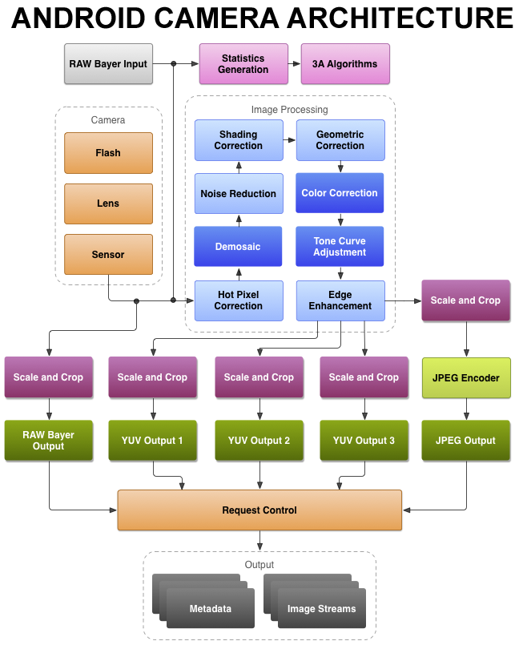

{:width="500px"}

Android is the most popular mobile operation system in the market today. Towards the end of last decade camera has emerged as one of the most important factor that contributes towards smartphone sales and different OEMs are trying to stay at the top of the throne. Smartphone cameras are built very similar to digital cameras in a compact packaging. With high end processing capabilities it has taken a big leap and is competing with digital cameras today. In this post I'll be covering the general hardware architecture of modern Android Camera.

## Components
> TODO(mebjas): add the cross section diagram

### Legends:
 - HAL: Hardware Access Layer
 - ISP: Image Signal Processor
 - DSP: Digital Singal Processor
 - 3A: Auto Exposure, Auto Focus, Auto White-Balance

### Lens
> TODO(mebjas): tbd

### Sensor
> TODO(mebjas): tbd

Camera sensor detects light convering from the lens and convert it into analog singals.

### Flash
> TODO(mebjas): tbd

### ISP: Image Signal Processor
{:width="700px"} 
_Figure: Android Camera low level architecture (source: source.android.com)_

Taking light from the camera sensor and converting it to beutiful images requries complicated process involving large amount of math and processing. ISP is specialized hardware capable of performing these steps in energy efficient way. Some of the algorithms that are run on ISP are:

 - **Auto Focus, Auto White Balance:** Auto focussing ensures the resulting images are sharp. There are different types of auto focus algorithms which an ISP can implement. This is explained in detail in [this post](https://blog.minhazav.dev/android-camera-subsystem-basic-image-processing-steps-done-at-hardware-level-in-android-camera/). ISP also monitors and adjust color and white balance as well as exposure in real time so that the pictures don't come out too dark or bright or off coloured. All of this happens even before the shutter button is clicked.
 - **Demosaic:** the ISP takes the reg, green and blue layer filtered from camera sensor and calculates the full resolution image from them. 
 - **Shading correction and geometric correction:** Once an ISP has RAW image data it runs algorithms to fix lens shading or curvature distortion. 

An ISP is essentially one of the major limiter of how many Mega Pixels a camera (or smartphone) can efficiently process. For example Qualcomm's latest Spectra 380 ISP is engineered to support upto 48 MP or two 22 MP sensors at once.

### DSP: Digital Signal Processor

### Specialized hardware in latest smartphones
OEMs have been introducing specialized hardware primarily to boost machine learning capabilities which are being extensively used in image processing. Initially these were being done in software layer executed on CPU or GPU. But specialized low level hardwares have helped reduce latency of such processing steps to provide support for features like live HDR (HDR on viewfiner), 4K video recording with HDR etc. Two outstanding OEMs who introduced such hardware were Google and Iphone.

#### Google Pixel Visual Core
Google introduced a secret chip in Google Pixel 2 and Pixel 2 XL alongside main processing components to enhance image processing capabilities. According to Google this extra chip brought in around 5X improvement in HDR+ processing time at 1/10th power consumption. Pixel Visual core was designed to handle complex machine learning algorithms related to image processing. It was reintroduced in Pixel 3 series as well.

#### Apple Iphone bionic chips
Apple has been bringing in A series chips like A13 Bionic chip introduced in Iphone 11. They claim to pack CPU, GPU and a _neural engine_ for boosting machine learning performance. In their latest chip Apple claimed to have boosted matrix multiplication to 6X faster which is core of many ML operation. Apple say's it's using ML in iphone 11's camerato help process their images.

## References
 - [Android Source - Camera](https://source.android.com/devices/camera)
 - [Android Authority - Pixel visual core](https://www.androidauthority.com/pixel-visual-core-808182/)
- [The Verge - Apple's new A13 Bionic chip](https://www.theverge.com/circuitbreaker/2019/9/10/20857177/apple-iphone-11-processor-a13-cpu-speed-graphics-specs)

