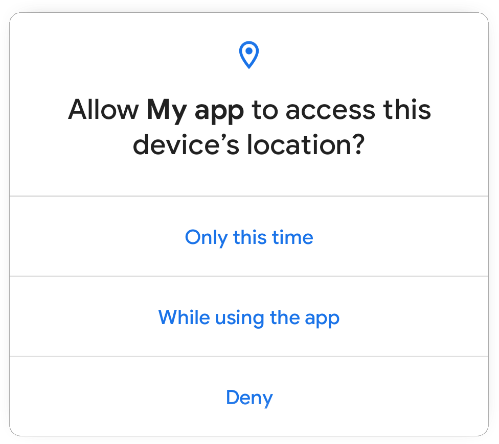

Android has released [developer preview of Android 11 (aka Android R) for Pixel series (and emulator)](https://android-developers.googleblog.com/2020/02/Android-11-developer-preview.html) last week. As per the blog article many changes have been introduced to support upcoming technologies like 5G, foldable displays, machine learning APIs and to strengthen Android's position in privacy and security. On top of that I could see couple of additions to support ongoing trends like pinhole or waterfall screens or giving first class support for bokeh in Camera. In this article I'd be exploring some of these changes and explaining what it means for users and developers.

> **Desclaimer:**
> 
> Following article is purely based on articles made publicly available by Android Team. It purely represents my comprehension and opinions around features. I have looked into these purely as a consumer of Android devices or developer of Android applications.

If you are interested in getting hands dirty please check section on - [How to flash]()

## How to flash Android 11 into your Pixel device
Google has made Android 11 developer preview builds available for **Google Pixel 4 / 4XL, Pixel 3a / 3a XL, Pixel 3 / 3 XL, and Pixel 2 / 2 XL** only. Follow following simple steps to reimage your Pixel device:
1. Download appropriate image from [Google website](https://developer.android.com/preview/download) and unzip it.
2. Unlock your bootloader from developer settings. 
   - Go to `settings` => `System` option => Select `Advanced` => Select `Developer Options`
   - Switch on `OEM Unlocking`.
   - For certain devices you may have to follow steps in section (4) of [this article](https://developers.google.com/android/images#instructions).
3. You'll need [adb](https://developer.android.com/studio/command-line/adb) to perform next steps.
   - Connect the device via USB.
   - Check if adb can detect the device using `adb devices`. It should show atleast one device as connected.
   - Open the bootloader using `adb reboot bootloader`. If there are multiple devices you'd have to provide device id.
   - For certain devices you may have to unlock bootloader
4. You will need `fastboot` tool for next steps
   - Navigate to unzipped image directory in your desktop.
   - Run `flash-all.sh` script.
5. Once the device is flashed and you have setup the new OS version. It'd be good to lock the bootloader for security reasons.
   - Start device in fastboot mode again using `adb reboot bootloader`.
   - Lock the bootloader using `fastboot flashing lock` or `fastboot oem lock` for older devices.

> Reference to Google website - [https://developer.android.com/preview/download](https://developer.android.com/preview/download)

## References
 - Google Android 11 preview blog post - [android-developers.googleblog.com](https://android-developers.googleblog.com/2020/02/Android-11-developer-preview.html)
 - Google preview download and install - [developer.android.com](https://developer.android.com/preview/download)

## Notes below


> Android has led the way towards the future of mobile, with new technologies like 5G to foldable displays to machine learning built into the core.

> With Android 11 we’re keeping our focus on helping users take advantage of the latest innovations, while continuing to keep privacy and security a top priority. We’ve added multiple new features to help users manage access to sensitive data and files, and we’ve hardened critical areas of the platform to keep the OS resilient and secure. For developers, Android 11 has a ton of new capabilities for your apps, like enhancements for foldables and 5G, call-screening APIs, new media and camera capabilities, machine learning, and more.

> Today’s release is an early baseline build for developers only and not intended for daily or consumer use, so we're making it available by manual download and flash only.

 - 5G
    - Dynamic meteredness API
    - Bandwidth estimator API
 - New screen types
    - Pinhole and waterfall screens 
 - Conversations API
   - Dedicated conversations section
   - Bubbles
   - Insert images into notification replies
 - Neural Networks API 1.3
   - Quality of Service APIs
   - Memory Domain APIs 
   - Expanded quantization support
 - Privacy and security

### Privacy
One time permission

> This permission means that apps can access the data until the user moves away from the app, and they must then request permission again for the next access. More information here.
https://developer.android.com/preview/privacy/permissions

In addition to these platform changes, users tell us that they want more protection on earlier versions of Android and more transparency around how apps will use this data, so we are updating Google Play Policy to ensure that apps only request location permissions when truly necessary.
https://android-developers.googleblog.com/2020/02/safer-location-access.html

## Scoped storage
This preview release includes several enhancements, such as opt-in raw file path access for media, updated DocumentsUI, and batch edit operations in MediaStore.
https://developer.android.com/preview/privacy/storage

Scoped storage enforcement
To give developers additional time for testing, apps that target Android 10 (API level 29) or lower can still request the `requestLegacyExternalStorage` attribute. This flag allows apps to temporarily opt out of the changes associated with scoped storage, such as granting access to different directories and different types of media files.

When you update your app to target Android 11, however, you cannot use requestLegacyExternalStorage, and there's no other flag available that offers the opt out functionality.


```
## Screen recording.
```

## Security
 - Biometrics
 - Platform hardening <-- Super cool
 - Secure storage and sharing of data
 - Identity credentials

## App compatibility
 - Easier testing and debugging 

 Dynamic resource loader - As part of their migration away from non-SDK interfaces, developers asked us for a public API to load resources and assets dynamically at runtime. We’ve now added a Resource Loader framework in Android 11, and thank you to the developers who gave us this input!

