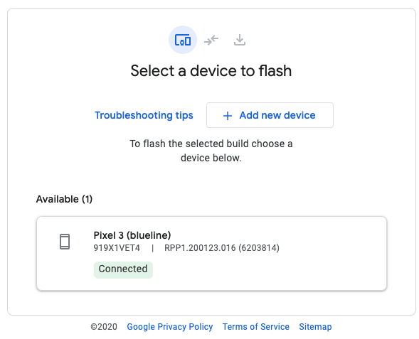

Android released [the Developer Preview 2 for Android 11](https://android-developers.googleblog.com/2020/03/android-11-developer-preview-2.html) on 18th March 2020 with a blog post from Dave Burke, VP of Engineering. The release is for **developers only** and not ready for daily or consumer use-cases. If you haven't read about the features made available in Developer Preview 1, I recommend reading that first - [Exploring Android 11 developer preview - Part 1](../exploring-android-11-developer-preview-part-1/). In this article, I'll be exploring the updates in DP2 and user-visible changes I could spot by playing with the device. To make flashing a bit easier, they have added the support for flashing the preview release from the [Android Flash Tool](https://developer.android.com/preview/download#flashtool).

>**Disclaimer:**
>
>The following article is purely based on articles made publicly available by Android Team. It purely represents my comprehension and opinions around the features. I have looked into these purely as a consumer of Android devices or a developer of Android applications. There doesn’t represent the opinions of the organization I work for.


If you are interested in getting hands dirty please check the section on - [How to flash](exploring-android-11-developer-preview-part-1/#how-to-flash-android-11-into-your-pixel-device).

## Exploring Android 11 developer preview
This is part 2 in this article series, other articles in this series are:
 - `New` [Exploring Android 11 developer preview - Part 3](../exploring-android-11-developer-preview-part-3)
 - [Exploring Android 11 developer preview - Part 1](../exploring-android-11-developer-preview-part-1/)

## What's new in this preview
### Privacy & Security
#### `foregroundServiceType` - now supports `Camera` & `Microphone`
[foregroundServiceType](https://developer.android.com/guide/topics/manifest/service-element#foregroundservicetype) was added in Android 10 as a way to add accountability on what a foreground service is doing. The support for some cases like `location` was added in Android 10. In DP2 they have added support for two more types - `Camera` & `Microphone`. If we want to access these in a foreground service, we need to declare them in the manifest now. This is a pretty useful update in my opinion as it gives more power to developers to add more multi-tasking experiences and gives more transparency to the users on which app is using what.

#### Scoped storage enforcement
Android is moving towards storage access limitation since Android Q. But to give breathing space to app developers Android provided a way to continue to have full external storage access by using the legacy storage model. But that ends with Android R and app developers are expected to change how they leverage the external storage and migrate all the data to app-specific directories that the app can access freely.

For those who were using the legacy storage model and wish to add support for Android R in their applications, Android has provided a mechanism to migrate the data from external storage to the app-specific directory. This means for some more time you may be able to access the storage (I guess read-only). To enable this you have to add `preserveLegacyExternalStorage` to `true` in the app manifest.

Read more about this [here](https://developer.android.com/preview/privacy/storage#migrate-data-for-scoped-storage).

## Camera Support in the emulator
> I may be biased, but this is my favorite. 

The Android emulator now supports front and back emulated camera devices. The back camera has been given `HW Level 3` Camera 2 API support. For the front camera `Full Level` support has been added with logical camera support. Also, the front camera will emulate two physical cameras underneath one logical camera. 

> Level 3 Camera 2 API support means support for features like YUV reprocessing, RAW capture and ZSL.

## MISC
### Variable refresh rate
Now that display on Android devices are capable of supporting different refresh rates like `90Hz` or even `120Hz`, Android 11 allows applications to set different refresh rates using APIs like:

```java
Surface#setFrameRate(float frameRate, int compatibility);

SurfaceControl.Transaction#setFrameRate(
   SurfaceControl sc, float frameRate, int compatibility);
```

Read more about this [here](https://developer.android.com/reference/android/view/SurfaceControl.Transaction#frame-rate-api).

### 5G state API
DP2 seems to have added an API called 5G state API that can be used to check if the device is using `5G` network. This can be used by applications to provide experiences tailored towards the enhanced 5G capabilities.

### Hinge angle API for foldable devices
In DP2 Android has added a [sensor API for getting HINGE Angle](https://developer.android.com/reference/android/hardware/Sensor#STRING_TYPE_HINGE_ANGLE) in foldable devices. This will allow applications to add seamless experiences around folding scenarios.

## Flashing the device with Android Flash Tool
Android has launched an easier way to flash Android devices using [Android Flash Tool](https://flash.android.com/). It's a web-based flashing solution which relies on [WebUSB](https://caniuse.com/#search=Webusb) technology. That means you can flash your device using Google Chrome. It's cross-platform and hence supports Linux, Mac OS and Windows (with some additional drivers - [learn more](https://source.android.com/setup/contribute/flash#installing-windows-drivers)).

To use this tool you still need to do the following things:
 1. Enable [Developer Options and USB Debugging](https://developer.android.com/studio/debug/dev-options#enable)
 2. Unlock your bootloader from developer settings. 
    - Go to `settings` => `System` option => Select `Advanced` => Select `Developer Options`
    - Switch on `OEM unlocking`.
 3. Connect your device via USB
 4. For flashing Android 11 DP2 on supported phones, find the appropriate link to flash tool from [Android Preview Site](https://developer.android.com/preview/download#flashtool).

    {:width="400px"}<br>
    _Figure: Easy and elegant device flashing at [flash.android.com](https://flash.android.com/)_

> Note: In my case, I observed that the flash tool was not able to properly reboot my device to the bootloader. So I did this step manually and then used the flash-tool to flash the device. To open the device in the bootloader, connect the device via USB, enable USB debugging, give permissions on the device and run following command in the terminal or cmd prompt:

```
adb reboot bootlaoder
```

## References
 - [Google blog on Developer Preview 2 for Android 11](https://android-developers.googleblog.com/2020/03/android-11-developer-preview-2.html)
 - [Data migration in Android R with preserveLegacyExternalStorage ](https://developer.android.com/preview/privacy/storage#migrate-data-for-scoped-storage)
 - [Android Flash Tool](https://flash.android.com/)
 - [Android Preview Site](https://developer.android.com/preview/download#flashtool)
 - [Android 11 frame rate APIs](https://developer.android.com/reference/android/view/SurfaceControl.Transaction#frame-rate-api)
