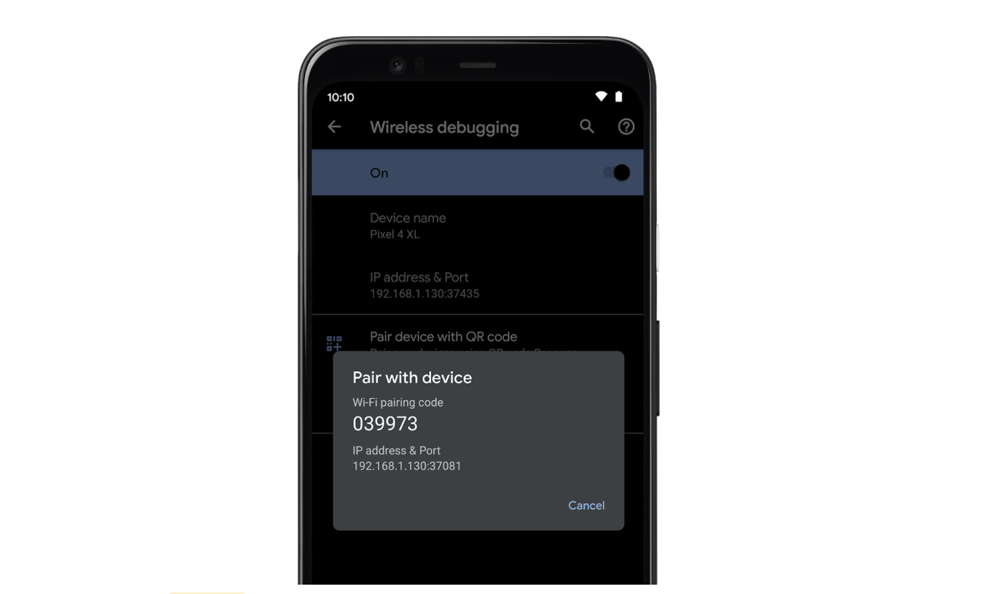

Android released [the Developer Preview 3 for Android 11](https://android-developers.googleblog.com/2020/04/android-11-developer-preview-3.html) on 23rd April 2020 with a blog post from Dave Burke, VP of Engineering. The release is for **developers only** and not ready for daily or consumer use-cases. If you haven't read about the features made available in [Developer Preview 1](../exploring-android-11-developer-preview-part-1/) or [Developer preview 2](../exploring-android-11-developer-preview-part-2/), I recommend reading them first. In this article, I'll be exploring the updates in developer preview 3 and user-visible changes I could spot by playing with it on the device. To make flashing a bit easier, they have added the support for flashing the preview release from the [Android Flash Tool](https://developer.android.com/preview/download#flashtool).

>**Disclaimer:**
>
>The following article is purely based on articles made publicly available by Android Team. It purely represents my comprehension and opinions around the features. I have looked into these purely as a consumer of Android devices or a developer of Android applications. There doesn’t represent the opinions of the organization I work for.


If you are interested in getting hands dirty please check the section on:
 - [How to flash using adb](../exploring-android-11-developer-preview-part-1/#how-to-flash-android-11-into-your-pixel-device).
 - [How to flash using flash tool](../exploring-android-11-developer-preview-part-2/#flashing-the-device-with-android-flash-tool)

## Exploring Android 11 developer preview
This is part 3 in this article series, other articles in this series are:
 - [Exploring Android 11 developer preview - Part 2](../exploring-android-11-developer-preview-part-2/)
 - [Exploring Android 11 developer preview - Part 1](../exploring-android-11-developer-preview-part-1/)

## What's new in this preview
Most of the changes highlighted in this preview seem to be more exciting for developers. As a developer I am very happy for a few of them like `wireless debugging` and `incremental adb installs`. There are some subtle UI changes that you can see by playing around with the latest system image on your pixel devices.

### Incremental ADB installs
Android has invested a lot in creating new tools or upgrading existing tools to make development easier. Some of them are very exciting like support for native memory profiling starting [Android Studio 4.1 Canary](https://g.co/androidstudio/preview) or support for Android GPU inspector to have a deeper look into an Android GPU. Some of these improvements seem to have been done to improve Game development experience on the Android platform. Similar to these in the DP3 they have introduced support for incremental `adb installs` to improve developer productivity while developing apps or games with large APKs (2GB+). Looks like - this can make installing large APKs from the development computer to Android 11 device `10x faster`.

The catch is this requires some steps and only works on certain file systems. To use this new developer tool, you need to: 
 - Sign your APK with the new [APK signature scheme v4](https://developer.android.com/preview/features#signature-scheme-v4). This can be done by using `--v4-signing-enabled` flag while signing the app with `apksigner`. This is required because older schemes do not support incremental installations.
 - Install the APK using new ADB, shipped with Android 11 Preview SDK. Command changes to `adb install --incremental`.

> Note that in developer preview 3 the incremental ADB install only works with Pixel 4 / Pixel 4 XL devices due to required file system changes at the device level. All devices launching with Android 11 will include this change and thus support this feature.

That sucks for a Pixel 3 owner!

### More detailed reasons for app exits
An app could exit for a variety of reasons like:
 - App crash
 - Killed by the system due to low memory
 - User action

As a developer, it could be useful to track exit reasons, particularly when monitoring the reliability of the Android app running on a variety of devices. Android 11 brings new `ApplicationExitInfo` API that can be used to track some recent exits by the app. It defines some exit reasons like:
 - `REASON_ANR` - Application not responding
 - `REASON_CRASH` - App crashed due to unhandled exception
 - `REASON_CRASH_NATIVE` - App crahed due to unhandled exception in native code
 - `REASON_DEPENDENCY_DIED` - Some related dependencyb died
 - [... some more](https://developer.android.com/reference/android/app/ApplicationExitInfo)
 - `REASON_OTHER`

The app can track it's reason for former exits using `ActivityManager#getHistoricalProcessExitReasons(...)` which returns a list of `ApplicationExitInfo`. This list contains the reason for some recent deaths. One can use `ApplicationExitInfo#getReason()` to track recent exit reasons.

[ApplicationExitInfo](https://developer.android.com/reference/kotlin/android/app/ApplicationExitInfo) contains more information on the state of exit scenario which could be used to track in more details the conditions around former app exits.

### Wireless debugging
This is super cool, Android is bringing first-class support for debugging Android Apps on Android device from developer tools like Android Studio running on development computers wirelessly.

{:width="400px"}<br>

Unlike the existing workflow for TCP/IP based debugging this feature wouldn't require cable to setup, would remember connections over time, and claims to utilize the full performance of the latest Wi-Fi standards. A cherry on top is they plan to add a QR code-based approach for quick pairing.

### Better ASan heap analysis
In developer preview 1 they introduced more performant address sanitizer called HWASan. I wrote in brief about this in - [exploring Android 11 developer preview - Part 1](../exploring-android-11-developer-preview-part-1/#hardware-assisted-address-sanitizer-hwasan). In this preview they have introduced another model called GWP-ASan. While I am not sure what the acronym stands for, as per the documentation unlike `HWASan` and `Malloc Debug`, `GWP-ASan` doesn't require source or re-complication and can work with 32-bit processes.

Once enabled `GWP-ASan` intercepts a randomly chose subset of heap allocation and places them to a special region that catches hard to catch heap memory corruption bugs. As per the documentations, `GWP-ASan` was helpful in catching a significant number of bugs in the Chrome browser. `GWP-ASan` can be enabled at the application level by adding `android:gwpAsanMode` in the app manifest.

```xml
<application android:gwpAsanMode="always">
  ...
</application>
```

Or at subprocess level like:
```xml
<application>
  <processes>
    <!-- Create the (empty) application process -->
    <process />

    <!-- Create subprocesses with GWP-ASan both explicitly enabled and disabled. -->
    <process android:process=":gwp_asan_enabled"
               android:gwpAsanMode="always" />
    <process android:process=":gwp_asan_disabled"
               android:gwpAsanMode="never" />
  </processes>

  <!-- 
    Target services and activities to be run on either the 
    GWP-ASan enabled or disabled processes.
  -->
  <activity android:name="android.gwpasan.GwpAsanEnabledActivity"
            android:process=":gwp_asan_enabled" />
  <activity android:name="android.gwpasan.GwpAsanDisabledActivity"
            android:process=":gwp_asan_disabled" />
  <service android:name="android.gwpasan.GwpAsanEnabledService"
           android:process=":gwp_asan_enabled" />
  <service android:name="android.gwpasan.GwpAsanDisabledService"
           android:process=":gwp_asan_disabled" />
</application>
```

### Some changes to data access auditing APIs
In DP3 some APIs related to data access auditing APIs have been made. Data access auditing APIs allow developers to better understand how the app or dependencies (third-party libraries) are accessing user data and from which user flow.

You can check classes that have been renamed / changed [here](https://developer.android.com/sdk/api_diff/r-dp3-incr/changes/pkg_android.app)

## References
 - [Google blog article on Developer Preview 3 for Android 11](https://android-developers.googleblog.com/2020/04/android-11-developer-preview-3.html)
 - [APK signature scheme v4](https://developer.android.com/studio/command-line/apksigner#v4-signing-enabled)
 - [New Android tool for mobile game development](https://android-developers.googleblog.com/2020/03/google-for-games-developer-summit-march.html)
 - [ADB incremental APK installation](https://developer.android.com/preview/features#incremental)
 - [Data access auditing](https://developer.android.com/preview/privacy/data-access-auditing)