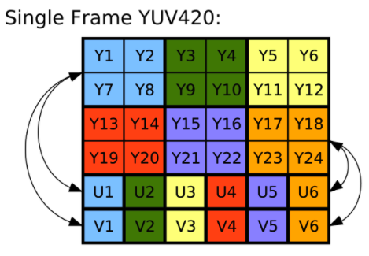

[ImageFormat#YUV_420_888](https://developer.android.com/reference/android/graphics/ImageFormat#YUV_420_888) is one of the most common image format supported by Android Cameras. It's a multi-plane YUV (YCbCr) format represented by three separate planes in [android.media.Image](https://developer.android.com/reference/android/media/Image) and the order of the planes is guaranteed to be:
 - \[0\]: Y plane (Luma)
 - \[1\]: U plan (Cb)
 - \[2\]: V plane (Cr)

{:width="500px"}<br>
_Figure: YUV420 representation, 8 bits for Y and 4 bits for UV (interleaved). Source: [Wikipedia](https://en.wikipedia.org/wiki/YUV)_

This format can be used for processing the input frames before saving to disk or some other action. A very common question around YUV is how to consume it in Android. In this article, I'd describe different ways it can be used. The most common question is how to convert YUV to Bitmap or jpeg format in Android.

## Theory
> Y′UV was invented when engineers wanted color television in a black-and-white infrastructure. They needed a signal transmission method that was compatible with black-and-white (B&W) TV while being able to add color. The luma component already existed as the black and white signal; they added the UV signal to this as a solution.

Super cool no? Source: [Wikipedia](https://en.wikipedia.org/wiki/YUV)

YUV images can be represented in different formats like `YUV444`, `YUV422`, `YUV4111` or `YUV420p`. It's easiest to convert between `RGB888` and `YUV444`.

### pseudo-code
In general you can convert a `YUV420 to RGB` using following logic
```c++
void yuv2rgb(uint8_t y, uint8_t u, uint8_t v) {
    int r = y + (1.370705 * (v - 128));
    int g = y - (0.698001 * (v - 128)) - (0.337633 * (u - 128));;
    int b = y + (1.732446 * (u - 128));
    r = clamp(r, 0, 255);
    g = clamp(g, 0, 255);
    b = clamp(b, 0, 255);
    return r, g, b;
}
```

## Convert YUV_420_888 to -------- ?
In this section, I'll cover various `how to` questions. If you have gone through the [theory](#theory) section, the solutions should look more intuitive.

<!-- **Performance benchmarking:** The numbers below are tested on `Pixel 3a` and `Nokia 1.3` and are relative in nature just for comparing approaches with each other. The benchmarks are done on `1600 X 1200` resolution. -->

### How to convert YUV_420_888 `Image` to `Bitmap`?

There are a couple of popular questions related to this in StackOverflow, like:
 - [Convert android.media.Image (YUV_420_888) to Bitmap](https://stackoverflow.com/questions/28430024/convert-android-media-image-yuv-420-888-to-bitmap).
 - [Has anyone managed to obtain a YUV_420_888 frame using RenderScript and the new Camera API?](https://stackoverflow.com/questions/30653287/has-anyone-managed-to-obtain-a-yuv-420-888-frame-using-renderscript-and-the-new)
 - [Getting RGB values from YUV_420_888 image](https://stackoverflow.com/questions/60066025/getting-rgb-values-from-yuv-420-888-image)

Most common suggestions there is to either use RenderScript based approach or a much hackier approach where we first convert the `Image` to `YuvImage` as mentioned [here](#how-to-convert-yuv_420_888-image-to-yuvimage). And then encode to `jpeg` as mentioned [here](#how-to-convert-yuv_420_888-image-to-jpeg-format). Then use [android.graphics.BitmapFactory](https://developer.android.com/reference/android/graphics/BitmapFactory#decodeByteArray(byte[],%20int,%20int,%20android.graphics.BitmapFactory.Options)) to decode the jpeg byte array. 

```java
// .. get YUV420_888 Image
byte[] jpegByteArray = getJpegFromImage(image);
BitmapFactory bitmapFactory = new BitmapFactory();
BitmapFactory.Options options = new BitmapFactory.Options();

Bitmap bitmap = bitmapFactory.decodeByteArray(
    jpegByteArray, /* offset= */ 0, jpegByteArray.length);
```

It was when I read the latter solution I decided to write this article. **If you are reading this article please do not convert the `Yuv Image` to `jpeg` just to convert it to `Bitmap`.**

#### Pure Java approach
If you look at how the YUV image looks like once again:

{:width="500px"}<br>

Per definition of [YUV_420_888](https://developer.android.com/reference/android/graphics/ImageFormat#YUV_420_888) format (very important - the code below is based on following principles):

> Multi-plane Android YUV 420 format
>
> This format is a generic YCbCr format, capable of describing any 4:2:0 chroma-subsampled planar or semiplanar buffer (but not fully interleaved), with 8 bits per color sample.
>
> Images in this format are always represented by three separate buffers of data, one for each color plane. Additional information always accompanies the buffers, describing the row stride and the pixel stride for each plane.
> 
> The order of planes in the array returned by [Image#getPlanes()](https://developer.android.com/reference/android/media/Image#getPlanes()) is guaranteed such that plane #0 is always Y, plane #1 is always U (Cb), and plane #2 is always V (Cr).
>
> The Y-plane is guaranteed not to be interleaved with the U/V planes.
>
> The U/V planes are guaranteed to have the same row stride and pixel stride.

You will see there is one U & V (chroma) value for four luma values. I'll try to use this information along with the `yuv to rgb` translation above to bring up some java code.

```java
Bitmap yuv420ToBitmap(Image image) {
    if (image.getFormat() != ImageFormat.YUV_420_888) {
      throw new IllegalArgumentException("Invalid image format");
    }

    int imageWidth = image.getWidth();
    int imageHeight = image.getHeight();
    // ARGB array needed by Bitmap static factory method I use below.
    int[] argbArray = new int[imageWidth * imageHeight];
    ByteBuffer yBuffer = image.getPlanes()[0].getBuffer();
    yBuffer.position(0);

    // A YUV Image could be implemented with planar or semi planar layout.
    // A planar YUV image would have following structure:
    // YYYYYYYYYYYYYYYY
    // ................
    // UUUUUUUU
    // ........
    // VVVVVVVV
    // ........
    //
    // While a semi-planar YUV image would have layout like this:
    // YYYYYYYYYYYYYYYY
    // ................
    // UVUVUVUVUVUVUVUV   <-- Interleaved UV channel
    // ................
    // This is defined by row stride and pixel strides in the planes of the
    // image.

    // Plane 1 is always U & plane 2 is always V
    // https://developer.android.com/reference/android/graphics/ImageFormat#YUV_420_888
    ByteBuffer uBuffer = image.getPlanes()[1].getBuffer();
    uBuffer.position(0);
    ByteBuffer vBuffer = image.getPlanes()[2].getBuffer();
    vBuffer.position(0);

    // The U/V planes are guaranteed to have the same row stride and pixel
    // stride.
    int yRowStride = image.getPlanes()[0].getRowStride();
    int yPixelStride = image.getPlanes()[0].getPixelStride();
    int uvRowStride = image.getPlanes()[1].getRowStride();
    int uvPixelStride = image.getPlanes()[1].getPixelStride();

    int r, g, b;
    int yValue, uValue, vValue;

    for (int y = 0; y < imageHeight; ++y) {
        for (int x = 0; x < imageWidth; ++x) {
            int yIndex = y * yRowStride + x * yPixelStride;
            // Y plane should have positive values belonging to [0...255]
            yValue = (yBuffer.get(yIndex) & 0xff);

            int uvx = x / 2;
            int uvy = y / 2;
            // U/V Values are subsampled i.e. each pixel in U/V chanel in a
            // YUV_420 image act as chroma value for 4 neighbouring pixels
            int uvIndex = uvy * uvRowStride +  uvx * uvPixelStride;

            // U/V values ideally fall under [-0.5, 0.5] range. To fit them into
            // [0, 255] range they are scaled up and centered to 128.
            // Operation below brings U/V values to [-128, 127].
            uValue = (uBuffer.get(uvIndex) & 0xff) - 128;
            vValue = (vBuffer.get(uvIndex) & 0xff) - 128;

            // Compute RGB values per formula above.
            r = (int) (yValue + 1.370705f * vValue);
            g = (int) (yValue - (0.698001f * vValue) - (0.337633f * uValue));
            b = (int) (yValue + 1.732446f * uValue);
            r = clamp(r, 0, 255);
            g = clamp(g, 0, 255);
            b = clamp(b, 0, 255);

            // Use 255 for alpha value, no transparency. ARGB values are
            // positioned in each byte of a single 4 byte integer
            // [AAAAAAAARRRRRRRRGGGGGGGGBBBBBBBB]
            int argbIndex = y * imageWidth + x;
            argbArray[argbIndex]
                = (255 << 24) | (r & 255) << 16 | (g & 255) << 8 | (b & 255);
        }
    }
}
```

This can easily become a costly approach when handled in the java layer as soon as the image resolutions crosses a certain limit. Let's take a look at benchmarks of this by running on a certain low end device (with viewfinder running):

<!-- 
{:class="styled-table"}
| Resolution | Pixel 3 | Certain low end device |
| ------ | ------- | ----- |
| 320 X 240 | 4.666 ms | 29.26 ms |
| 1600 X 1200 (2MP) | 142.2 ms | 683.0 ms |
| 2592 X 1944 (5MP) | 363.6 ms | 1829.6 ms |
| 3264 X 2488 (8MP) | 535.0 ms | 2826.9 ms |
-->

{:class="styled-table"}
| Resolution | Convertion time (ms) |
| ------ | ----- |
| 320 X 240 |  29.26 ms |
| 1600 X 1200 (2MP) | 683.0 ms |
| 3264 X 2488 (8MP) | 2826.9 ms |

_Table 1: Running time for algorithm above on a certain Android device (low end)_

Also, there are high chances that you might start to see logs that look like:

> Background concurrent copying GC freed 1648(142KB) AllocSpace objects, 2(38MB) LOS objects, 50% free, 20MB/41MB, paused 1.135ms total 128.325ms

High frequency of such logs or high value of `paused <some value> ms` are an indicator of increased GC pressure.

So JVM probably is not suited to handle really big images both w.r.t latency and reliability. JVM also sets a limit on max heap memory allocations by an application in Android which can be bypassed to a higher limit but even higher limit comes with restriction. This is just FYI, converting a single image shouldn't lead to such high allocations. If you must know a `YUV_420_888` image takes `1.5 bytes per pixel` so an `8MP (3264 x 2488) = 8120832 pixels` image should be `11.61 Mb` in memory while a single ARGB_8888 bitmap would take `4 bytes per pixel` leading to `30.97 Mb` per image of the same size.


#### Renderscript approach
> RenderScript is a framework for running computationally intensive tasks at high performance on Android. RenderScript is primarily oriented for use with data-parallel computation, although serial workloads can benefit as well. The RenderScript runtime parallelizes work across processors available on a device, such as multi-core CPUs and GPUs. This allows you to focus on expressing algorithms rather than scheduling work. RenderScript is especially useful for applications performing image processing, computational photography, or computer vision.

[Source: developer.android.com](https://developer.android.com/guide/topics/renderscript/compute.html)

Android team has published an `intrinsic` for converting an Android YUV buffer to RGB. The input allocation is supplied as `8bit NV12 YUV byte array` and the output is `4 channel 8 bit ARGB` buffer which can be converted to a `Bitmap`. The name of `intrinsic` is [ScriptIntrinsicYuvToRGB](https://developer.android.com/reference/android/renderscript/ScriptIntrinsicYuvToRGB). 

Here's a `java` code sample on how to use it:
```java
static Bitmap yuv420ToBitmap(Image image, Context context) {
    RenderScript rs = RenderScript.create(context);
    ScriptIntrinsicYuvToRGB script = ScriptIntrinsicYuvToRGB.create(
            rs, Element.U8_4(rs));

    // Refer the logic in a section below on how to convert a YUV_420_888 image
    // to single channel flat 1D array. For sake of this example I'll abstract it
    // as a method.
    byte[] yuvByteArray = yuv420ToByteArray(image);

    Type.Builder yuvType = new Type.Builder(rs, Element.U8(rs))
            .setX(yuvByteArray.length);
    Allocation in = Allocation.createTyped(
            rs, yuvType.create(), Allocation.USAGE_SCRIPT);

    Type.Builder rgbaType = new Type.Builder(rs, Element.RGBA_8888(rs))
            .setX(image.getWidth())
            .setY(image.getHeight());
    Allocation out = Allocation.createTyped(
        rs, rgbaType.create(), Allocation.USAGE_SCRIPT);

    // The allocations above "should" be cached if you are going to perform
    // repeated conversion of YUV_420_888 to Bitmap.
    in.copyFrom(yuvByteArray);
    script.setInput(in);
    script.forEach(out);

    Bitmap bitmap = Bitmap.createBitmap(
            image.getWidth(), image.getHeight(), Config.ARGB_8888);
    out.copyTo(bitmap);
    return bitmap;
}
```

For benchmarking I'll be looking at the setup part (i.e. creating RenderScrip allocations) separately and the actual conversions separately. In this article, I am only investigating the latency aspect of the algorithm but while using this in the applications it'd be worthwhile to track the peak heap memory usage using the Android Studio profiler.

{:class="styled-table"}
| Resolution | Setup time (ms) | Convertion time (ms) | Speedup as compared to Java approach |
| ------ | ----- | ----- | ---- |
| 320 X 240 | ~188 ms | 2.88 ms ms | 10.2x |
| 1600 X 1200 (2MP) | ~175 ms | 35.64 ms | 19.2x  |
| 3264 X 2488 (8MP) | ~253 ms | 44.14 ms| 64x |

_Table 2: Running time for algorithm above on a certain Android device (low end)_

**`RenderScript` is a winner** as compared to the pure java approach and considering what it's build for it makes complete sense for this approach to be fast. Considering realtime applications this can be a fair approach even for low-end devices.

#### Native approach
Another approach is to leverage [JNI (Java Native Interface)](https://developer.android.com/training/articles/perf-jni) in Android. I don't have exact code examples here but in my experience JNI is very well suited for low latency image processing in Android. You can also use shaders like [OpenGL ES](https://developer.android.com/guide/topics/graphics/opengl) for realtime applications. For our `YUV_420_888` to `Bitamp` conversion the API would look like:

```java
// java delegate.
Bitmap yuv420ToBitmap(Image image) {
    int width = image.getWidth();
    int height = image.getHeight();
    // Pass this array to native code to write to.
    int argbResult = new int[width * height];
    Plane yPlane = image.getPlanes()[0];
    Plane uPlane = image.getPlanes()[1];
    Plane vPlane = image.getPlanes()[2];
    ByteBuffer yBuffer = yPlane.getBuffer();
    ByteBuffer uBuffer = uPlane.getBuffer();
    ByteBuffer vBuffer = vPlane.getBuffer();

    // call the JNI method
    yuv420ToBitmapNative(
        width,
        height,
        yBuffer,
        yPlane.getPixelStride(),
        yPlane.getRowStride(),
        uBuffer,
        uPlane.getPixelStride(),
        uPlane.getRowStride(),
        vBuffer,
        vPlane.getPixelStride(),
        vPlane.getRowStride(),
        argbResult);
    return Bitmap.createBitmap(argbResult, width, height, Config.ARGB_888);
}

// native interface
static native void yuv420ToBitmapNative(
    int width,
    int height,
    ByteBuffer yBuffer,
    int yPixelStride,
    int yRowStride,
    ByteBuffer uBuffer,
    int uPixelStride,
    int uRowStride,
    ByteBuffer vBuffer,
    int vPixelStride,
    int vRowStride,
    int[] argbResult);
```

And then consume this data in the native code and use the same logic as mentioned [above](#pseudo-code) to convert `YUV_420_888 to argb`. I do not have the exact numbers with me w.r.t peformance latency.

### How to convert YUV_420_888 `Image` to `YuvImage`?
Here's code example to convert [android.media.Image](https://developer.android.com/reference/android/media/Image) to [android.graphics.YuvImage](https://developer.android.com/reference/android/graphics/YuvImage):

#### Code

```java
YYuvImage toYuvImage(Image image) {
    if (image.getFormat() != ImageFormat.YUV_420_888) {
      throw new IllegalArgumentException("Invalid image format");
    }

    int width = image.getWidth();
    int height = image.getHeight();

    // Order of U/V channel guaranteed, read more:
    // https://developer.android.com/reference/android/graphics/ImageFormat#YUV_420_888
    Plane yPlane = image.getPlanes()[0];
    Plane uPlane = image.getPlanes()[1];
    Plane vPlane = image.getPlanes()[2];

    ByteBuffer yBuffer = yPlane.getBuffer();
    ByteBuffer uBuffer = uPlane.getBuffer();
    ByteBuffer vBuffer = vPlane.getBuffer();

    // Full size Y channel and quarter size U+V channels.
    int numPixels = (int) (width * height * 1.5f);
    byte[] nv21 = new byte[numPixels];
    int index = 0;

    // Copy Y channel.
    int yRowStride = yPlane.getRowStride();
    int yPixelStride = yPlane.getPixelStride();
    for(int y = 0; y < height; ++y) {
      for (int x = 0; x < width; ++x) {
        nv21[index++] = yBuffer.get(y * yRowStride + x * yPixelStride);
      }
    }

    // Copy VU data
    // NV21 format is expected to have YYYYVU packaging.
    // The U/V planes are guaranteed to have the same row stride and pixel stride.
    int uvRowStride = uPlane.getRowStride();
    int uvPixelStride = uPlane.getPixelStride();
    int uvWidth = width / 2;
    int uvHeight = height / 2;

    for(int y = 0; y < uvHeight; ++y) {
        for (int x = 0; x < uvWidth; ++x) {
            // V channel
            nv21[index++] = vBuffer.get(y * uvRowStride + x * uvPixelStride);
            // U channel
            nv21[index++] = uBuffer.get(y * uvRowStride + x * uvPixelStride);
        }
    }
    return new YuvImage(nv21, ImageFormat.NV21, width, height, /* strides= */ null);
}
```

#### Running time at different resolutions

{:class="styled-table"}
| Resolution | Average (ms) | Min (ms) | Max (ms)
| ------ | ----- | ---- | ----- |
| 176 x 144 | 2.6 ms | - | 14 ms |
| 320 X 240 |  3.6 ms | 1 ms | 18 ms |
| 1600 X 1200 (2MP) | 47.5 ms | 43 ms | 70 ms |
| 3264 X 2488 (8MP) | 68.3 ms | 63 ms | 88 ms |

_Table 4: Running time for algorithm above on Pixel 4a._

Overall these algorithms didn't seem to have an inherent high cost on its own - its primarily memory copy. This can probably be optimised a more CPU centric for loop structure - but that is out of scope of this article.

### How to convert YUV_420_888 `Image` to JPEG format?
You can convert the [android.media.Image](https://developer.android.com/reference/android/media/Image) to JPEG format (like single plane `byte[]`):

#### Code
```java
byte[] toJpegImage(Image image, int imageQuality) {
    if (image.getFormat != ImageFormat.YUV_420_888) {
        throw new IllegalArgumentException("Invalid image format");
    }

    YuvImage yuvImage = toYuvImage(image);
    int width = image.getWidth();
    int height = image.getHeight();

    // Convert to jpeg
    byte[] jpegImage = null;
    try (ByteArrayOutputStream out = new ByteArrayOutputStream()) {
        yuvImage.compressToJpeg(new Rect(0, 0, width, height), imageQuality, out);
        jpegImage = out.getBytes();
    }

    return jpegImage;
}
```

#### Running time at `imageQuality = 100` at different resolution

{:class="styled-table"}
| Resolution | Average (ms) | Min (ms) | Max (ms)
| ------ | ----- | ---- | ----- |
| 320 X 240 |   3.60 ms | 3.00 ms | 6.00 ms |
| 1600 X 1200 (2MP) | 74.20 ms | 72.00 ms | 85.00 ms |
| 3264 X 2488 (8MP) | 98.35 ms | 94.00 ms | 110.00 ms |

_Table 5: Running time for algorithm above on a certain Android device (low end)._

<!-- 
2592 X1944 | 83.099998 ms | 80.000000 ms | 103.000000 ms |
 | 3264 X 2488 (8MP) 37.650002 ms | 36.000000 ms | 42.000000 ms | -->

<!-- >**Note** The most interesting observation here is processing 8MP image for this algorithm is faster than processing a 5MP image. I validated the behavior to exist for a flagship (high end) device as well. The reason for this will be covered in another article. -->
