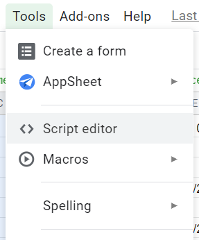

I use Google Sheets for tracking my expenses, assets and liabilities. And 2020 has been a year where I was pushed to rethink my portfolio. Google Sheet has a first class support for getting the latest values of stocks on some US based exchanges like `NASDAQ`. On the other hand it doesn't have as well support for other exhanges like `SGX: Singapore Exchange`. To overcome this we are supposed to run awkward hacks like crawling `yahoo finance` pages. In this article I'll be writing about how to write an `AppScript` that will allow you to crawl such information from some API respository and mildly mention option to cache some data if there is limited API call per hour. I'll be using example of how to get latest gold price, silver price and platinum price in USD in Google Sheet. This can be easily extended to solve questions on how to get latest gold prices in India in Google Sheet or latest price of Indian stocks or Singapore Exachange stocks.

## Some existing approaches
### Using GOOGLEFINANCE function, example: =GOOGLEFINANCE("NASDAQ:MSFT")
This is very helpful in getting latest values of some `NASDAQ` or `NYSE` listed stocks. For example:

```gs
Some NASDAQ examples:
=GOOGLEFINANCE("NASDAQ:MSFT") --> for Microsoft
=GOOGLEFINANCE("NASDAQ:GOOG") --> for Google
=GOOGLEFINANCE("NASDAQ:AAPL") --> for Apple

Some NYSE examples:
=GOOGLEFINANCE("NYSE:ABT") --> for Abbot laborartories
=GOOGLEFINANCE("NYSE:PINS") --> for Pinterest Inc
```

`GOOGLEFINANCE` function supports more options like getting values over a period of time for a given stock with different attributes. [Read more about it](https://support.google.com/docs/answer/3093281?hl=en) in Google support page.

### ImportHtml and ImportXml
`ImportHtml` and `ImportXml` are functions that allow you to crawl a certain web page or xml respectively over internet, parse the structured data and get some values from it if you can pinpoint the position w.r.t document structure. An example of how I use this is for getting latest values of some `Singapore Exchange: SGX` listed stocks. Example of how to do this would be:

```gs
=IMPORTXML("https://sg.finance.yahoo.com/quote/RW0U.SI",
    "//span[@class='Trsdu(0.3s) Fw(b) Fz(36px) Mb(-4px) D(ib)']")
```

This allows us to get the value of stock `RWOU.SI` which is ticker for [Mapletree North Asia Commercial Trust (RW0U.SI)](https://sg.finance.yahoo.com/quote/RW0U.SI)

Another example of this would be:

```gs
=Dollar(Index(ImportHTML("http://www.apmex.com/spotprices/silver-price","table",8),2,2))
```

This allow us to get the latest spot value of Silver in USD per ounce. The `Dollar` function is used ot convert the `text/decimal` value to Dollar directly.

Now this option is what I call awkward hack, I found these references online but it's hard to do this all the time and is prone to changes in the source of information. Also, for Yahoo finance, I find the request rejected from time to time. The next option was using API endpoints which give structured data possibly in `JSON` format. While looking further I realised Google Sheets allow you to define your own function in `AppScript`.

## Custom Function using App Script
> Google Apps Script lets you do new and cool things with Google Sheets. You can use Apps Script to add custom menus, dialogs, and sidebars to Google Sheets. It also lets you write custom functions for Sheets, as well as integrate Sheets with other Google services like Calendar, Drive, and Gmail.

[Source: developer.google.com](https://developers.google.com/apps-script/guides/sheets) - Read more about AppScript here. The syntax are almost same as Javascript.

You can create a new script in Google Sheets by going to `Tools > Script Editor`.



As an example I'd be using API from `metals-api.com` which provides latest spot prices for commodities like Gold, Silver, Platinum, Rhodium etc. The API is returned as `JSON`. I'll be using free tier which allows me to query 50 times per hour. In interest of money I'll also show how to cache the results in local cache using `AppScript` so you probably don't have to use a paid tier of `metals-api`.

### [1] Create a new script called `metalsApi.gs` and create a stub function
In the script create a new function that takes `symbol` as input. The function can be directly called from Google Sheets after saving the script.

```js
/**
 * Returns the value of given {@param symbol} from metals-api.
 */
function metalsApi(symbol) {
    if (!symbol || symbol === "") {
        return "symbol is mandatory"
    }

    // This is a stub implementation
    return symbol;
}
```

After saving you'd see output something like this:

{:class="styled-table"}
| Function in Google Sheet | Output |
| ------- | ------ |
| =metalsApi("XAU") | XAU |
| =metalsApi("XAG") | XAG |
| =metalsApi("") | symbol is mandatory |

### [2] Call the API and return the response
```js
/**
 * Returns the value of given {@param symbol} from metals-api.
 */
function metalsApi(symbol) {
    if (!symbol || symbol === "") {
    return "symbol is mandatory"
    }
    // TODO(Minhaz): Add caching support, limited calls/hour.
    const apiKey = "<Your api key here - get it from metals-api.com>";
    const url = "https://metals-api.com/api/latest?access_key=" + apiKey;
    var response = UrlFetchApp.fetch(url);
    var data = JSON.parse(response.getContentText());

    Logger.log(response);
    if (data.success !== true) {
        return "No Success";
    }

    /**
     * Data format {..., "rates": {"XAU": 0.22}, ...}
     */
    let value = parseFloat(data.rates[symbol]);
    if (Number.isNaN(value)) {
        return "NaN";
    }

    // For this API the value is returned in this format.
    return 1 / value;
}
```

After saving you'd see output something like this*:

{:class="styled-table"}
| Function in Google Sheet | Output (values are per ounce) |
| ------------------ | --------------- |
| =metalsApi("XAU") | 1882.975555 |
| =metalsApi("XAG") | 26.29441802 |
| =metalsApi("") | symbol is mandatory |

_*The values are from the date I wrote this article._

### [3] (Optional) Add caching support
If there is limited API calls per hour and you don't care much about the data being delayed by say 10 minutes you can leverage [CacheService](https://developers.google.com/apps-script/reference/cache/cache?hl=en) class in App Script. 

> This class allows you to insert, retrieve, and remove items from a cache. This can be particularly useful when you want frequent access to an expensive or slow resource. For example, say you have an RSS feed at example.com that takes 20 seconds to fetch, but you want to speed up access on an average request.
[Source: developer.google.com](https://developers.google.com/apps-script/reference/cache/cache?hl=en)

The script can be modified something like this:

```js
/**
 * Returns the value of given {@param symbol} from metals-api.
 */
function metalsApi(symbol) {
    if (!symbol || symbol === "") {
        return "symbol is mandatory"
    }

    // If there is data in cache, return directly.
    const cacheId = "MetalsApiCache_XXX";
    let cache = CacheService.getDocumentCache();
    var cached = cache.get(cacheId);
    if (cached != null) {
        var data = JSON.parse(cached);
        if (data.success) {
            let value = parseFloat(data.rates[symbol]);
            if (!Number.isNaN(value)) {
                // For this API the value is returned in this format.
                return 1 / value;
            }
        }
    }

    const apiKey = "<Your api key here - get it from metals-api.com>";
    const url = "https://metals-api.com/api/latest?access_key=" + apiKey;
    var response = UrlFetchApp.fetch(url);
    var data = JSON.parse(response.getContentText());

    Logger.log(response);
    if (data.success !== true) {
        return "No Success";
    }

    // Put API response text to cache with timeout of 5 minutes = 60*5 seconds.
    // Note: this value can be made as a variable too with some default value for
    // different cache duration.
    cache.put(cacheId, response.getContentText(), 300);

    let value = parseFloat(data.rates[symbol]);
    if (Number.isNaN(value)) {
        return "NaN";
    }

    // For this API the value is returned in this format.
    return 1 / value;
}
```

After saving you'd see output something like this*:

{:class="styled-table"}
| Metal** | Function in Google Sheet | Output (values are per ounce) |
| ---- | ------------------ | --------------- |
| Gold | =Dollar(metalsApi("XAU")) | $1882.96 |
| Silver | =Dollar(metalsApi("XAG")) | $26.29 |
| Platinum | =Dollar(metalsApi("XPT")) | $1063.17 |
| Rhodium | =Dollar(metalsApi("XRH")) | $16650.00 |
| Error condition | =Dollar(metalsApi("")) | #VALUE! |

_*The values are from the date I wrote this article._ The data here might be slightly delayes as expected due to caching with timeout of 5 minutes.

** This is just for reference, is't not an artefact of the AppScript.

## Possibilties
You can use the same approach to do different things like:
 - Get price of Gold in India in specific cities.
 - Get price of some Stock in Singapore Exchange.
 - Get price of some stock in `BSE` or `NSE`.
 - Get price of certain Mutual Fund or `ETF`

Basically get any value you want from internet in numeric format into Google Sheet if you know a reliable source of data or preferrably an API endpoint.