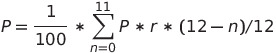
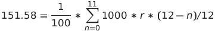

Joyalukkas is a fairly well-known certified jewelry group based out of India. They have a variety of gold schemes that allow customers to pre-plan for the future buy of gold and in a way invest in it. In Singapore, the scheme is as follows:

```
1. Invest a fixed amount say 1000 SGD every month for 12 month.
2. In the end of 12th month you can buy gold worth 12000 SGD + 1000 SGD.
Notes:
 - This can be done for a smaller amount per month, starting from 100 SGD a month.
```

This was introduced to me by a friend and in the beginning, this sounded like a no-brainer. This looked like a `8.3% ROI` (with naive math) - which is greater than most of the instruments available to us for investment. I went down to the stores to understand more and finally decided it to not be a good investment vehicle. In this article, I intend to share my findings on why it is not as attractive as it looks and explain why.

## TL;DR; or Bottom line
Most of the content in the rest of the section could be considered unnecessary, so here is my interpretation in few points:

 - It's not an investment that gives `8%+` rate of interest per annum on maturity.
 - If the goal is to buy gold as jewelry for the purpose for jewelry it might be a good scheme to go with, assuming you know you want to buy it after 12 months. 

## First the correct math
Considering we are paying a principle amount `P` in the beginning of every month for 12 months and then in the end we can buy gold worth `13P` the actual rate of interest can be computed as:
```
Interest = (Principle * ROI * Time) / 100
```
In this case, we want to compute `ROI`, we know the principle and interest and time for each investment we make at the beginning of each month.



Solving this equation for `r` we get `r = 13.483% per annum`. 

## The catch with `13.48%` ROI pa
Now `13.48% pa` is a fantastic ROI and I would be very tempted to put a lot of my money into it, primarily when I compare it with other available instruments in Singapore. But it turns out there are a few conditions from Joyalukkas, which controls how the final value is materialized.

1. The final `13P` value at the maturity of the scheme can only be used to buy 22K or 18K gold jewelry (or diamonds or other jewelry items) and not investment grade 24K bullions or coins.
2. It cannot be directly liquidated at the exact value. Joyalukkas shall buy back gold jewelry back at 10% depreciation of the market price of gold.
3. Jewelry items come with an additional mark-up called making charges which is nearly around 10% of the price of the gold per sales folks in the stores. However, Joyalukkas does offer certain jewelry w/o making charges. However, this is limited collection and might not be most attractive from the perspective of jewelry.
4. Non-investment grade gold like 22K gold shall attract 7% GST at the time of purchase. The GST for investment-grade gold (i.e. atleast 99.5% purity of gold) was exempted in 2012. [[2]](https://www.buygold.sg/blog/post/buy-gold-and-silver-in-singapore-without-GST.html).
5. The final gold will be bought at the market price of gold on the day gold is bought. Joyallukas allows buying the gold within one month of maturity of the scheme.

Now if we look at the value of assets at the end of 12'th month with some assumptions like:
1. Price of 22K gold is `G22 SGD` per gram. And it was constant throughout the 12 months. Assuming the price of gold to increase or decrease would lead to trying to time the market and that's not relevant in this article.

The amount of gold money can buy can be calculated with:
```
13P = (1 + GST) * (goldGrams * G22 * (1 + makingCharges))
Putting: GST = 0.07 (7%), makingCharges = 0.1 (10%)

13P = 1.07 * (goldGrams * G22 * 1.1)

goldGrams = 11.04P / G22
```

And similarly, without the making charges:
```
goldGrams = 12.15P / G22
```

For better visualization I'll take today's price of gold in Joyalukkas as reference:
```
[24K] => 85.60 SGD
[22K] => 75.90 SGD
[18K] => 64.80 SGD
```
_Source: [eshop.joyalukkas.com](https://eshop.joyalukkas.com/)_

Considering Joyalukkas will buy back gold at `10% depreciation` and will not consider the making charges, the 22K gold will be bought back at `G' = 0.9 * G = 68.31 SGD`

{:class="styled-table"}
| # | Buying jewelry with making charges | Buying jewelry without making charges |
| -- | ------ | ------- |
| Invested value (`12P`) | 12000 SGD | 12000 SGD |
| Gold bought for (`13P`) | 13000 SGD | 13000 SGD |
| Gold Bought | 145.45g | 160.10g |
| Selling back immediately at 10% depreciation | 9,935.7 SGD | 10,936.43 SGD |
| Growth | -2,064.4 SGD |  -1,063.57 SGD |

If the purpose was to grow money, then at that point in time it will probably not look like a sweet deal. If the purpose was to buy jewelry then this is probably a good option, let's analyse that next.

## Buying gold directly after saving for 12 months
If your intention is to buy gold jewelry for the purpose of jewelry, then this is definitely a good place to put the money in. Assuming in Singapore the savings account is growing at `0.05%` per annum, and you save `1000 SGD` every month for 12 months, this is what you'd have at the end of 12 months:

{:class="styled-table"}
| # | Buying jewelry with making charges | Buying jewelry without making charges |
| -- | ------ | ------- |
| Cash in hand | 12002.75 SGD | 12002.75 SGD |
| Gold bought | 134.36g | 147.79g |
| Difference compared with gold scheme | -11.09g | -12.31g |

## A few more things I did not like in the deal from an investment perspective
One of the reasons people invest in physical gold is to keep it as a hedge against the crisis. If this is the purpose, I strongly advise you to read the terms and conditions laid out by Joyalukas for the gold scheme. It calls out that during the duration of the investment and till maturity the company has all the rights to close the scheme and not pay any extra benefits to the investor. Probably accumulating gold every month with the savings might provide a better hedge and also help with dollar cost averaging. 

## Bottom line
> Once again, my key goal was to show the deal is not as gold as it looks (pun intended). This is not a rock solid short term investment to grow the money in 12 months time period.

In the later part of this article, I have added some more analysis for the scenario where the goal is to add gold as an investment in our portfolio. 

## What if we saved money to buy 24K gold?
24K gold bullion might actually be a good option. You directly save on the mark-ups like making charges and GST. So if we saved `1000 SGD` every month and bought gold bullions at the end of 12'th month we would be able to buy something like:

{:class="styled-table"}
| # | Buying bullion at Joyalukkas | 
| -- | ------ |
| Cash in hand | 12002.75 SGD |
| Gold bought | 140.22g |

> Note that ^ this is 24K gold in gram and thus not directly comparable to the values in tables above.

Gold bullions are usually sold in unit weights like `5g`, `10g`, `20g`, `50g`.. and so on. And based on my conversation at the store they were willing to sell `50g` at a slightly lower value than what they sell `20g` gold bullion. However, do note that when buying & selling physical 24K gold the same 10% depreciation still applies and the jewelers would buy back the gold only at `90%` of its current market value at which they sell. This means your `12002.75 SGD` worth gold immediately becomes worth `10,802.475 SGD`. Interestingly, this is slightly less than (in terms of value) if you had invested in the gold scheme and bought 22K gold without making-charges.

> So gold scheme + no making charges might be an efficient way to acquire physical gold. But this is assuming there is no other instrument at hand appreciate the money in hand during 12 month period.

### How much should the money have grown in this time period to match the value?
So gold scheme + no making charges option was worth `10,936.43 SGD` which is what you would get by selling 24K gold bought at `12,151.58 SGD`. So the ROI at which we would need to grow a monthly saving of `1000 SGD` would be:



Which is equal to `2.09%` rate of interest per annum. So if you can grow your savings at the rate of interest equal to or higher than this, probably 24K without the scheme will be a better option.


One more thing I noted was Joyalukkas was selling the 24K gold much above the spot price of gold and some other options like [bullionstar.com](https://www.bullionstar.com/buy/gold-bars) was selling 20g 24k gold for `83.70 SGD per gram`. But they would also buy back the gold at `77.61 SGD per gram` which is nearly `7.2%` depreciation.

## Dollar-cost averaging?
From an investment perspective, one more alternative would be dollar cost average (DCA) [[4]](https://www.investopedia.com/terms/d/dollarcostaveraging.asp) and invest every month instead of a single lump sum at the end of the year. The price of gold is definitely not static and we cannot predict the market. So once again if the goal is to acquire physical gold as an investment or hedge against crisis, and keep certain amount of the portfolio as physical gold buying a certain quantity of 24K gold might be a viable option as well.

## Closing point
There are definitely more ways to invest in gold but I would keep that out of the scope of this article. I found [[3]](https://blog.seedly.sg/how-to-invest-in-gold-singapore/) a good reference article for this purpose.

## Disclaimer
I have no affiliation with any brand mentioned in this article. 

## References
 1. [Terms and conditions at easygold.joyalukkas.com](https://easygold.joyalukkas.com/)
 2. [GST exemption on investment-grade gold in Singapore](https://www.buygold.sg/blog/post/buy-gold-and-silver-in-singapore-without-GST.html)
 3. [A Singaporean's Guide: How To Invest In Gold (2020)](https://blog.seedly.sg/how-to-invest-in-gold-singapore/)
 4. [Dollar cost averaging](https://www.investopedia.com/terms/d/dollarcostaveraging.asp)