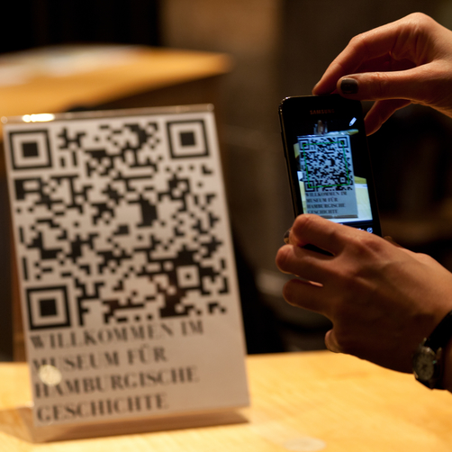
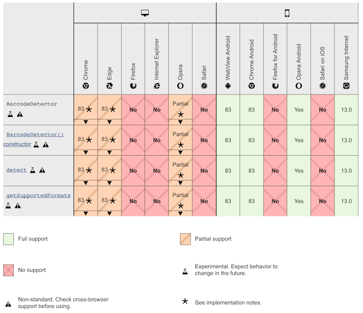

In the past the APIs like [MediaDevices.getUserMedia()](https://developer.mozilla.org/en-US/docs/Web/API/MediaDevices/getUserMedia), [local file reading API](https://developer.mozilla.org/en-US/docs/Web/HTML/Element/input/file) made it fairly easy
to capture images and process them. This made libraries like [@mebjas/html5-qrcode](https://github.com/mebjas/html5-qrcode)
possible - which today allows developers to easily integrate QR code or bar code
scanning capabilities to their web applications. Several developers have used
the library to build Android applications using Cordova. Now the [Web Platform
Incubator Community Group](https://www.w3.org/community/wicg/) has come with
a draft for [shape detector APIs](https://wicg.github.io/shape-detection-api/)
which aims at providing access to accelearated shape detectors (like human faces,
QR codes, bar codes, etc) for still images and live image feeds. This is
particularly exciting for mobile devices which today comes with hardware chips
which are highly performant at certain tasks like detecting faces, barcodes, texts etc.
In this article, I have explained how to use the new `BarcodeDetector` library and how 
it can be used directly with [html5-qrcode](https://github.com/mebjas/html5-qrcode) and 
what kind of performance improvement we see when compared to `ZXingJS` library.

<br>
_Figure: QR Code scanning is used extensively in the post Covid19 world to enable, contact less information sharing._

This new API is part of the new [capabilities project](https://developers.google.com/web/updates/capabilities). Barcode detection has launched in `Chrome 83`. If the APIs evolve in future this article would be updated.

## Important notes
The `Shape detector APIs` are still in draft and not a `W3C standard` not it is
on the W3C Standards Track. The feature can still be turned on in the library
as it'd fallback to using `ZXing` based detector if `BarcodeDectector` library
is not available.

## The Barcode Detection API

> `BarcodeDetector` represents an underlying accelerated platform’s component for detection of linear or two-dimensional barcodes in images. It provides a single `detect()` operation on an `ImageBitmapSource` which result is a `Promise`.

_Source: [wicg.github.io/shape-detection-api/](https://wicg.github.io/shape-detection-api/)_

The draft proposal expects core system APIs like [com.google.android.gms.vision.barcode](https://developers.google.com/android/reference/com/google/android/gms/vision/barcode/package-summary), [CIQRCodeFeature](https://developer.apple.com/documentation/coreimage/ciqrcodefeature?preferredLanguage=occ) or [VNDetectBarcodesRequest](https://developer.apple.com/documentation/vision/vndetectbarcodesrequest?language=objc) to act as underlying components.

> By providing high-performance shape detection capabilities this interface allows developers to run image analysis tasks on the local device. This offers a privacy advantage over offloading computation to a remote system. Developers should consider the results returned by this interface as privacy sensitive as the original image from which they were derived.

## How to use
The `BarcodeDetector` API has following interface (based on [documentation](https://developer.mozilla.org/en-US/docs/Web/API/BarcodeDetector)):

```ts
enum BarcodeFormat {
  "aztec",
  "code_128",
  "code_39",
  "code_93",
  "codabar",
  "data_matrix",
  "ean_13",
  "ean_8",
  "itf",
  "pdf417",
  "qr_code",
  "unknown",
  "upc_a",
  "upc_e"
};

/** Config to create instance of {@code BarcodeDetector}. */
interface BarcodeDetectorConfig {
    formats: Array<string>;
}

interface BarcodeDetectorResult {
    /**
     * A DOMRectReadOnly, which returns the dimensions of a rectangle
     * representing the extent of a detected barcode, aligned with the image.
     */
    boundingBox: DOMRectReadOnly;

    /**
     * The x and y co-ordinates of the four corner points of the detected
     * barcode relative to the image, starting with the top left and working
     * clockwise. This may not be square due to perspective distortions within
     * the image.
     */
    cornerPoints: Array<Point2D>;

    /** The detected barcode format. */
    format: BarcodeFormat;

    /** A String decoded from the barcode data. */
    rawValue: string;
}

class BarcodeDetector {
    constructor(config: BarcodeDetectorConfig) {}

    /** Async decoding API. */
    async decode(source: ImageBitmapSource): Promise<BarcodeDetectorResult> {}

    /** Returns list of supported formats as string. */
    static getSupportedFormats(): Array<string> {}
}
```

An example usage in Javascript would look like this:
```js
// Get supported formats:
let supportedFormats = new BarcodeDetector.getSupportedFormats();
let barcodeDetector = new BarcodeDetector({ formats: supportedFormats });

try {
  let detector = await barcodeDetector.detect(canvas);
  barcodes.forEach(barcode => {
      // Handle barcode of format BarcodeDetectorResult
  });
} catch (error) {
  console.error(error);
}
```

## Supported formats
The library specification has a support for variety of 2D and 1D code formats like
`QR Code`, `Aztec`, `code_128`, `code_39`, etc. A full list of all supported formats
is listed [here](https://developer.mozilla.org/en-US/docs/Web/API/Barcode_Detection_API#supported_barcode_formats).

**Important**: While the specification defines formats API support, the actual
support depends on browser and device implementations. The supported format
list should always be first queried using `BarcodeDetector.getSupportedFormats()` API.

## Compatiblity
Compatibility as of 20th June 2020

<br>
_Figure: Compatibility of the API, source - [developer.mozilla.org](https://developer.mozilla.org/en-US/docs/Web/API/Barcode_Detection_API#browser_compatibility)_


## Support in @mebjas/html5-qrcode
I learned about this API when `AlfonsoML@` filed a feature request [#195](https://github.com/mebjas/html5-qrcode/issues/195) in the project to add support for `BarcodeDetector` API.

> **Is your feature request related to a problem? Please describe.**
>
> Chromium has added native support to detect barcodes, so using it would be interesting as it can lead to better performance in the long term.
>
> ...

As an author of the project it was very exciting to see web coming with support
for hardware acceleration to boost performance of a very common usecase in todays
world. Current `ZXing` based decoder takes `~350+ms` to scan a single feed,
which leads to less than ideal real time performance. And, also it's a shame, if
the web applications cannot make use of exact support availabe in the hardware.

With pull request [#238](https://github.com/mebjas/html5-qrcode/pull/238) I have
added support for using `BarcodeDetector` API if supported by the browser after
doing performance investigations (see results below). It's supported both in
[Html5Qrcode](../QR-and-barcode-scanner-using-html-and-javascript/) &
[Html5QrcodeScanner](../QR-and-barcode-scanner-using-html-and-javascript/)
classes (read more on how to use [Html5Qrcode to scan QR & bar codes in javascript
 with few lines of code](../QR-and-barcode-scanner-using-html-and-javascript/)).

<a class="github-button" href="https://github.com/mebjas/html5-qrcode" data-color-scheme="no-preference: light; light: light; dark: light;" data-size="large" data-show-count="true" aria-label="Star mebjas/html5-qrcode on GitHub">Star</a>
<a class="github-button" href="https://github.com/mebjas/html5-qrcode/fork" data-color-scheme="no-preference: light; light: light; dark: light;" data-size="large" data-show-count="true" aria-label="Fork mebjas/html5-qrcode on GitHub">Fork</a>
<a class="github-button" href="https://github.com/mebjas/html5-qrcode/issues" data-color-scheme="no-preference: light; light: light; dark: light;" data-size="large" data-show-count="true" aria-label="Issue mebjas/html5-qrcode on GitHub">Issue</a>
<a class="github-button" href="https://github.com/mebjas/html5-qrcode/discussions" data-color-scheme="no-preference: light; light: light; dark: light;" data-size="large" aria-label="Discuss mebjas/html5-qrcode on GitHub">Discuss</a>

 

Using this API is now supported in the library as an experimental feature. An
experimental feature is one that is:
-   Supported in the library, can be turned on using certain config
-   Is not directly documented, but some context exists [here](https://github.com/mebjas/html5-qrcode/blob/master/experimental.md)
-   Is not recommeded for production usage yet
-   Can be migrated to full scale feature set if the feature is well tested and has wider compatibility.

<script async src="https://pagead2.googlesyndication.com/pagead/js/adsbygoogle.js?client=ca-pub-6209792783516879"
    crossorigin="anonymous"></script>
<ins class="adsbygoogle"
    style="display:block; text-align:center;"
    data-ad-layout="in-article"
    data-ad-format="fluid"
    data-ad-client="ca-pub-6209792783516879"
    data-ad-slot="5886734070"></ins>
<script>
    (adsbygoogle = window.adsbygoogle || []).push({});
</script>

### How to use this in the library
It can be turned on using new config called `useBarCodeDetectorIfSupported`
added to `experimentalFeatures` config group. It's off (`value = false`) by
default. If set to on (`value = true`) and the `BarcodeDetector` is supported
by the browser, it'll be used for scanning all the kind of 1D and 2D codes.

#### Html5Qrcode class

```js
function onScanSuccess(decodedText, decodedResult) {
    /** Handle success condition. */
}

let html5qrcode = new Html5Qrcode("reader", {
    // Use this flag to turn on the feature.
    experimentalFeatures: {
        useBarCodeDetectorIfSupported: true
    }
});

const scanConfig = { fps: 10, qrbox: 250 };
// If you want to prefer front camera
html5qrcode.start({ facingMode: "user" }, scanConfig, onScanSuccess);
```

#### Html5QrcodeScanner class

```js
function onScanSuccess(decodedText, decodedResult) {
    /** Handle success condition. */
}

let html5QrcodeScanner = new Html5QrcodeScanner(
    "reader", 
    { 
        fps: 10,
        qrbox: 250,
        // Use this flag to turn on the feature.
        experimentalFeatures: {
            useBarCodeDetectorIfSupported: true
        }
    });
html5QrcodeScanner.render(onScanSuccess);
```

## Performance
I conducted the performance test on different devices to see how `BarcodeDecoder`
API performed as compared to non accelerated `ZXingJS` based library. Numbers below
are the average time it took for decoding any given image feed for supported QR code
or bar codes in milli seconds.

{:class="styled-table"}
| Device | With ZXing | With BarcodeDecoder |
|--|--|--|
| Macbook Pro 16, Google Chrome | 21 ms |  10 ms|
| Pixel 4 Google Chrome | 56 ms | 23 ms |
| Pixel 4a Google Chrome | 92 ms| 47.3 ms |
| (low end) Android Device Google Chrome | 373 ms | 77.5 ms|

Across devices & browsers where it was supported (example Safari on Macbook pro
Big Sur doesn't support this API yet), the `BarcodeDetector` API performed better
than `ZXing` based library.

## Embedded Demo
<div id="barcode-detector-support" style="margin: 10px; background: #009879; padding: 10px; color: white;"></div>
<div id="qr-reader" style="width:600px; margin: auto"></div>
<br>

See full scale demo at [qrcode.minhazav.dev](https://blog.minhazav.dev/research/html5-qrcode)

## Conclusion
-   `BarcodeDetector` is easy to use WIP library, and it would be
super useful to both developers and users in the future.
-   If this API starts to get wider adoption across browers and hardware, I am
happy to migrate this from experimental to more well tested and documented feature set.

Happy to hear what you think about this in the comment section!

## References
-   [mebjas/html5-qrcode](https://github.com/mebjas/html5-qrcode) - end to end QR & bar code scannign library in javascript
-   [MediaDevices.getUserMedia()](https://developer.mozilla.org/en-US/docs/Web/API/MediaDevices/getUserMedia)
-   [The Shape Detection API: a picture is worth a thousand words, faces, and barcodes](https://web.dev/shape-detection/#barcodedetector)
-   [BarcodeDetector - developer.mozilla.org](https://developer.mozilla.org/en-US/docs/Web/API/BarcodeDetector)

<!-- Script area -->
<script async defer src="https://buttons.github.io/buttons.js"></script>
<script src="https://unpkg.com/html5-qrcode@2.0.11/dist/html5-qrcode.min.js"></script>
<script>
var supportedOrNotInfo = document.getElementById("barcode-detector-support");
if ("BarcodeDetector" in window) {
    supportedOrNotInfo.innerText = "BarcodeDetector API is supported. The demo "
        + "below should be using the API to scan QR or barcodes.";
} else {
    supportedOrNotInfo.innerText = "BarcodeDetector API is not supported. The "
        + " demo below is based on ZXing js decoder library.";
    supportedOrNotInfo.style.background = "#ee5e5e";

}

var html5QrcodeScanner = new Html5QrcodeScanner(
	"qr-reader", { fps: 10, qrbox: 250 });
html5QrcodeScanner.render()
</script>