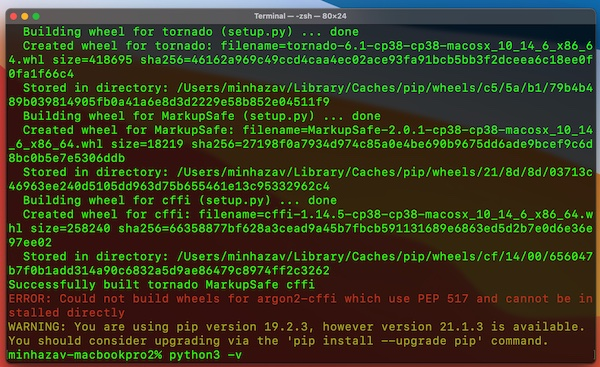
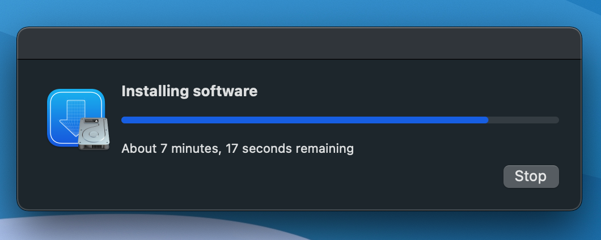
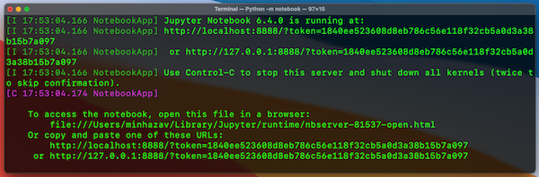

{:width="500px"}<br>
_Figure: Terminal with error_

While trying to install `jupyter notebook` in Mac OS with PIP ([source](https://jupyter.org/install))

```sh
pip install notebook
```

You could get error message like:

```sh
ERROR: Could not build wheels for argon2-cffi which use PEP 517 and cannot be installed directly
```

In this article I have added the series of steps I tried and it's possible the issue for you could be fixed with just of them (based on what the underlying issue is). 

## Solutions

### [1] Try to install `Argon2-CFFI` separately
`Argon2-CFFI` is a secure password hashing algorithm. Try to install it separately:
```sh
pip install argon2-cffi
```

If it works try to install jupyter notebook again. Most likely this will fail with the same error.

### [2] If it doesn't work, make sure your PIP is updated to latest version
```
pip install --upgrade pip --user
```

> The installation worked for me after this step. But since I didn't follow the steps in this order I found other solutions that worked for some other folks. Adding it here, in case it comes in handy.

### [3] Install xcode command line tools

```sh
xcode-select --install
```

This command is used to install the command line developer tools. This should ideally open a popup and after the installation is complete, try running the notebook installation again.

#### [3.1] Error while xcode-select --install, reinstall command line tools

`xcode-select --install` could sometime fail with following error

```sh
$ xcode-select --install
xcode-select: error: command line tools are already installed, use "Software Update" to install updates
```

Based on the SO answer for [How to update Xcode from command line](https://stackoverflow.com/questions/34617452/how-to-update-xcode-from-command-line) - the easiest way to do this would be to remove the old version of the tools and reinstall the new one.

```sh
sudo rm -rf /Library/Developer/CommandLineTools
xcode-select --install
```

A popup will open and it will take a bit of time to install the command line tools.

{:width="500px"}<br>
_Figure: Popup while the command line tools are being reinstalled._


### [4] Still failing with the same error
If you are still getting following error:
```sh
ERROR: Could not build wheels for argon2-cffi which use PEP 517 and cannot be installed directly
```

Per [this](https://stackoverflow.com/questions/61365790/error-could-not-build-wheels-for-scipy-which-use-pep-517-and-cannot-be-installe) you could try to install `p5py` and `PEP517` directly.

```sh
pip install p5py
pip install PEP517
```

If this fails with
```sh
ERROR: Could not install packages due to an EnvironmentError: [Errno 13] Permission denied: '/Library/Python/3.8'
Consider using the `--user` option or check the permissions.
```

Follow the advice:
```sh
pip install p5py --user
pip install PEP517 --user
```

## If it works, run jupyter notebook to verify
```sh
python3 -m notebook
```

It should run without error:

{:width="500px"}<br>
_Figure: Successfully starting jupyter notebook from mac._

## References
1.   [Mac installation Jupyter Notebook error error: COULD NOT BUILD WHEELS for argon2-cffi Which USE PEP 517 and...](https://www.programmersought.com/article/59338561311/)
2.   [How to update Xcode from command line](https://stackoverflow.com/questions/34617452/how-to-update-xcode-from-command-line)
3.   [ERROR: Could not build wheels for scipy which use PEP 517 and cannot be installed directly](https://stackoverflow.com/questions/61365790/error-could-not-build-wheels-for-scipy-which-use-pep-517-and-cannot-be-installe)