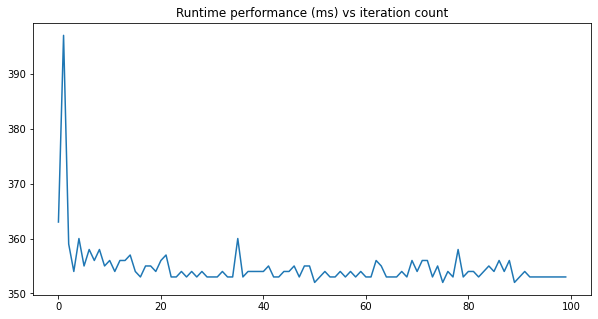
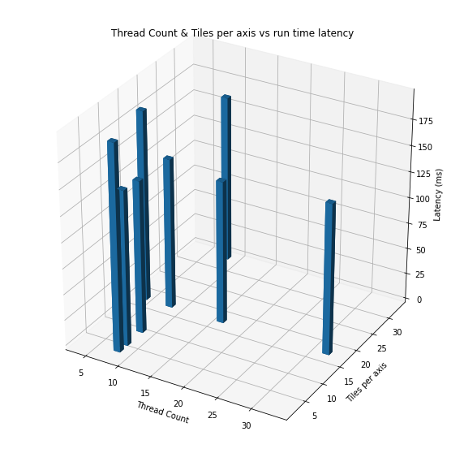
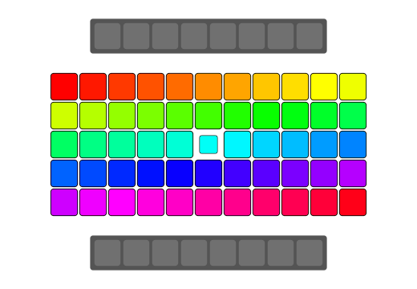

While I was exploring different ways to do efficient image processing in Android
I realized that a simple two-dimensional for-loop when written in Java vs C++
could have very different performance. For example: I have been comparing
different ways we can do color-space conversion of an image in Android from
[YUV](https://en.wikipedia.org/wiki/YUV) color-space to [RGB](https://en.wikipedia.org/wiki/RGB_color_model) and observed the Java version to be `4.62x` slower than a standard C++ native
code integrated with [JNI](https://en.wikipedia.org/wiki/Java_Native_Interface).

{:class="styled-table"}
| Approach | Average | Notes |
|--|--|--|
| Native | 76.4 ms | 4.62 x faster |
| Java | 353 ms | |

_Table: Performance of converting 8MP (3264x2448) `YUV` image to an `ARGB Bitmap` in Android using Pixel 4a._

And I am talking about straight forward two-dimensional for loops here, with pseudocode like
this for both Java and C++:

```c++
for (int y = 0; y < IMAGE_HEIGHT; ++y) {
    for (int x = 0; x < IMAGE_WIDTH; ++x) {
        // convert pixel in (x, y) from (y, u, v) to (a, r, g, b)
        // a here is alpha channel value always set to 1 in this case.
    }
}
```

> And I'd re-assert, for this example the C++ for loop was not making use of any explicit parallelization or [SIMD](https://en.wikipedia.org/wiki/SIMD) instruction sets.

In this article, I am going to write about why do we see this kind of performance difference and how we could mitigate it.

## Important Note
For image processing operation in Android **I don't recommend using Java implementation if your application
is performance sensitive**. This includes the fixes I am going to callout in this article. If you are interested in learning about efficient ways to do image processing in Android please read some of my other articles on the topic:

> Coming soon: Efficient ways to do image processing in Android.

<div class="embedded-post">
    <div class="embedded-post-title">
        <a href="https://blog.minhazav.dev/how-to-use-renderscript-to-convert-YUV_420_888-yuv-image-to-bitmap/">
        How to use RenderScript to convert YUV_420_888 YUV Image to Bitmap
        </a>
    </div>
In this code I have explained how to useScriptIntrinsicYuvToRGB intrinsic that is available in Android APIs to convert an android.media.Image in YUV_420_888 format to Bitmap.
</div>

<div class="embedded-post">
    <div class="embedded-post-title">
        <a href="https://blog.minhazav.dev/how-to-convert-yuv-420-sp-android.media.Image-to-Bitmap-or-jpeg/">
        How to use YUV (YUV_420_888) Image in Android
        </a>
    </div>
In this article, I have explained some of the different ways to convert a YUV image to Bitamp in Android.
</div>

## Why is the Java code slower than C++ code?
> To be honest I am still exploring this deeply and would update this article as I continue to find more.

Let's look at some key differences between Java code running on Android and Native code running on Android.

{:class="styled-table"}
| # | Java on Android | Native on Android |
| -- | -- | -- | 
| Compiler | With Android 8.0, Android adopted Android Runtime (ART) | Native Development Kit (NDK) in Android uses Clang front end with LLVM backend for compiling native code. |
| Features | Ahead of Time (AOT) compilation + JIT compiler running with the runtime continuously optimizing the algorithm.| No JIT compiler |
| Auto Vectorization | Supported | Has `loop-vectorizer` which widens the instructions in the loop, converting scalar code to vector instructions |

> If some of these concepts are not familiar to you, please check the [appendix](#appendix).

I initially thought it's related to the good `auto-vectorization` support in LLVM compilers used currently in NDK. But as Android adopted ART (Android Runtime), it came with support for loop optimization techniques like `SIMDization`, also known as auto vectorization.

One key difference between Android Runtime vs the C++ compiler is, ART also includes a Just in Time (JIT) compiler with code profiling that continually improves the performance of an Android Application as they run. The JIT compiler complements ART's current ahead-of-time (AOT) compiler and improves runtime performance, saves storage space, and speeds application and system updates.

To verify this I ran 100 iteration of the algorithm but found the convergence to happen to soon yet not matching the performance of the C++ code:

<div style="text-align: center">
    
    <br />
    <i>
        figure: performance of 8MP YUV to ARGB Bitmap conversion with the Java
        code in Android. Observed the performance to stabilize in the early set of iterations.
    </i>
    <br />
    <br />
</div>


### Digging more
<div style="text-align: center">
    <br />
</div>

There are some similar questions on StackOverflow like: 
<div class="so-embedded-post">
    <div class="embedded-post-title">
        <a href="https://stackoverflow.com/questions/21399257/android-why-is-native-code-so-much-faster-than-java-code">
        Android: why is native code so much faster than Java code
        </a>
    </div>
</div>


Some answers in this StackOverflow question offer some interesting insights for potential reasons for the slowdown, like:

-   **Array bound checking:** Java will check every access and confirm if it's within the bounds or
    throw a useful exception. C++ code on the other hand trust the code and fails miserably if your code mess up, but it ends up being faster.
-   **Garbage Collector:** GC can run at any time, and it consumes CPU cycles. On a low-end device in the past
    I have observed the GC to go crazy when we allocate large contiguous memory for Bitmaps. However, I haven't been able to verify it to be the root cause in this case.

> I am not satisfied with the answers, so I'll continue to explore. I also have my own SO question out there with no satisfactory answer so far.

<div class="so-embedded-post">
    <div class="embedded-post-title">
        <a href="https://stackoverflow.com/questions/68500753/android-java-for-loop-uses-less-cpu-and-is-slower-than-c-for-loop">
        Android Java for loop uses less CPU and is slower than C++ for loop
        </a>
    </div>
</div>

On digging a bit, I noticed one more thing — when running the C++ version had much higher CPU utilization as
compared to the Java counterpart.

<image src="../images/performance/android/java-forloops-poor-cpu-usage.png" style="width: 100%;" /><br>
_Figure: Screenshot of running profiler, the region in the left with lower CPU usage is when the Java
code is running, while the peaks are when C++ code is running._

{:class="styled-table"}
| Approach	| Avg CPU usage |
| -- | -- | 
| Java | ~12% |
| Native | ~70%+ |

_Table: CPU usage when converting 8MP (3264x2448) `YUV` image to an `ARGB Bitmap` in Android using Pixel 4a._

> I am not sure, why the C++ code reports ~70% CPU utilization! But the poor performance and poor CPU usage
> by the Java code isn't optimal, and we should be able to improve it.

## Java `ByteBuffer` vs Native `byte[]`
**Note: this is an update to the existing article, last updated: 08/04/2021**

If we look closely into what I was testing — I am trying to convert an [Image](https://developer.android.com/reference/android/media/Image) to [Bitmap](https://developer.android.com/reference/android/graphics/Bitmap). In case of java code we access the pixel values via the [ByteBuffer](https://developer.android.com/reference/java/nio/ByteBuffer) like this:

```java
// rest of the code
ByteBuffer yBuffer = image.getPlanes()[0].getBuffer();
yBuffer.position(0);
ByteBuffer uBuffer = image.getPlanes()[1].getBuffer();
uBuffer.position(0);
ByteBuffer vBuffer = image.getPlanes()[2].getBuffer();
vBuffer.position(0);

// .. more code
int r, g, b;
int yValue, uValue, vValue;
for (int y = 0; y < imageHeight; ++y) {
    for (int x = 0; x < imageWidth; ++x) {
        int yIndex = y * yRowStride + x * yPixelStride;
        yValue = (yBuffer.get(yIndex) & 0xff);

        int uvx = x / 2;
        int uvy = y / 2;
        int uvIndex = uvy * uvRowStride +  uvx * uvPixelStride;

        uValue = (uBuffer.get(uvIndex) & 0xff) - 128;
        vValue = (vBuffer.get(uvIndex) & 0xff) - 128;

        r = (int) (yValue + 1.370705f * vValue);
        g = (int) (yValue - (0.698001f * vValue) - (0.337633f * uValue));
        b = (int) (yValue + 1.732446f * uValue);
        r = clamp(r, 0, 255);
        g = clamp(g, 0, 255);
        b = clamp(b, 0, 255);
        int rgbIndex = y * imageWidth + x;
        argbArray[rgbIndex] = (255 << 24) | (r & 255) << 16 | (g & 255) << 8 | (b & 255);
    }
}
```

While in case of native code the JNI provides API called [GetDirectBufferAddress](https://docs.oracle.com/javase/7/docs/technotes/guides/jni/spec/functions.html#GetDirectBufferAddress) which allow us to get the pointers
for the underlying hardware buffer and the algorithm directly consumes the `uint8_t*` data. 

```c++
// JNI code

jboolean
Java_com_example_androidcv_camera_processing_JniInterface_yuv420toNv21(
    JNIEnv *env, jclass clazz,
    jint image_width, jint image_height, jobject y_byte_buffer,
    jobject u_byte_buffer, jobject v_byte_buffer, jint y_pixel_stride,
    jint uv_pixel_stride, jint y_row_stride, jint uv_row_stride,
    jbyteArray nv21_array) {

    auto y_buffer = static_cast<uint8_t*>(env->GetDirectBufferAddress(y_byte_buffer));
    auto u_buffer = static_cast<uint8_t*>(env->GetDirectBufferAddress(u_byte_buffer));
    auto v_buffer = static_cast<uint8_t*>(env->GetDirectBufferAddress(v_byte_buffer));
    // ^ for loops have similar algorithm as the Java layer but they operate directly
    // on the continous data (known to compiler) which is easier to auto-vectorise.

    // .. rest of the code
    uint32_t a = (255u << 24);
    int r, g, b;
    int y_val, u_val, v_val;
    for (int y = 0; y < imageHeight; ++y) {
        for (int x = 0; x < imageWidth; ++x) {
            int y_idx = (y * y_row_stride) + (x * y_pixel_stride);
            y_val = static_cast<int>(y_buffer[y_idx] & 255);

            int uvx = x / 2;
            int uvy = y / 2;
            int uv_idx = (uvy * uv_row_stride) +  (uvx * uv_pixel_stride);

            u_val = static_cast<int>(u_buffer[uv_idx] & 255) - 128;
            v_val = static_cast<int>(v_buffer[uv_idx] & 255) - 128;

            // Compute RGB values per formula above.
            r = y_val + 1.370705f * v_val;
            g = y_val - (0.698001f * v_val) - (0.337633f * u_val);
            b = y_val + 1.732446f * u_val;

            r = clamp(r, 0, 255);
            g = clamp(g, 0, 255);
            b = clamp(b, 0, 255);

            int argb_idx = y * image_width + x;
            argb_output[argb_idx] = a | (r & 255) << 16 | (g & 255) << 8 | (b & 255);
        }
    }
}
```

It's possible the java compiler cannot auto-vectorize & perform other optimizations like loop unrolling the for loops based on `ByteBuffer#get(..)` access.
Best way of validating this would be looking at the generated byte code. To verify I am going to try an
alternative approach to make the for loops similar to how we have it for the native code.

### Potential solution(s)
If this coming from the poor vectorizability of code with `ByteBuffer` we could try forking the data in the 
`ByteBuffer` to `byte[]` arrays. One with Y channel data of size `IMAGE_WIDTH * IMAGE_HEIGHT`. The other one to hold interleaved UV data of size `IMAGE_WIDTH * IMAGE_HEIGHT / 2`. Note that this has memory cost on java heap and would take `1.5 byte per pixel = 11.4Mb` for the 8MP image.

> Important note: The YUV_420_888 image can also have a planar layout (i.e. non interleaved UV channels) per definition of the format. While this is uncommon, it needs to be addressed. To handle such cases we could also have two different `byte[]` for U & V channel. But detecting the layout is hard & probably not recommended (could be done with a small (& cheap) help from native layer). Anyways, putting all of these as out of scope of this article, in case you hit a wall because of this, please add a comment.

So if you know the layout of the YUV image say:
-   Y channel has tight packing i.e. `row stride == width of image`
-   UV channel has tight interleaved packaging i.e. `pixel stride == 2`, `row stride == width of image`

you can cheaply copy the data using following logic:

```java
int yPixelCount = IMAGE_WIDTH * IMAGE_HEIGHT;
int uvPixelCount = yPixelCount / 2
byte[] yData = new byte[yPixelCount];
byte[] uvData = new byte[uvPixelCount];

ByteBuffer yBuffer = image.getPlanes()[0].getBuffer();
yBuffer.position(0);
ByteBuffer uBuffer = image.getPlanes()[1].getBuffer();
uBuffer.position(0);
ByteBuffer vBuffer = image.getPlanes()[2].getBuffer();
vBuffer.position(0);

// Fast byte[] copy
yBuffer.get(yData, /* offset= */ 0, /* length= */ yPixelCount);

// If format is NV12 then the uBuffer has following data
// UVUVUVUVU                -- uBuffer
// ^ start at U end at U, length = uvPixelCount - 1
//  VUVUVUVUV               -- vBuffer
//  ^ start at V end at V, length = uvPixelCount - 1

// If NV12 i.e. UVUVUVUVUV packaging
if (isInterleaved(image) && isNv12(image)) {
    uBuffer.get(uvData, /* offset= */ 0,  /* length= */ uvPixelCount - 1);
    uvData[uvLength - 1] = vBuffer.get(uvLength - 2);
} else if (isInterleaved(image)) {
    // NV21 i.e. VUVUVUVUV packaging
    vBuffer.get(uvData, /* offset= */ 0,  /* length= */ uvPixelCount - 1);
    uvData[uvLength - 1] = uBuffer.get(uvLength - 2);
}

// isNv12(..) will need some JNI intervention, we can determine this by looking
// at the pointer address of U & V data.
// isInterleaved(..) can be determined based on pixel stride, if it's 2 for UV
// channel it should be interleaved
```

And this is super quick (number on Pixel 4a for 8MP YUV image)

{:class="styled-table"}
| Approach	| Avg runtime | 
| -- | -- | 
| YUV `ByteBuffer` to `byte[]` | 2.9 ms |


So with this we can do the conversions directly on array like we'd do for native code:

```java
for (int y = 0; y < IMAGE_HEIGHT; ++y) {
    for (int x = 0; x < IMAGE_WIDTH; ++x) {
        uvx = x / 2;
        uvy = y / 2;
        uvIndex = uvy * (imageWidth / 2) + uvx;

        yValue = yData[y * imageWidth + x] & 0xff;
        uValue = (uvData[2 * uvIndex] & 0xff) - 128;
        vValue = (uvData[2 * uvIndex +1] & 0xff) - 128;

        // .. rest of algorithm
    }
}
```

This loop seems to have an average runtime of `116.6 ms`. So that combined with
array copy gives us:

{:class="styled-table"}
| Approach | Average | Notes |
|--|--|--|
| Native | 76.4 ms | **fastest** |
| Java `ByteBuffer` | 353 ms | 4.62x slower |
| Java `byte[]` | 119.5 ms | 1.56x slower |

This way we have improved the java code performance by `2.9x` times, but it's still
slower than the native code. I guess we could do a tad bit more digging.

<div style="text-align: center">
    <br />
</div>

## Multi-threaded Java code
One way to improve the performance is to explicitly write multi-threaded code. For an image we can break it down to tiles of a certain size and process them in parallel. 

<div style="text-align: center">
    
    <br />
    <i>
        figure: Processing the image in 4 tiles in parallel. (Image Source - <a href="https://halide-lang.org/tutorials/tutorial_lesson_05_scheduling_1.html">halide-lang.org</a>)
    </i>
    <br />
    <br />
</div>

In the GIF above, the image is divided into 4 tiles and processed in parallel. We could do something similar with following pseudo-code:

```java
// .. some tuning params
final int THREAD_COUNT = 8;
final int TILES_PER_AXIS = 16;

// ...
int tileWidth = imageWidth / TILES_PER_AXIS;
int tileHeight = imageHeight / TILES_PER_AXIS;
int threadCount = TILES_PER_AXIS * TILES_PER_AXIS;
ExecutorService executor = Executors.newFixedThreadPool(THREAD_COUNT);
List<Future<Void>> futures = new ArrayList<>();
// Split the image into NUM_THREADS tiles
for (int i = 0; i < threadCount; i++) {
    int startY = i / TILES_PER_AXIS * tileHeight;
    int endY = startY + tileHeight;
    int startX = i / TILES_PER_AXIS * tileWidth;
    int endX = startX + tileWidth;
    Future<Void> future = executor.submit(() -> {
        yuvToArgb(startX, endX, startY, endY, /** rest of image params. */)
        return /* Void */ null;
    });
    futures.add(future);
}

try {
    for (Future<?> future : futures) {
        future.get(); // do anything you need, e.g. isDone(), ...
    }
} catch (InterruptedException | ExecutionException e) {
    e.printStackTrace();
}
executor.shutdown();
```

And have `yuvToArgb(..)` do the operation in the provided bounds. The task at hand like `YUV` to `RGB` conversion is particularly suited for this kind of multi-threading as we don't need to explicitly handle concurrency issues.

```java
void yuvToArgb(int startX, int endX, int startY, /** rest of image params. */) {
    for (int y = startY; y < endY; ++y) {
        for (int x = startX; x < endX; ++x) {
            // convert pixel in (x, y) from (y, u, v) to (a, r, g, b)
            // a here is alpha channel value always set to 1 in this case.
        }
    }
}
```

### Performance

#### With `byte[]` approach (updated)
**Note: this is an update to the existing article, last updated: 08/04/2021**

{:class="styled-table"}
| Approach	| Average latency (ms) | Verdict |
| -- | -- | 
| Native (unoptimized) | 76.4 ms | **no longer fastest** |
| Java (single threaded) | 119.5 ms | Slowest |
| Java Threads=4, TilesPerAxis=8 | 67 ms | 1.78x faster|
| Java Threads=8, TilesPerAxis=4 | 59.5 ms | 2.0x faster|
| Java Threads=8, TilesPerAxis=16 | 54.5 ms | 2.19x faster |
| Java Threads=16, TilesPerAxis=16 | **53.8 ms** | 2.2x, **fastest among these**|

> So with optimized (multithreaded + `byte[]` loops) — we can get performance faster than unoptimized C++ code in Android! Nice!!

Also, with respect to CPU usage — I saw following numbers:

{:class="styled-table"}
| Approach	| Avg CPU usage |
| -- | -- | 
| Java (single threaded, `ByteBuffer`) | ~12% |
| Native | ~70%+ |
| Java `byte[]` + multithreaded | ~33%+ |

> Still not super sure about the 70% usage in native code and lower usage for java code.
>
> TODO(minhazav): Dig more...

#### With `ByteBuffer` approach
<div style="text-align: center">
    
    <br />
    <i>
        figure: Runtime latency for different thread count & tiles per axis.
    </i>
    <br />
    <br />
</div>

{:class="styled-table"}
| Approach	| Average latency (ms) | Verdict |
| -- | -- | 
| Java (single threaded) | 353 ms | Slowest |
| Java Threads=2, TilesPerAxis=8 | 199.1 ms | 1.7x faster|
| Java Threads=8, TilesPerAxis=16 | 147 ms | 2.4x faster|
| Java Threads=8, TilesPerAxis=32 | 161 ms | 2.19x faster|
| Java Threads=16, TilesPerAxis=16 | 137.5 ms | 2.57 x faster, **fastest among these**|

_Table: Performance of converting 8MP (3264x2448) `YUV` image to an `ARGB Bitmap` in Android using Pixel 4a
using Java code._

### Verdict
 - Multi threaded code improves the performance of image processing algorithms in Android when using Java.
 - For loops with `byte[]` have better performance than ones accessing pixel values using `ByteBuffer`, but this has non-trivial memory cost. Be mindful of this while optimizing.
 - The Native code performance for this kind of operation still beats the performance
    - The multi-threaded code still is `1.8x` slower that standard C++ loops.
    - The same operation can be done in `31.5 ms` using `RenderScript` ([reference](https://blog.minhazav.dev/how-to-use-renderscript-to-convert-YUV_420_888-yuv-image-to-bitmap/)) — which is 4.3x faster.
    - Hence, **Java code may not be most suited for this kind of operations**.
 - It's still a `TODO` to understand why we cannot achieve same level of performance with Java code for this kind of operation as that of a standard C++ code (no hand tuning).

<!--

## My usual note to readers
<br>

-   I have a habit of explaining concepts before showing the code (& probably deviate a lot from the topic at hand), if you want to see the money, no code — go to [TODO: add a ptr here].
-   Despite lacking a good sense of humor, I tend to try to write funny.
-   For this article, I expect readers to be familiar with Android, Java, multi-threading.
-->

<!--
## Why is the Java code runtime latency slower than that of the native counterpart
To really explain this I have to take you through a series of concept on modern CPUs and some key differences
between Java's JIT compiler and C++ compilers generally used for Android. The knowledge might be helpful when
doing top-notch performance optimizations.
-->

## MISC notes
### Using 1D loop instead of 2D loop

I received feedback that having a 1D loop might be faster as it may reduce the amount of array bound checks in java. We can convert a 2D for loop to 1D like this:

```java
int maxElements = IMAGE_WIDTH * IMAGE_HEIGHT;
for (int i = 0; i < maxElements; ++i) {
    int y = i / IMAGE_WIDTH;
    int x = i % IMAGE_WIDTH;
    // .. rest of the code as is.
}
```

I didn't see any performance boost because of this, see the numbers (both of them are with single threaded `byte[]` logic):

{:class="styled-table"}
| Approach	| Average latency (ms) | Verdict |
| -- | -- | 
| Java 2D loop | 116.6 ms | |
| Java 1D loop | 142.4 ms | 1.219x slower|

> I suppose this is slower due to more math involved in computing `x` and `y`.
>
> TODO(minhazav): Read more about this, has bound checks been optimized for Java between 2D and 1D loops.

## Appendix
> Reminder of the content is not critical from this article's perspective. Feel free to read!

### SIMD vs SISD
> To explain this we first need to talk about modern CPUs

[SISD](https://en.wikipedia.org/wiki/SISD) stands for Single Instruction Stream, Single Data Stream.
Typically, a program's code is executed in sequence, i.e. one after another. Let's say we have two arrays say `a` and `b`, and we want to write a program which converts each element in `a` with following operation:

```c++
a[i] = a[i] + b[i];
```

For each index `i` in the arrays. On the other hand, modern CPUs have capabilities and support for 
[SIMD](https://en.wikipedia.org/wiki/SIMD) which stands for Single Instruction, Multiple Data. Such machines
can exhibit data level parallelism (which is different from concurrency). They can perform the same instruction
on multiple data at once. For the above example the SIMD CPUs could group and execute the operations in one batch as:

```c++
a[0] = a[0] + b[0];
a[1] = a[1] + b[1];
a[2] = a[2] + b[2];
a[3] = a[3] + b[3];
```

> SIMD instruction for + is called `addps` in [SSE](https://en.wikipedia.org/wiki/Streaming_SIMD_Extensions) or `vaddps` in [AVX](https://en.wikipedia.org/wiki/Advanced_Vector_Extensions), and they support grouping of 4 elements and 8 elements respectively (integer type).

<div style="width: 100%; text-align: center">
    <div>
        
        <br />
        <i>Figure: SISD swapping - <a href="https://dev.to/wunk/fast-array-reversal-with-simd-j3p">source: dev.to</a></i>
        <br />
    </div>

    <div>
        
        <br />
        <i>Figure: SIMD swapping - <a href="https://dev.to/wunk/fast-array-reversal-with-simd-j3p">source: dev.to</a></i>
        <br />
    </div>
</div>

### Vectorization
SIMD supports instructions that can operate on vector data types. In the above example a group of array
elements like `a[0...3]` or `b[4...7]` can be called vectors. Vectorization is the use of vector instructions
to speed up program execution. Vectorization can be done both by programmers by explicitly writing vector
instructions and by a compiler. The latter case is called `Auto Vectorization`.

Auto Vectorization can be done by AOT (Ahead of Time) compilers at compile time or by JIT (Just in Time) compiler at execution time.

<!-- TODO(mebjas): Add Pointer to article on using NEON. -->

### C++ compiler used in Android
In March 2016, with Android NDK, Revision 11 GCC in the NDK (Native Development Kit) was deprecated in
favor of [Clang](https://en.wikipedia.org/wiki/Clang) (see [NDK revision history](https://developer.android.com/ndk/downloads/revision_history.html)).
Clang uses [LLVM](https://en.wikipedia.org/wiki/LLVM) as the backend which itself is a set of compiler.
LLVM is designed for compile-time, link-time, run-time and idle-time optimizations. I would refrain from writing more about LLVM except for the interesting part in scope of this article.


LLVM has a vectorizer called [Loop Vectorizer](https://llvm.org/docs/Vectorizers.html#loop-vectorizer) which widens the instructions in the loop to operate on multiple consecutive iterations. It uses a cost model to 
decide on the optimal vectorization factor and unroll factor.

Also, Clang support different command line flags which the authors can use to decide what kind of optimizations they prefer. You may have seen flags like `-O0 -O1 -O2 -Os -Oz -O3 -O4` when compiling the native code.

 - `-O0` means no optimization.
 - `-O2` means moderate level of optimization which enables most of the optimizations.
 - `-Oz` and `-Os` are like `-O2` but used for code size reduction.
 - `-O3` is like `-O2`, except that it enables optimizations that take longer to perform or that may generate larger code (in an attempt to make the program run faster).

In my case the code was compiled with `-O3` flag.

### Java: Android Runtime & JIT compiler
> On the other hand in case of Java code in Android:

Android Runtime (ART) was adopted in Android 8.0 and amongst other optimizations it included loop
optimizations including SIMDization (also called vectorization). ART also includes a just in time (JIT)
compiler with code profiling that continually improves the performance of an Android Application as
they run. The JIT compiler complements ART's current ahead-of-time (AOT) compiler and improves runtime performance, saves storage space, and speeds application and system updates. 

## References
1.   [YUV color space](https://en.wikipedia.org/wiki/YUV)
2.   [RGB color space](https://en.wikipedia.org/wiki/RGB_color_model)
3.   [JNI — Java Native Interface](https://en.wikipedia.org/wiki/Java_Native_Interface)
4.   [Clang](https://en.wikipedia.org/wiki/Clang)
5.   [LLVM](https://en.wikipedia.org/wiki/LLVM)
6.   [SIMD](https://en.wikipedia.org/wiki/SIMD)
7.   [Auto Vectorization in Java](http://daniel-strecker.com/blog/2020-01-14_auto_vectorization_in_java/)
8.   [Android ART improvements](https://source.android.com/devices/tech/dalvik/improvements)


## Attributions
1.  [People vector created by freepik — www.freepik.com](https://www.freepik.com/vectors/people)