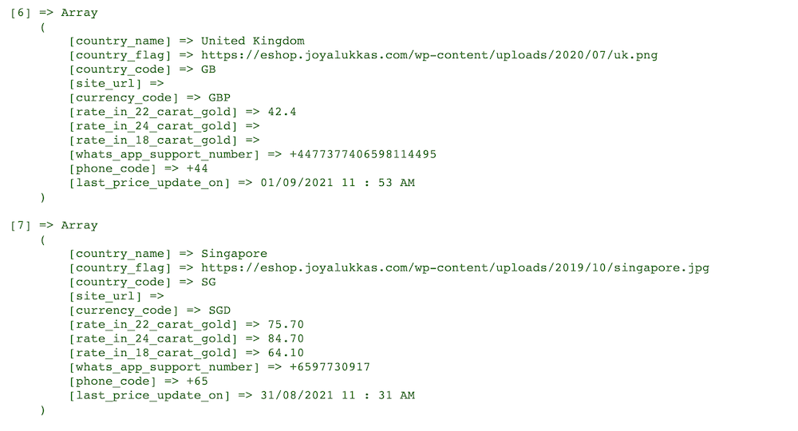

I use Google Sheets for tracking my expenses, assets, and liabilities. Google Sheet has a first-class support for querying the latest values of stocks on US-based exchanges like <code>NASDAQ</code> or <code>NYSE</code>. On the other hand it doesn't have support for getting spot price of metals and commodities which can vary market by market.

In this article I have shared a hack on how to scrape some reliable sources of gold prices and get the latest values in Google sheets to easily track the latest value of gold by market.

<div style="text-align: center">
    
</div>

In the past I wrote about how to get the spot price of metals or other commodities using `metals-api` and `AppScript`. While it works, it has two caveats:
 - Free tier only supports `50 API calls / month` — _Which can easily be super low!_
 - Spot price may not reflect the reality on ground from region to region.

## Source of data
I use `eshop.joyalukkas.com` as source of data. In their own words:

> Joyalukkas has expanded into a revered global jewellery brand since its inception in 1987, serving over 10 million customers in 160 showrooms across 11 countries. Our highly committed team of 8000 employees personify the group’s unwavering dedication to quality. Being the world’s favourite jeweller, Joyalukkas brings forth an exuberant choice of artistic pieces for customers from all walks of life. We are the first jewellery retailer to receive esteemed ISO 9001:2008 and 14001:2004 certifications...

I know them because I have purchased gold offline from them, and they are pretty big deal, so we can trust the data.

In their website, they have inline JavaScript with the data structured by country like this:
<div style="text-align: center">
    
</div>

From scraping perspective, this is a gold mine 😂. So let's use `Google Apps Script` to write Google sheet functions and get them into our Google sheets in a tidy manner.


## Getting gold price in Google Sheets

> Google Apps Script lets you do new and cool things with Google Sheets. You can use Apps Script to add custom menus, dialogs, and sidebars to Google Sheets. It also lets you write custom functions for Sheets, as well as integrate Sheets with other Google services like Calendar, Drive, and Gmail.

[Source: developer.google.com](https://developers.google.com/apps-script/guides/sheets) — Read more about `Apps Script` here. The syntax is almost the same as JavaScript.

You can create a new script in Google Sheets by going to `Tools > Script Editor`.


### [1] Create a new script called `joyAllukas.gs`
Create a new file called `joyAllukas` (should get saved as `joyAllukas.gs`).

Let's define a function `joyAllukasGoldPrice` that query price for `Singapore`.

```js
/**
 * Returns an object with latest price of gold in Singapore in SGD.
 *
 * Data is returned as {24: <24 carat price>, 18: <18 carat price>, 22: <22 carat price>}.
 */
function joyAllukasGoldPrice(cahceDurationSeconds=600) {

    // Add caching support, to avoid too many calls.
    // It's only ethical we don't add unnecessary load on the server.
    const cacheId = "JoyAllukasSingapore";
    let cache = CacheService.getDocumentCache();
    var cached = cache.get(cacheId);
    if (cached != null) {
        let result = JSON.parse(cached);
        if (result) {
            Logger.log("Data from cache: " + JSON.stringify(result));
            return result;  
        }
    }

    // Note, in
    const singaporeLineCode = "[country_name] => Singapore";
    const carats = ["24", "22", "18"];
    const format = "rate_in_%%_carat_gold";

    const url = "https://eshop.joyalukkas.com";
    const expectingToFind = 3;

    // Load the content as text.
    var html = UrlFetchApp.fetch(url).getContentText();
    var splits = html.split("\n");
    var singaporeFound = false;
    var found = 0;

    // Following is a very crude way to find the data. I am sure it can be done
    // better using regular expression. Feel free to replace the code to make
    // it more robust. This is a quick dirty way that works today.
    const result = {24: 0, 22: 0, 18: 0};
    for (var i = 0; i < splits.length; i++) {
        var line = splits[i];
        if (!singaporeFound) {
            if (line.includes(singaporeLineCode)) {
                singaporeFound = true;
            }
            continue;
        }

        for (var j = 0; j < carats.length; j++) {
            const carat = carats[j];
            const needle = format.replace("%%", carat);
            if (line.includes(needle)) {
                // Looking for format like:
                // format = "             [rate_in_22_carat_gold] => 77.30, "
                const value = line.trim().split("=>")[1].trim().split(",")[0];
                result[parseInt(carat)] = parseFloat(value);
                found++;
            }
        }

        if (found == expectingToFind) {
            break;
        }
    }

    cache.put(cacheId, JSON.stringify(result), cahceDurationSeconds);
    Logger.log(result);
    return result;
}
```

And then you can wrap this with some sub-functions like:

```js
function joyAllukasGold24kSg(cahceDurationSeconds=600) {
    var result = joyAllukasGoldPrice(cahceDurationSeconds);
    if (24 in result) return result[24];
    return result["24"];
}

function joyAllukasGold22kSg(cahceDurationSeconds=600) {
    var result = joyAllukasGoldPrice(cahceDurationSeconds);
    if (22 in result) return result[22];
    return result["22"];
}

function joyAllukasGold18kSg(cahceDurationSeconds=600) {
    var result = joyAllukasGoldPrice(cahceDurationSeconds);
    if (18 in result) return result[18];
    return result["18"];
}
```

### [2] Save the script and use it in Google Sheets

After saving you'd see output something like this*:

{:class="styled-table"}
| Function in Google Sheet | Output (values are per gram) |
| ------------------ | --------------- |
| =joyAllukasGold24kSg() | 85.30 |
| =joyAllukasGold22kSg() | 76.30 |
| =joyAllukasGold18kSg() | 64.60 |

_*The values are from the date I wrote this article (09/01/2021)._

### You can customize the script to do so much more
If you take another look at the gold mine of data

```
[6] => Array
    (
        [country_name] => United Kingdom
        [country_flag] => https://eshop.joyalukkas.com/wp-content/uploads/2020/07/uk.png
        [country_code] => GB
        [site_url] => 
        [currency_code] => GBP
        [rate_in_22_carat_gold] => 42.4
        [rate_in_24_carat_gold] => 
        [rate_in_18_carat_gold] => 
        [whats_app_support_number] => +4477377406598114495
        [phone_code] => +44
        [last_price_update_on] => 01/09/2021 11 : 53 AM
    )
```

You can customize your `Apps Script` to get all the structured information back to caller and then have easy functions that can give the gold price by `country code` or in right currency of choice at different carats.

### Link to full script
You can find the full script [here](https://gist.github.com/mebjas/c5f7b8b3ad265af3a89405ebc548aa1e).

## Since the data is scraped, it can stop working in future
If the source of data decides change the structure, it can stop working. Please let me know if that happens — I'll update this article. Also, feel free to share more robust approaches in the comment section.

## Is such scraping legal
> Is it legal to scrape data from websites using software ? The answer to this question is not a simple yes or no.
>
> The real question here should be regarding how you plan to use the data which you have extracted from a website (either manually or via using software). Because the data displayed by most website is for public consumption. It is totally legal to copy this information to a file in your computer. But it is regarding how you plan to use this data that you should be careful about. If the data is downloaded for your personal use and analysis, then it is absolutely ethical. But in case you are planning to use it as your own, in your website, in a way which is completely against the interest of the original owner of the data, without attributing the original owner, then it is unethical, illegal.

_Source - [webharvy.com](https://www.webharvy.com/articles/is-scraping-legal.html)_

## Attributions
1.  [People vector created by freepik — www.freepik.com](https://www.freepik.com/vectors/people)