I have been reading the book [Digital Image Processing — by Rafael C. Gonzalez & Richard E. Woods](https://www.amazon.com/gp/product/9353062985/ref=as_li_tl?ie=UTF8&camp=1789&creative=9325&creativeASIN=9353062985&linkCode=as2&tag=minhazav07-20&linkId=1f68b39f7dc9c5752a6ba0e8a391571c) and writing some notes to remember. But I realized I have done this before, but I don't know where the notebooks are. So here I am writing my notes in an article, chapter by chapter. This one is from chapter — 2 — **Intensity transformation and spatial filtering**. I'll only be listing some key pointers, sample code and the result of running them.

For other readers this article may be interesting if you are looking for code examples on how to run a certain algorithm you read about in the chapter.

<div style="text-align: center">
<a target="_blank"  href="https://www.amazon.com/gp/product/9353062985/ref=as_li_tl?ie=UTF8&camp=1789&creative=9325&creativeASIN=9353062985&linkCode=as2&tag=minhazav07-20&linkId=1f68b39f7dc9c5752a6ba0e8a391571c"></a>
<br /></div>

> _Disclaimer: While I do recommend this book (I use it) for learning digital image processing, if you buy this book via this link — I'll be paid a certain small percentage in commission._

## Log transformation

 - Applies `s = c * log(1 + r)` transformation.
 - Expands the value of dark pixels in an image.

```py
## Stretch the image between [0..255].
C = 255.0 / 5.545177444479562
lut = [C * math.log(1 + i) for i in range(0, 256)]
lut = np.array(lut, dtype='uint8')
transformed = cv2.LUT(img, lut)

## Plot side by side.
plotimage2(img, transformed, "Original image", "Log transformed image")
```

<div style="text-align: center">
    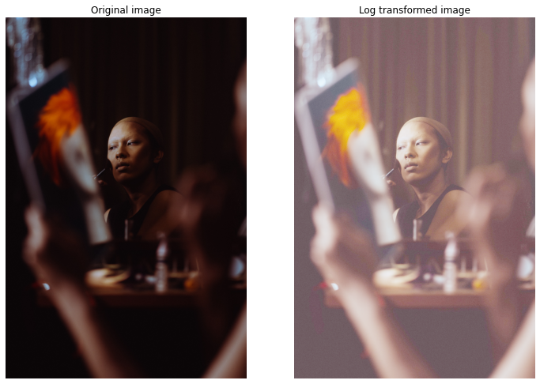
</div>

## Gamma transformation
 - Applies `s = c * r^gamma` transformation.
 - Also called power-law transformation.
 - Can be used to brighten or darken the image in non-linear fashion.

```py
G = 1.5
lut = [math.pow(i / 255, 1.0 / G) * 255.0 for i in range(0, 256)]
lut = np.array(lut, dtype='uint8')

transformed = cv2.LUT(img, lut)

## Plot side by side.
plotimage2(
    img,
    transformed,
    "Original image",
    "Gamma %.2f transformed image" % G)
```

<div style="text-align: center">
    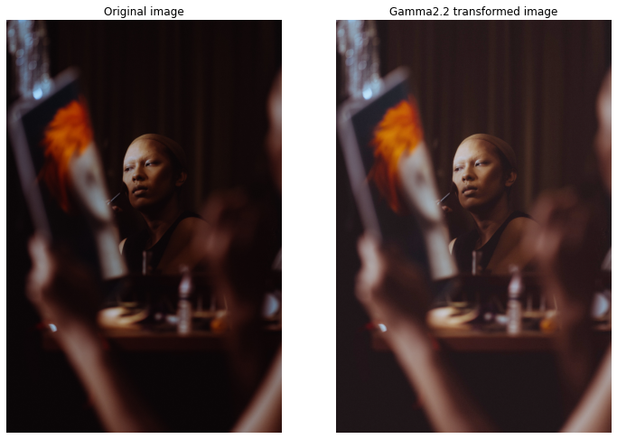
</div>

## Contrast stretching

 - Expands the range of intensity levels in an image so that it spans the ideal full intensity range.

```py
rmax = image.max()
rmin = image.min()
max_intensity_level = 255
r_diff = rmax - rmin
lut = [ (i - rmin) / r_diff * max_intensity_level for i in range(0, 256)]
lut = np.array(lut, dtype='uint8')
result = cv2.LUT(image, lut)
```

<div style="text-align: center">
    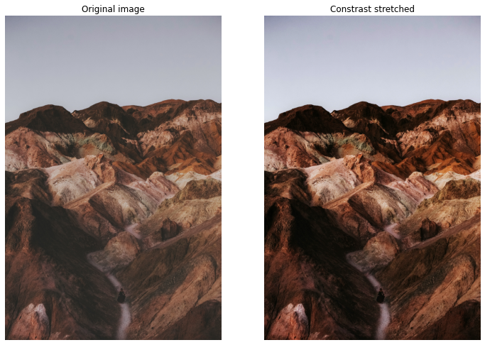
</div>

## Histogram equalization
 - Improve image contrast by spreading intensities to all levels.

```py
def equalize(image):
    hist = cv2.calcHist([image], [0], None, [256], [0, 256])
    n_pixels = image.shape[0] * image.shape[1]
    normalized_hist = hist / n_pixels
    cdf = np.zeros(256)
    cdf[0] = normalized_hist[0] * 255.0
    for i in range(1, 256):
        cdf[i] = cdf[i - 1] + normalized_hist[i] * 255.0
    lut = np.array(cdf, dtype='uint8')
    return cv2.LUT(image, lut)
```

<div style="text-align: center">
    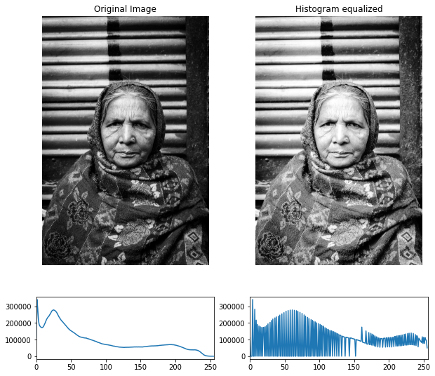
</div>

## Histogram Matching (specification)
 - Mapping histogram of one image to histogram of another image.

<div style="text-align: center">
    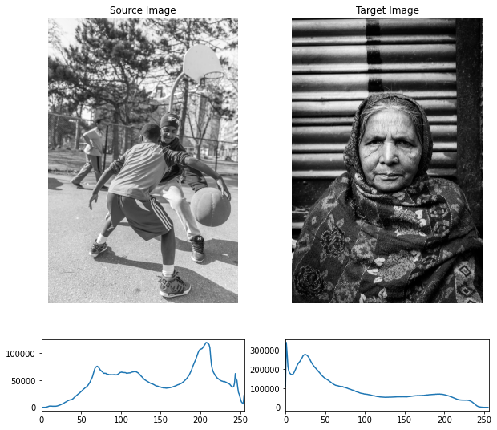
</div>

```py
def equalize_lut(image):
    hist = cv2.calcHist([image], [0], None, [256], [0, 256])
    n_pixels = image.shape[0] * image.shape[1]
    normalized_hist = hist / n_pixels
    cdf = np.zeros(256)
    cdf[0] = normalized_hist[0] * 255.0
    for i in range(1, 256):
        cdf[i] = cdf[i - 1] + normalized_hist[i] * 255.0
    lut = np.array(cdf, dtype='uint8')
    return lut

im1_e = equalize(im1)
im2_e = equalize(im2)

lut1 = equalize_lut(im1)
lut2 = equalize_lut(im2)

matching_lut = np.zeros(256)
for i, r1 in enumerate(lut1):
    for j, s1 in enumerate(lut2):
        if j == 255:
            break
        
        if r1 >= s1 and r1 <= lut2[j + 1]:
            matching_lut[i] = j

matching_lut[255] = matching_lut[254]
im1_transferred = cv2.LUT(im1, np.array(matching_lut, dtype='uint8'))
```

<div style="text-align: center">
    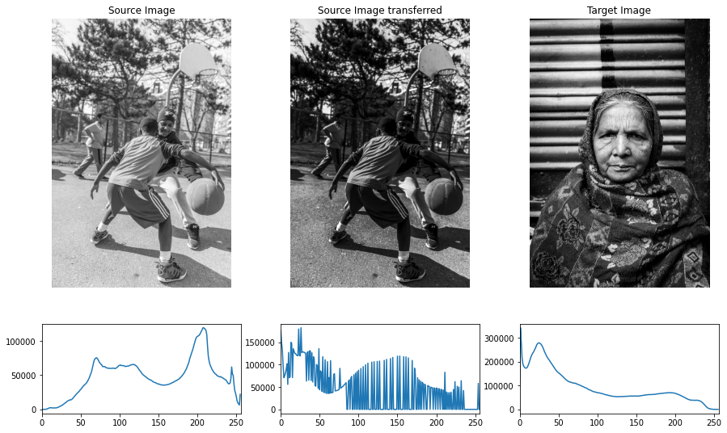
</div>

## Blur — Low pass filters
 - Non-separable filters complexity — `O(MNmn)`
 - Separable filters complexity — `O(MN(m+n))`
 - Spatial correlation vs spatial convolution, convolution kernel pre-rotated by 180 degrees.
 - Isotropic kernel — circular symmetry — their response is independent of the orientation.
 - Gaussian kernel — only circular & separable filter.
 - Low pass filter — smoothening.
 - High pass filter — sharpening.

<div style="text-align: center">
    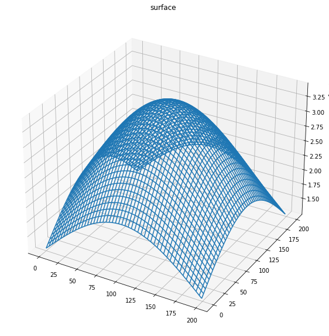<br>
    <i>Gaussian kernel of size 200x200.</i>
</div>

```py
## Seprable 1D kernel, ksize=5, sigma=5
kernel_1d = cv2.getGaussianKernel(5, 5)
blurred = cv2.sepFilter2D(img, -1, kernel_1d, kernel_1d)
```

<div style="text-align: center">
    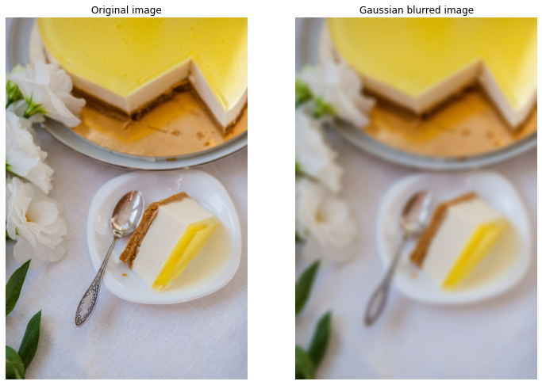
</div>

## Sharpening — High pass filter

### Laplacian — 2nd order derivative

 - `∇^2 f(x, y) = f(x + 1, y) + f(x - 1, y) + f(x, y + 1) + f(x, y - 1) - 4*f(x, y)`, `∇^2 f(x, y)` is the Laplacian (2nd order derivative).
 - Kernel generated for this is isotropic for rotations in increment of 90 degrees.
 - Diagonal directions can be incorporated with following kernel.
   ```
   -1, -1, -1
   -1,  8, -1
   -1, -1, -1
   ```
  - Sharpening can be achieved by adding the Laplacian to the image `g(x, y) = f(x, y) + c * (∇^2 f(x, y))` where `g(x, y)` is the sharpened image and `f(x, y)` is the input image.

```py
laplacian_kernel = [[-1, -1, -1],
                   [-1, 8, -1],
                   [-1, -1, -1]]
laplacian_kernel = np.array(laplacian_kernel)

laplacian = cv2.filter2D(gray, -1, laplacian_kernel)
```
<div style="text-align: center">
    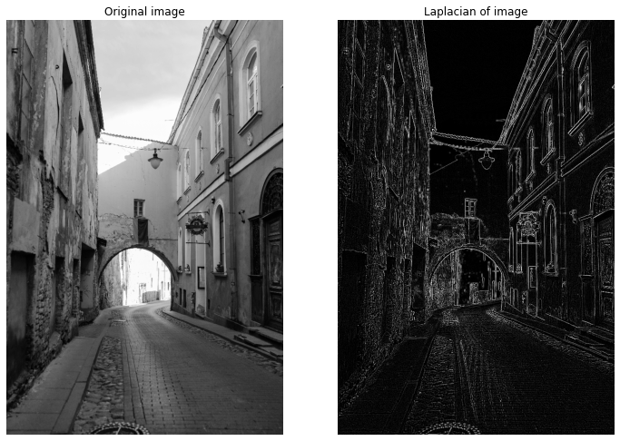
</div>

### Sharpen

```py
sharpen_kernel = [[-1, -1, -1],
                   [-1, 9, -1],
                   [-1, -1, -1]]
sharpen_kernel = np.array(sharpen_kernel)

sharpened_image = cv2.filter2D(image, -1, sharpen_kernel)
```

<div style="text-align: center">
    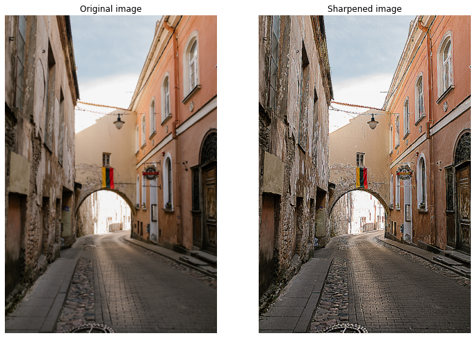
</div>

### Sobel — 1st order derivative

 - `∇f(x, y) = [∂f / ∂x, ∂f / ∂y]` — this points in direction of the change of f at point (x, y).
 - Magnitude can be computed as `||∇f|| = sqrt(Gx * Gx + Gy * Gy)`.
 - Direction is given by `theta = atan2(Gy / Gx)`
 - Sobel and Feldman presented the idea of an "Isotropic 3x3 Image Gradient Operator" at a talk at SAIL in 1968, computes approximation of the gradient operator.

```py
sobel_x_kernel = [[-1, -2, -1],
                   [0, 0, 0],
                   [1, 2, 1]]
sobel_x_kernel = np.array(sobel_x_kernel)

sobel_y_kernel = [[-1, 0, 1],
                   [-2, 0, 2],
                   [-1, 0, 1]]
sobel_y_kernel = np.array(sobel_y_kernel)

sobel_x = cv2.filter2D(gray, -1, sobel_x_kernel)
sobel_y = cv2.filter2D(gray, -1, sobel_y_kernel)
```

<div style="text-align: center">
    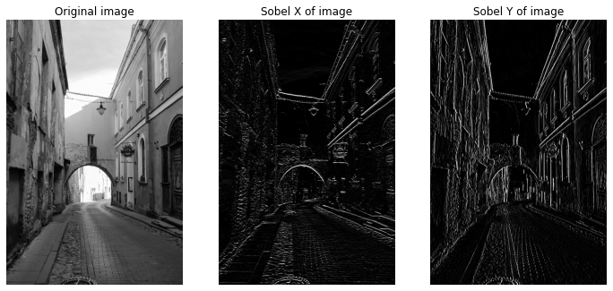
</div>


## Reference
1.   [https://docs.opencv.org/3.4/d4/d1b/tutorial_histogram_equalization.html](https://docs.opencv.org/3.4/d4/d1b/tutorial_histogram_equalization.html)
2.   [Histogram equalization](https://medium.com/@kyawsawhtoon/a-tutorial-to-histogram-equalization-497600f270e2)
3.   [histogram transfer](https://towardsdatascience.com/histogram-matching-ee3a67b4cbc1)
