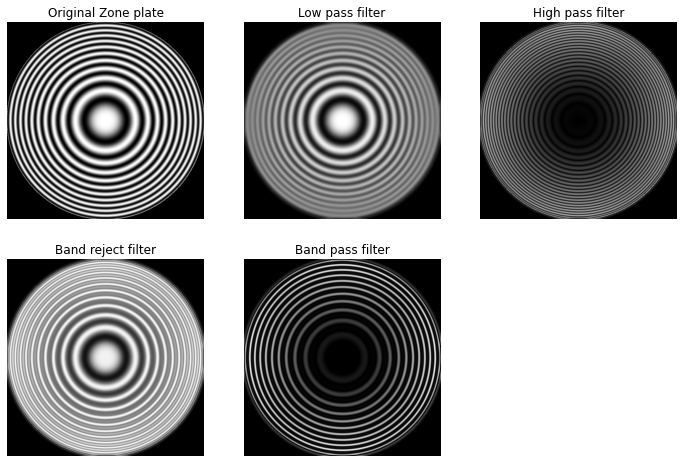
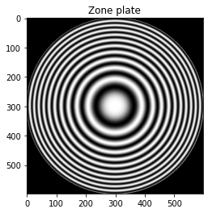
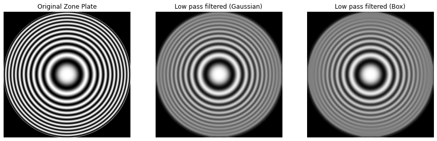
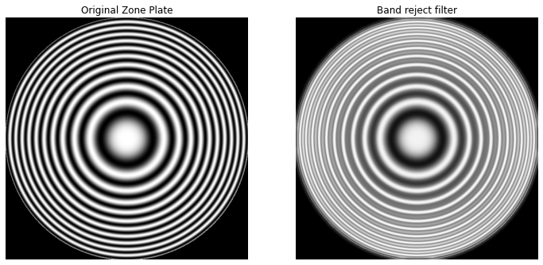
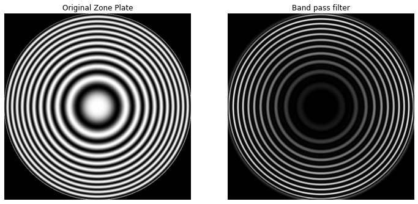

Spatial domain and frequency domain filters are commonly classified into four
types of filters — low-pass, high-pass, band-reject and band-pass filters. In
this article I have notes, code examples and image output for each one of them.

## Types of filters

<div style="text-align: center">
    
</div>

 - **Lowpass filters**: Allow passing only low frequency details, attenuates the high frequency details. Example: Smoothening filters.
 - **Highpass filters**: Allows passing only high frequency details, attenuates the low frequency details. Example: Sharpening mask filters.
 - **Bandreject filters**: Attenuate signal in range of a certain frequency. Allows frequency below a certain threshold and above another threshold to pass.
 - **Bandpass filters**: Only allows signals within a certain band to pass, attenuates the frequencies below a threshold and above another threshold to pass.

<!-- TODO(minhazav) Add image samples for all of these. -->

### Spatial kernels in terms of low-pass kernel — `lp(x, y)`

{:class="styled-table"}
| Kernels | Equation |
| ------ | --------- |
| Lowpass kernel | `lp(x, y) `|
| Highpass kernel | `hp(x, y) = δ(x, y) - lp(x, y)` |
| Bandreject kernel | `br(x, y) = lp1(x, y) + hp2(x, y)` <br>  `br(x, y) = lp1(x, y) + (δ(x, y) - lp2(x, y))` |
| Bandpass kernel | `bp(x, y) = δ(x, y) - br(x, y)` |

>  `δ(x, y)` is a unit impulse kernel

## Processing images with these filters using Zone plate
Zone plate is used for testing the characteristics of the filters. There are various versions of zone plates the one I'd be using can be generated with:


> Where x, y belong to `[-8.2, 8.2]` increasing in steps of `0.0275` to form a 597x597 image.

<div style="text-align: center">
    
</div>

```py
def zone(x, y):
    return 0.5 * (1 + math.cos(x * x + y * y))

SIZE = 597
image = np.zeros((SIZE, SIZE))

start = -8.2
end = 8.2
step = 0.0275

def dist_center(y, x):
    global SIZE
    center = SIZE / 2
    return math.sqrt( (x - center)**2 + (y - center)**2)

for y in range(0, SIZE):
    for x in range(0, SIZE):
        if dist_center(y, x) > 300:
            continue
        y_val = start + y * step
        x_val = start + x * step
        image[y, x] = zone(x_val, y_val)
```

## Lowpass filter

```py
kernel_size = 15

lowpass_kernel_gaussian = gkern(kernel_size)
lowpass_kernel_gaussian = lowpass_kernel_gaussian / lowpass_kernel_gaussian.sum()

lowpass_kernel_box = np.ones((kernel_size, kernel_size))
lowpass_kernel_box = lowpass_kernel_box / (kernel_size * kernel_size)

lowpass_image_gaussian = cv2.filter2D(image, -1, lowpass_kernel_gaussian)
lowpass_image_box = cv2.filter2D(image, -1, lowpass_kernel_box)
```

<div style="text-align: center">
    
</div>

## Highpass filter

In spatial domain, a Highpass filtered image can be obtained by subtracting
a Lowpass filtered image from the image itself (like unsharp mask).

```py
highpass_image_gaussian = image - lowpass_image_gaussian
highpass_image_gaussian = np.absolute(highpass_image_gaussian)

highpass_image_box = image - lowpass_image_box
highpass_image_box = np.absolute(highpass_image_box)
```

<div style="text-align: center">
    
</div>

## Bandreject filter
Similarly, a Bandreject filtered image can be obtained by adding a Lowpass filtered with a Highpass filtered image (at different threshold).

```py
bandreject_image = lowpass_image_gaussian + highpass_image_box
```

<div style="text-align: center">
    
</div>

## Bandpass filter
And Bandpass filtered image can be obtained by subtracting the Bandreject filtered image from
the image itself.

```py
bandpass_image = image - bandreject_image
bandpass_image = np.absolute(bandpass_image)
```

<div style="text-align: center">
    
</div>

## Credits

A lot of this is derived from the book [Digital Image Processing — by Rafael C. Gonzalez & Richard E. Woods](https://www.amazon.com/gp/product/9353062985/ref=as_li_tl?ie=UTF8&camp=1789&creative=9325&creativeASIN=9353062985&linkCode=as2&tag=minhazav07-20&linkId=1f68b39f7dc9c5752a6ba0e8a391571c) and can be used as quick refresher.
I'll only be listing some key pointers, sample code and the result of running them.

<div style="text-align: center">
<a target="_blank"  href="https://www.amazon.com/gp/product/9353062985/ref=as_li_tl?ie=UTF8&camp=1789&creative=9325&creativeASIN=9353062985&linkCode=as2&tag=minhazav07-20&linkId=1f68b39f7dc9c5752a6ba0e8a391571c"></a>
<br /></div>

> _Disclaimer: While I do recommend this book (I use it) for learning digital image processing, if you buy this book via this link — I'll be paid a certain small percentage in commission._