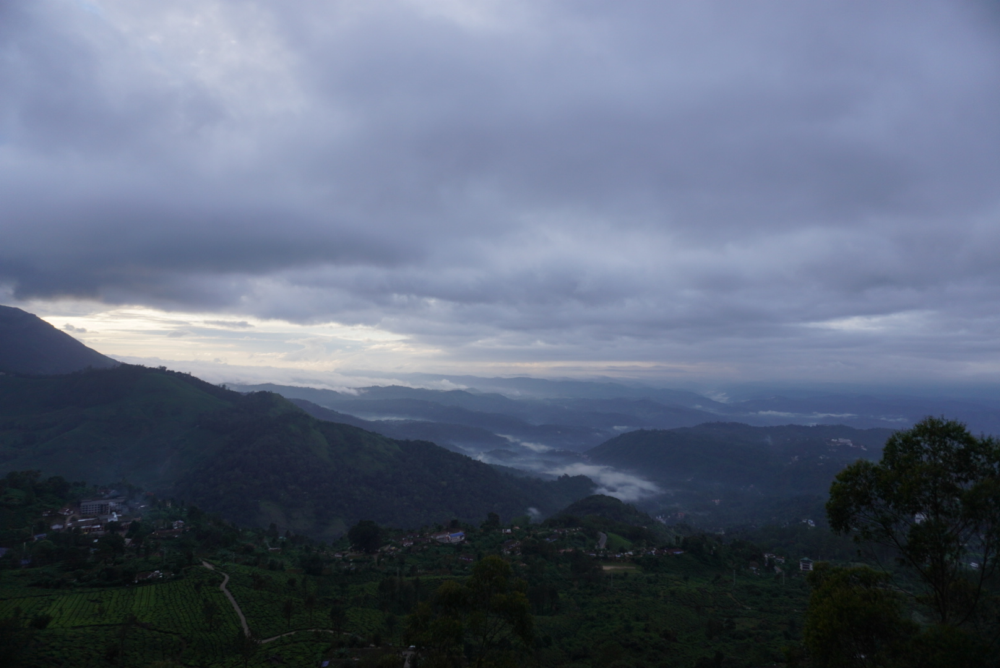
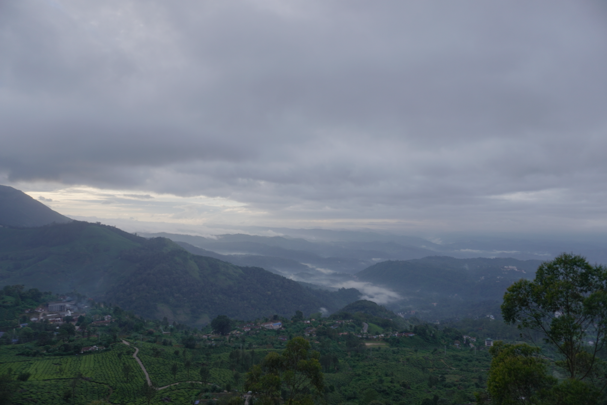
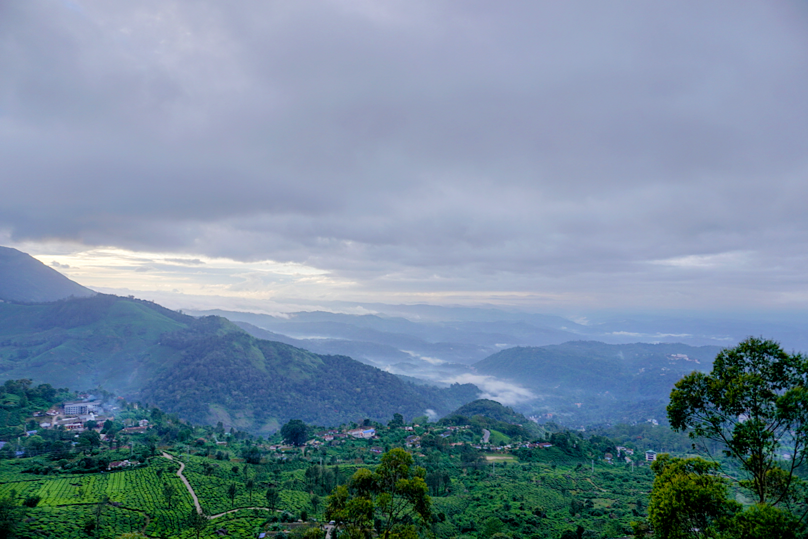

Very often it happens that when we take pictures particularly with DSLR or phone camera without HDR the images turns out to be like this

    

Even though from our eyes it'd look like this

    

And a great photographer would capture it like this.

    

This is all done with a technology called HDR — High Dynamic Range Imaging.

- Aurora HDR : https://skylum.com/aurorahdr
- 8 Free HDR software: https://expertphotography.com/free-hdr-software/