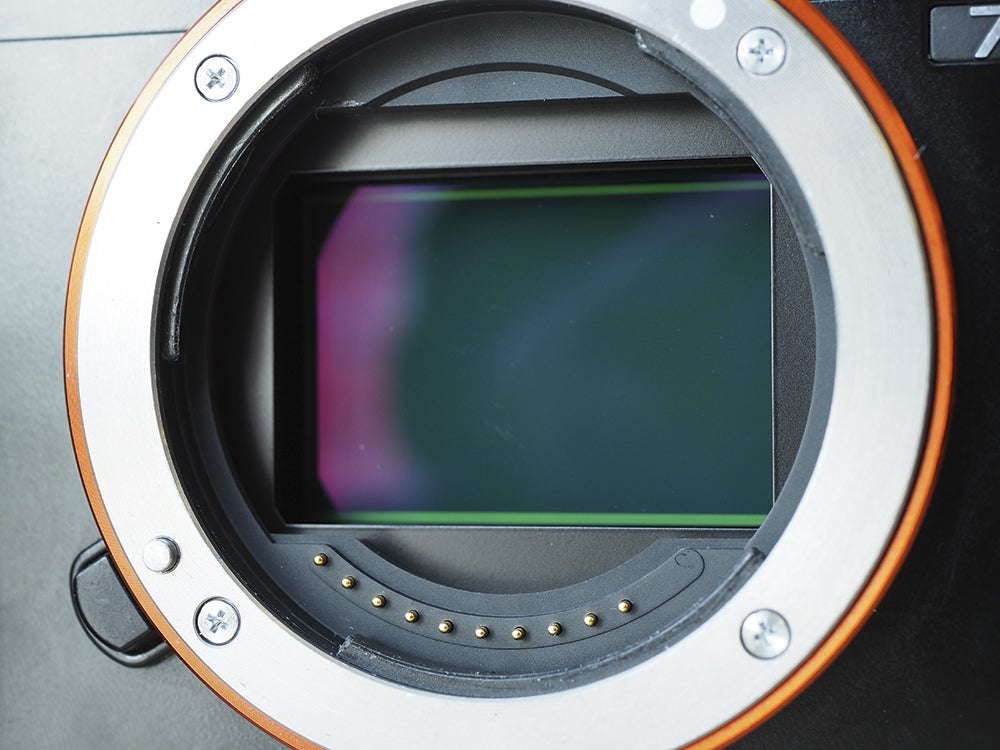
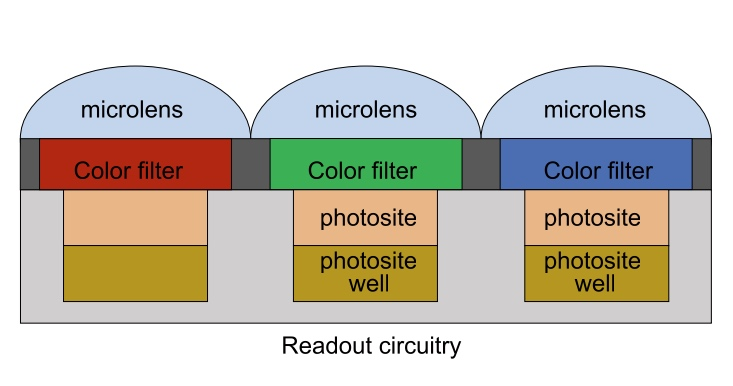

Most of us today have a smartphone we can't keep our hands off of. And one of the most important features of the smartphone, is **the camera**. And many photography enthusiasts may have additional equipments like a DSLR or a mirrorless camera or even a GoPro or a drone. So how do we decide if a camera is good or bad? It depends on several components - like the main 'sensor' in the camera, the software stack (that's usually associated with manufacturing company), the processor which dictates the performance of the camera and so on.

In this article I'll be explaining some less known properties of a camera sensor that could be used to evaluate the sensors used in the camera.

> I don't think this will help you select the next smartphone as most of this information was not handed out by the smartphone manufacturer. This will instead give you a little more insight into the metrics relevant at the sensor level.

<div style="text-align: center; margin-bottom: 10px">
    
    <br>
    <i>Figure: A CMOS sensor in a mirrorless camera. </i>
</div>

## Basics of a camera sensor

<div style="text-align: center; margin-bottom: 10px">
    
    <br>
    <i>Figure: Simple high level diagram of camera sensor pixel level circuitry. </i>
</div>

### Color filters
Usually sensors have a 2D array of pixels each collecting a certain color / wavelength of light. A typical photo sensor detects intensity of light with little or no wavelength specificity and thus cannot separate the colors in the incoming light. The color filters only allow light in certain wavelength range to pass. A typical pattern is to have the color filters in RGBG pattern, such that a four pixel block has - one red, one blue and two green color detecting pixels. There are other kinds of filter patterns as well - you can read more about them [here](https://en.wikipedia.org/wiki/Color_filter_array).

### Photosite & Photosite well
Photosite is composed of photo sensitive materials (or photodiodes) which release electrons upon receiving photons. When the shutter button is clicked the electron accumulation begins in the photosite well and collection stops when the shutter closes again. This duration is commonly referred to as exposure time.

### Microlens
Microlens a.k.a lenslet help photosite collect more light by bending the rays towards the photosensitive area thus increasing the amount of photons received.

### Readout circuitry
The accumulated electrons are sensed and amplified based on sensor sensitivity settings and converted to discrete signals later in Analog to Digital Conversion (ADC) stage. The discrete signals then undergo a series of image processing steps and usually output is generated for user consumption in 8-bit format. You can read more about these steps in another article (although scoped to Android).

<div class="post-info" style="border: 1px solid #cfcfcf73; padding: 10px; margin: 10px;">
    <h3 class="post-header"><a class="post-link" href="https://blog.minhazav.dev/android-camera-subsystem-basic-image-processing-steps-done-at-hardware-level-in-android-camera/">Android Camera Subsystem - basic image processing steps done at hardware level in Android Camera</a></h3>
     <span class="post-description">
       
       In this post, I'll be describing various algorithms implemented in the android camera subsystem that is consistent across OEMs which are used to produce stunning images that we capture from camera applications.
     </span>
     <br>
     <span class="read-more"><a href="https://blog.minhazav.dev/android-camera-subsystem-basic-image-processing-steps-done-at-hardware-level-in-android-camera/">[&nbsp;Read&nbsp;more&nbsp;]</a></span>
</div>

## Different quality metrics
Moving on to the crux of the articles, some very basic yet not so commonly known quality metrics of a camera sensor. All of these should be applicable to both CCD and CMOS sensors.

### Quantum Efficiency
Quantum Efficiency is defined as:

```
QE = # of electrons / # of photons
```

Since the energy of photon is inversely proportional to its wavelength QE is measured over a range of different wavelengths to characterize a device's quantum efficiency at each photo energy level. A photographic film typically has a QE of less than `10%` while new commercial CCD based sensors can have `QE` of over `90%`.

### Photosite full well capacity

<svg xmlns="http://www.w3.org/2000/svg" xmlns:xlink="http://www.w3.org/1999/xlink" version="1.1" width="402px" viewBox="-0.5 -0.5 402 311" content="&lt;mxfile host=&quot;app.diagrams.net&quot; modified=&quot;2021-12-18T15:01:00.579Z&quot; agent=&quot;5.0 (Macintosh; Intel Mac OS X 10_15_7) AppleWebKit/537.36 (KHTML, like Gecko) Chrome/96.0.4664.93 Safari/537.36&quot;" style="max-width:100%;max-height:311px;"><defs/><g><path d="M 30 280 L 400 280" fill="none" stroke="#000000" stroke-miterlimit="10" pointer-events="stroke"/><path d="M 30 280 L 30 0" fill="none" stroke="#000000" stroke-miterlimit="10" pointer-events="stroke"/><path d="M 30 280 L 190 160" fill="none" stroke="#000000" stroke-miterlimit="10" stroke-dasharray="3 3" pointer-events="stroke"/><path d="M 190 160 L 390 160" fill="none" stroke="#000000" stroke-miterlimit="10" stroke-dasharray="3 3" pointer-events="stroke"/><rect x="30" y="290" width="370" height="20" fill="none" stroke="none" pointer-events="all"/><g transform="translate(-0.5 -0.5)"><switch><foreignObject pointer-events="none" width="100%" height="100%" requiredFeatures="http://www.w3.org/TR/SVG11/feature#Extensibility" style="overflow: visible; text-align: left;"><div xmlns="http://www.w3.org/1999/xhtml" style="display: flex; align-items: unsafe center; justify-content: unsafe center; width: 368px; height: 1px; padding-top: 300px; margin-left: 31px;"><div style="box-sizing: border-box; font-size: 0px; text-align: center;"><div style="display: inline-block; font-size: 12px; font-family: Helvetica; color: rgb(0, 0, 0); line-height: 1.2; pointer-events: all; white-space: normal; overflow-wrap: normal;">No of photons --&gt;</div></div></div></foreignObject><text x="215" y="304" fill="#000000" font-family="Helvetica" font-size="12px" text-anchor="middle">No of photons --&gt;</text></switch></g><rect x="-129.23" y="129.23" width="280" height="21.54" fill="none" stroke="none" transform="rotate(-90,10.77,140)" pointer-events="all"/><g transform="translate(-0.5 -0.5)rotate(-90 10.769999999999982 140)"><switch><foreignObject pointer-events="none" width="100%" height="100%" requiredFeatures="http://www.w3.org/TR/SVG11/feature#Extensibility" style="overflow: visible; text-align: left;"><div xmlns="http://www.w3.org/1999/xhtml" style="display: flex; align-items: unsafe center; justify-content: unsafe center; width: 278px; height: 1px; padding-top: 140px; margin-left: -128px;"><div style="box-sizing: border-box; font-size: 0px; text-align: center;"><div style="display: inline-block; font-size: 12px; font-family: Helvetica; color: rgb(0, 0, 0); line-height: 1.2; pointer-events: all; white-space: normal; overflow-wrap: normal;">No of electrons ---&gt;</div></div></div></foreignObject><text x="11" y="144" fill="#000000" font-family="Helvetica" font-size="12px" text-anchor="middle">No of electrons ---&gt;</text></switch></g><rect x="210" y="90" width="130" height="20" fill="none" stroke="none" pointer-events="all"/><g transform="translate(-0.5 -0.5)"><switch><foreignObject pointer-events="none" width="100%" height="100%" requiredFeatures="http://www.w3.org/TR/SVG11/feature#Extensibility" style="overflow: visible; text-align: left;"><div xmlns="http://www.w3.org/1999/xhtml" style="display: flex; align-items: unsafe center; justify-content: unsafe center; width: 128px; height: 1px; padding-top: 100px; margin-left: 211px;"><div style="box-sizing: border-box; font-size: 0px; text-align: center;"><div style="display: inline-block; font-size: 12px; font-family: Helvetica; color: rgb(0, 0, 0); line-height: 1.2; pointer-events: all; white-space: normal; overflow-wrap: normal;">Saturation Point</div></div></div></foreignObject><text x="275" y="104" fill="#000000" font-family="Helvetica" font-size="12px" text-anchor="middle">Saturation Point</text></switch></g><path d="M 190 160 Q 220 150.77 195 125.77 Q 170 100.77 213.63 100.77" fill="none" stroke="#000000" stroke-miterlimit="10" pointer-events="stroke"/><path d="M 218.88 100.77 L 211.88 104.27 L 213.63 100.77 L 211.88 97.27 Z" fill="#000000" stroke="#000000" stroke-miterlimit="10" pointer-events="all"/></g><switch><g requiredFeatures="http://www.w3.org/TR/SVG11/feature#Extensibility"/><a transform="translate(0,-5)" xlink:href="https://www.diagrams.net/doc/faq/svg-export-text-problems" target="_blank"><text text-anchor="middle" font-size="10px" x="50%" y="100%">Viewer does not support full SVG 1.1</text></a></switch></svg><br>
<i>Figure: Photosite response</i><br><br>

We can assume sensors mostly have a linear response to incident photons (with the slope of the line being the quantum efficiency), but at a certain point we can assume that the photosite well can hold no more electrons and call it saturated. This capacity of number of electrons a photosite can hold before getting saturated can be called full well capacity.

Two factors that contributes to this are:
 - `Pixel pitch`: The length of one side of a square pixel (typically 1-20 micrometer).
 - `Percentage fill factor`: The percentage of the pixel size taken up by photosensitive material as it determines the actual area receiving the incident light.

However, it's useful to note that microlens play a role here, microlenses can bend the light towards the photosensitive material thus increasing the effective area receiving light. Thus, it's useful to evaluate `effective fill factor` instead of actual `fill factor`.

## So, what makes a camera sensor good?
There are of-course more components, but if you are considering the above-mentioned properties you want better Quantum Efficiency and full well capacity to take high SNR and high dynamic range shots.

## References
 - [CMU computational photography lecture 2 on digital photography - PDF](http://graphics.cs.cmu.edu/courses/15-463/lectures/lecture2.pdf)
 - [Color Filter Array - CFA, Wikipedia](https://en.wikipedia.org/wiki/Color_filter_array)