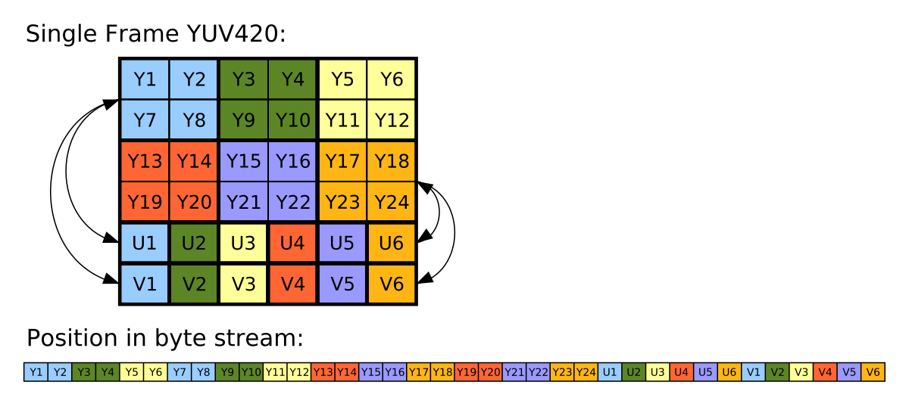

`Halide` is a programming language designed to make it easier to write high-performance image and array processing code on modern machines.

> TODO(minhazav) Add more information.

 - Halide currently targets: diff CPU, diff OS, diff compute APIs like CUDA, OpenCL, OpenGL…
 - Rather than being a standalone programming language, Halide is embedded in C++.

You can [read more about it at halide-lang.org](https://halide-lang.org)

> We use Halide heavily, when building performance intensive algorithms for low-end devices (as well as high-end devices) at Google.

## Halide example

> TBA — blur example

## YUV to RGB conversion
I have been exploring performance of different frameworks / technologies for performance of image processing in Android taking the example of YUV Image to Bitmap conversion. Here are some examples of the same using other techniques.

    <h3 class="post-header"><a class="post-link" href="https://blog.minhazav.dev/processing-images-fast-with-native-code-in-android/">Procesing images fast with native code in Android</a></h3>
     
       
       TODODODODODODODO
     
     <a href="https://blog.minhazav.dev/processing-images-fast-with-native-code-in-android/">[.. &nbsp;Read&&nbsp;more&nbsp;]</a>

    <h3 class="post-header"><a class="post-link" href="https://blog.minhazav.dev/how-to-use-renderscript-to-convert-YUV_420_888-yuv-image-to-bitmap/">How to use RenderScript to convert YUV_420_888 YUV Image to Bitmap</a></h3>
     
       
       RenderScript turns out to be one of the best APIs for running computationally-intensive code on the CPU or GPU (that too, without having to make use of the NDK or GPU-specific APIs). In this code I have explained how to use ScriptIntrinsicYuvToRGB intrinsic that is available in Android APIs to convert an android.media.Image in YUV_420_888 format to Bitmap.
     
     <a href="https://blog.minhazav.dev/how-to-use-renderscript-to-convert-YUV_420_888-yuv-image-to-bitmap/">[.. &nbsp;Read&&nbsp;more&nbsp;]</a>

    <h3 class="post-header"><a class="post-link" href="https://blog.minhazav.dev/guide-compiler-to-auto-vectorise/">Faster image processing in Android Java using multi threading</a></h3>
     
       
       While I was exploring different ways to do efficient image processing in Android I realized that a simple two-dimensional for-loop when written in Java vs C++ could have very different performance. For example: I have been comparing different ways we
     
     <a href="https://blog.minhazav.dev/guide-compiler-to-auto-vectorise/">[.. &nbsp;Read&&nbsp;more&nbsp;]</a>

 

I plan to write a full series article that explains performance of different approaches.

{:class="styled-table"}
| Approach | Average | Notes |
| --- | --- | --- |
| [Java](https://blog.minhazav.dev/faster-image-processing-in-android-java-using-multi-threading/)	| 353 ms |	11.2x slower |
| [Java multi-threaded](https://blog.minhazav.dev/faster-image-processing-in-android-java-using-multi-threading/#multi-threaded-java-code) | 53.8 ms |	1.7x slower |
| [RenderScript](https://blog.minhazav.dev/how-to-use-renderscript-to-convert-YUV_420_888-yuv-image-to-bitmap/) | 31.5 ms |	fastest among these |

_Table 1: Performance latency of converting a `8MP (3264x2448)` YUV Image to Bitmap on Pixel 4a device_.