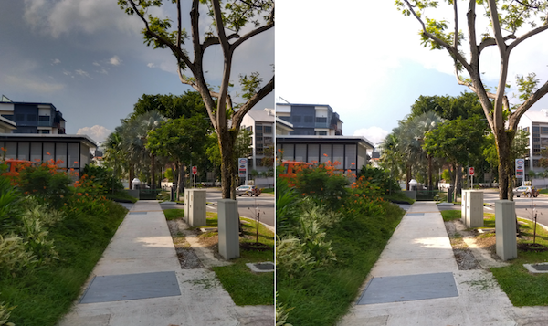
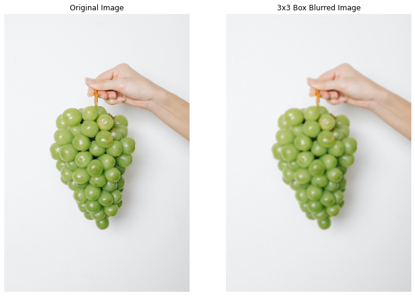
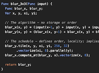

## Introduction

**Halide** is an open-source programming language designed to make it easier to **write and maintain** high-performance image processing or array processing code on modern machines. Halide currently targets
-   Different CPUs
-   Different Operating Systems
-   Diff compute APIs like `CUDA`, `OpenCL`, `OpenGL`, etc.

Rather than being a standalone programming language, Halide is embedded in C++. This means you write C++ code that builds an in-memory representation of a Halide pipeline using Halide's C++ API. You can then compile this representation to an object file, or JIT-compile it and run it in the same process. You can [read more about it at halide-lang.org](https://halide-lang.org).

Halide is used very often in Google, for example in the famous HDR+ algorithm that powers the camera app on the flagship Pixel devices. Beyond that, Halide pipelines are run at scale within Google Photos, Youtube and elsewhere [[3]](#references).


<div style="text-align: center; margin-bottom: 10px">
    
    <br>
    <i>Figure: HDR image (left) & standard image (right). Captured with Camera from Google on a low end Android device.</i>
</div>
<!-- TODO: replace with a side by side HDR comparision image -->

I work on [Camera from Google](https://developers.google.com/camera) at Google and we use Halide language extensively for implementing our features like [HDR](https://developers.google.com/camera/features#hdr) or [Night Mode](https://developers.google.com/camera/features#full-resolution-night-mode). Migrating to Halide from Open CV helped us significantly improve performance of some of these algorithms on the arm chipsets that power most of Android devices.

> **Important Disclaimer**: Any opinion called out in this article are my own and don't reflect opinion or stance of the organizations I work with.

## Need: Why should I care about yet another programming language?

### Scale: Let's look at the scale first
Modern hardware has become significantly powerful over time. But, so has the scale of the problem statements we are dealing with.

Let's take the example of computational photography algorithms. These days mobile devices have fairly large image sensors. Certain Android devices are now shipping with as large as 108 Mega Pixels cameras. Even at a smaller resolution like 13MP, an image has `~13,000,000` pixels. If we have to run a simple brightening operation like

```
f(x) = a * x + b
```

We have to run this function for `~13 million` pixels.

But, its good for us that - the CPUs that we are dealing with, are neither single core nor scalar. So we can often take advantages of multiple cores and [support for vector instructions](https://minhazav.medium.com/guide-the-compiler-to-speed-up-your-code-655c1902b262) in the modern CPUs to improve the runtime latency of these algorithms by multiple order.

### Example: 3x3 blur

<div style="text-align: center; margin-bottom: 10px">
    <br>
    <i>Figure: Original image (left) and Box Blurred image with 3x3 box kernel (right).</i>
</div>

You can blur an image by convolving it with a 3x3 box filter. For each pixel at position `(x, y)` you replace it with the average of all pixels in it's immediate neighborhood.

The brute-force approach would be to do it for every pixel, thus getting a time complexity of `O(K^2 * WH)` for `K` being the kernel size (= 3 here) and W and H being width and height of the image respectively.

```c++
void blur(const Image<uint16_t> &in, Image<uint16_t> &bv) {
  for (int y = 0; y < in.height(); y++) {
    for (int x = 0; x < in.width(); x++) {
      uint32_t sum = 0;
      for (int dy = -1; dy < 2; dy++) {
        for (int dx = -1; dx < 2; dx++) {
          sum += in(x + dx, y + dy);
        }
      }
      bv = sum / 9;
    }
  }
}
```

And one improvement over this is to leverage [separability of kernel](https://en.wikipedia.org/wiki/Separable_filter). We can decompose the single `3x3` kernel into two `1x3` and `3x1` kernels.

This way we split the single step into row and column interations reducing the complexity to `O((K + K)WH)`. For `K=3` that alone should be `~50%` optimisation.

```c++
void blur(const Image<uint16_t> &in, Image<uint16_t> &bv) {
  Image<uint16_t> bh(in.width(), in.height());

  for (int y = 0; y < in.height(); y++)
    for (int x = 0; x < in.width(); x++)
      bh(x, y) = (in(x-1, y) + in(x, y) + in(x+1, y))/3;

  for (int y = 0; y < in.height(); y++)
    for (int x = 0; x < in.width(); x++)
      bv(x, y) = (bh(x, y-1) + bh(x, y) + bh(x, y+1))/3;
}
```

Per [[3]](#references), the authors benchmarked this on `Intel Core i7-4790` CPU and found the average latency to be around `6.5ms/MP`.

Everything is fine so far. However, to achieve superior performance and take the full advantage of modern CPU - we need to leverage vectorization, multi threading, tiling and fusion. Doing so helped authors achieve **20x faster performance** on the same `x86` CPU.

```c++
void fast_blur(const Image<uint16_t> &in, Image<uint16_t> &bv) {
  __m128i one_third = _mm_set1_epi16(21846);
  #pragma omp parallel for
  for (int yTile = 0; yTile < in.height(); yTile += 32) {
    __m128i a, b, c, sum, avg;
    __m128i bh[(256/8)*(32+2)];
    for (int xTile = 0; xTile < in.width(); xTile += 256) {
      __m128i *bhPtr = bh;
      for (int y = -1; y < 32+1; y++) {
        const uint16_t *inPtr = &(in(xTile, yTile+y));
        for (int x = 0; x < 256; x += 8) {
          a = _mm_loadu_si128((__m128i*)(inPtr - 1));
          b = _mm_loadu_si128((__m128i*)(inPtr + 1));
          c = _mm_load_si128 ((__m128i*)(inPtr));
          sum = _mm_add_epi16(_mm_add_epi16(a, b), c);
          avg = _mm_mulhi_epi16(sum, one_third);
          _mm_store_si128(bhPtr++, avg);
          inPtr += 8;
        }
      }
      bhPtr = bh;
      for (int y = 0; y < 32; y++) {
        __m128i *outPtr = (__m128i *)(&(bv(xTile, yTile+y)));
        for (int x = 0; x < 256; x += 8) {
          a = _mm_load_si128(bhPtr + (256 * 2) / 8);
          b = _mm_load_si128(bhPtr + 256 / 8);
          c = _mm_load_si128(bhPtr++);
          sum = _mm_add_epi16(_mm_add_epi16(a, b), c);
          avg = _mm_mulhi_epi16(sum, one_third);
          _mm_store_si128(outPtr++, avg);
        }
      }
    }
  }
}
```

This approach reduces the average latency to `0.30ms/MP` which is like **20x faster**. 

This is very significant performance boost, but it comes with certain caveats:

-    **Portability**: The instructions used in the code are not supported on all CPU types and thus, are not portable across different chipsets. To achieve best performance on a different CPU type (example 32 bit architecture), we need to write another implementation of similar nature. One that leverages the set of intrinsic, supported for that CPU type.
-    **Simplicity**: This requires the engineers in the team to have strong domain knowledge - to both build and maintain these algorithms across different implementations. Realistically, such domain knowledge is often rare.
-   **Maintainability**: If the team needs to update the algorithms, they need to pay the cost of several modifications and sometimes even down to - how the loops are structured to achieve best performance. This will overall cost the teams much more engineering-hours than standard approaches.

### Answer for "Need"
So the need was to have a way to achieve high performance while retaining portability, simplicity and maintainability of the code.

## What does Halide lang offer
**Halide enables us to write simpler high performance code** by separating the algorithm of an image processing pipeline from how to efficiently run it on a certain machine. As programmers, we still need to define how the algorithm should be executed - but defining these strategies much easier to **write**, **test** and **maintain**.

This separation also makes it much easier to separately maintain the algorithm and schedule. It makes it much faster to try out different schedules which otherwise requires complex loop structure changes.

The same `3x3 box blur` in Halide is written as

```c++
Func halide_blur(Func in) {
  Func bh, bv;
  Var x, y, xi, yi;

  // The algorithm
  bh(x, y) = (in(x-1, y) + in(x, y) + in(x+1, y))/3;
  bv(x, y) = (bh(x, y-1) + bh(x, y) + bh(x, y+1))/3;

  // The schedule
  bv.tile(x, y, xi, yi, 256, 32)
    .vectorize(xi, 8)
    .parallel(y);
  bh.compute_at(bv, x).vectorize(x, 8);
  
  return bv;
}
```

The above code seemed to have an average latency of `0.29ms/MP` on the target hardware (same as above).

The schedule above tells the compiler to generate tiled loops, generate vector instructions and paralellise the loop in row order. Usually as we start exploiting parallelism, memory bandwidth starts to become the bottleneck. If you decide to do a full horizontal pass before computing the blur vertically - it doubles the storage and memory bandwidth requirements. These are usually addressed by breaking down the 2D loops to tiles of carefully selected size and then fusing the loops.

<div style="text-align: center; margin-bottom: 10px">
    <br>
    <i>Figure: Tiled execution of for loop (Source: <a href="https://halide-lang.org/tutorials/tutorial_lesson_05_scheduling_1.html">halide-lang.org</a>, Apache license).</i>
</div>


Halide code makes it much easier to do so. From engineering perspective this significantly reduces the boilerplate code that needs to be written to achieve the same.

## Pros and Cons summary

{:class="styled-table"}
| # | Clean C++ | Fast C++ | Halide |
| --- | --- | --- | --- |
| Performance | `6.5ms.MP` | `0.3ms/MP` | `0.29ms/MP` |
| Simplicity | Simple to read and write | Fairly hard to both read and write. High domain knowledge. | Simple to read and write. Learning curve involved. |
| Portability | Easily Portable | Not portable. Needs implementation for different hardware. | Halide supports different hardware and can generate binaries for them. We can also define different schedules for different hardwares or revert to fallback of inline compute. |
| Maintainability | Easy to maintain | Hard to maintain, might be troublesome if the experts leave the team. | Easy to maintain. Some additional expertise still needed - but easier to learn than learning intrinsics for each hardware. |

It's thus fair to conclude that - **Halide language allows us to write fast and maintainable code.**

Even an expert takes time to come up with fast code - **Halide makes it much easier to explore the choice space for different approaches.**

## Shout out to the development team
A huge shout out to the Jonathan Ragan-Kelly and team for coming up with Halide and making it open source. Much of the content in this article is derived from their work published on - [Halide: decoupling algorithms from schedules for high-performance image processing](https://dl.acm.org/doi/10.1145/3150211).
I have been very fortunate for getting change to work with some of the authors and involved members.

## Article Series
This article is part of a multi part series. In the next article I'll be talking about the general concepts in Halide code.

<div class="post-embed" url="/write-fast-and-maintainable-code-with-halide-part-2/">
  <div class="post-embed-image">
    
  </div>
  <div class="post-embed-article">
    <div class="post-embed-article-title">
      <a href="/write-fast-and-maintainable-code-with-halide-part-2/">Write fast and maintainable code with Halide - Part 2</a>
    </div>
    <div class="post-embed-article-subtitle">
      In this article I'll dig deeper and share some general concepts in Halide - key data types and different schedule primitives. For different schedule primitives - example of generated code and demo of code execution is included.
    </div>
  </div>
</div>

## References
1.   [Halide - halide-lang.org](https://halide-lang.org/)
2.   [Halide tutorials](https://halide-lang.org/tutorials/tutorial_introduction.html)
3.   [Halide: decoupling algorithms from schedules for high-performance image processing](https://dl.acm.org/doi/10.1145/3150211) - Open access research article by Jonathan Ragan-Kelley et. al.
4.   Some of my relevant articles
    -   [Processing images fast with native code in Android](https://blog.minhazav.dev/processing-images-fast-with-native-code-in-android/)
    -   [How to use RenderScript to convert YUV_420_888 YUV Image to Bitmap](https://blog.minhazav.dev/how-to-use-renderscript-to-convert-YUV_420_888-yuv-image-to-bitmap/)
    -   [Faster image processing in Android Java using multi threading](https://blog.minhazav.dev/faster-image-processing-in-android-java-using-multi-threading/)
