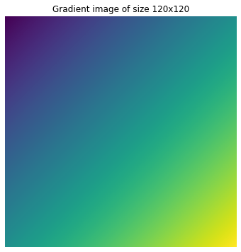

## Introduction
Halide is an open-source programming language designed to make it easier to write high-performance image processing or array processing code on modern machines. 

In the last article of this series

<div class="post-embed" url="/write-fast-and-maintainable-code-with-halide/">
  <div class="post-embed-image">
    
  </div>
  <div class="post-embed-article">
    <div class="post-embed-article-title">
      <a href="/write-fast-and-maintainable-code-with-halide/">Write fast and maintainable code with Halide - Part 1</a>
    </div>
    <div class="post-embed-article-subtitle">
      Often achieving high performance comes with a trade-off of reduced portability and simplicitly. Halide language has been a successfull attempt at addressing both of these at the same time.
    </div>
  </div>
</div>

I explianed:
-    What is Halide?
-    Need for Halide?
-    How Halide addresses this!

In this article I'll dig deeper and share some general concepts in Halide - key data types and different schedule primitives. For different schedule primitives - example of generated code and demo of code execution is included.

> This article is pretty much a fork of the [documentation](https://halide-lang.org/index.html#gettingstarted) and [tutorials](https://halide-lang.org/tutorials/tutorial_introduction.html) shared by the Halide development team. I have tried to summarize some of the primary concepts for the readers and my own future reference.


## Halide concepts - the general structure
> I'll be covering this topic just at the surface, for learning more please checkout the tutorials at [halide-lang.org/tutorials](https://halide-lang.org/tutorials/tutorial_introduction.html).

A Halide code typically have some `input(s)`, one or more `output(s)`, some expressions that expresses the conversion of `input(s)` to `output(s)` and one or more schedules defining how the algorithm should run. We can define multiple schedules each targetting a different subset of hardware. Also, Halide code typically have three key components:

-   `Func`: A `Func` object represents a pipeline stage. It's a pure function that defines what value each pixel should have. You can think of it as a computed image.
-   `Var`: `Var` objects are names to use as variables in the definition of a Func. They have no meaning by themselves. We generally use `x` and `y` as variables that define the `x axes` and `y axes` of images.
-   `Expr`: `Expr` allows us to define complex expressions using `Var`s.

I'll use the gradient example shared in the tutorials as example here:

```c++
int main(int argc, char **argv) {
  Halide::Func gradient;        // Func defined.
  Halide::Var x, y;             // Vars defined.
  Halide::Expr e = x + y;       // An expression for gradient defined, this is
                                // not really needed in this example, but serves the purpose.
  gradient(x, y) = e;
  // This is the same as writing:
  //   gradient(x, y) = x + y;

  // Run it.
  Halide::Buffer<int32_t> output = gradient.realize({800, 600});
  return 0;
}
```

> Source: [halide-lang.org > tutorials > lesson 1](https://halide-lang.org/tutorials/tutorial_lesson_01_basics.html)

This should generate something like this

<div style="text-align: center; margin-bottom: 10px">
    
    <br>
    <i>Figure: Gradient image generated with f(x, y) = x + y with matplotlib (cmap=vidris).</i>
</div>

### Schedules
Schedule is Halides way of defining _"how to run the algorithm efficiently on a particular machine"_.

> Following content is summary of the larger tutorial at 
> [halide-lang.org > tutorials > lesson 5](https://halide-lang.org/tutorials/tutorial_lesson_05_scheduling_1.html)

For the above `gradient()` example, by default the code will be executed in sequence in row major iteration. The generated code shall look something like:

```c++
for (int y = 0; y < HEIGHT; ++y) {
  for (int x = 0; x < WIDTH; ++x) {
    // gradient
  }
}
```

<div style="text-align: center; margin-bottom: 10px">
    
    <br>
    <i>Figure: Execution order of the gradient example - default. Source: <a href="https://halide-lang.org/tutorials/tutorial_lesson_05_scheduling_1.html">halide-lang.org</a>, Apache license.</i>
</div>

Let's take a look at different schedule options:

#### Reorder
```c++
gradient.reorder(x, y);
```

This reorders the sequence of iteration, in this the loop shall be exectured in column major fashion. The generated code will instead look like

```c++
for (int x = 0; x < WIDTH; ++x) {
  for (int y = 0; y < HEIGHT; ++y) {
    // gradient
  }
}
```

<div style="text-align: center; margin-bottom: 10px">
    
    <br>
    <i>Figure: Execution order of the gradient example - column major iteration. Source: <a href="https://halide-lang.org/tutorials/tutorial_lesson_05_scheduling_1.html">halide-lang.org</a>, Apache license.</i>
</div>

This kind of change usually have a large impact on the performance based on how the CPU leverages caches.

#### Split

```c++
Var x_outer, x_inner;
gradient.split(x, x_outer, x_inner, 2);  
```

This is a very powerful primitive and allows us to split a loop in certain dimension in multiple parts. The last argument here is called the "split factor". In this case the generated code changes to something like

```c++
for (int y = 0; y < HEIGHT; ++y) {
  for (int x_outer = 0; x_outer < X_OUTER_BOUNDS; x_outer++) {
    for (int x_inner = 0; x_inner < X_INNER_BOUNDS; x_inner++) {
      int x = x_outer * X_INNER_BOUNDS + x_inner;
      // gradient.
    }
  }
}
```

#### Fuse
```c++
Var fused;
gradient.fuse(x, y, fused);
```

This is opposite of splitting, in this case we fuse two variables and merges the two loop into a single for loop over the product of the extents. The generated code looks like

```c++
for (int fused = 0; fused < WIDTH * HEIGHT; ++fused) {
  int y = fused / WIDTH;
  int x = fused % WIDTH;
  // gradient
}
```

#### Tiling
```c++
Var x_outer, x_inner, y_outer, y_inner;
gradient.split(x, x_outer, x_inner, 4);
gradient.split(y, y_outer, y_inner, 4);
gradient.reorder(x_inner, y_inner, x_outer, y_outer);

// Shorthand:
Var x_outer, x_inner, y_outer, y_inner;
gradient.tile(x, y, x_outer, y_outer, x_inner, y_inner, 4, 4);
```

With both split and reorder in hand, we can now do tiled evaluations. The above shedule allows us to split both `x` and `y` loop by a factor of 4 and reorder the order of execution. The generated code is now complex but should look something like

```c++
for (int y_outer = 0; y_outer < 2; y_outer++) {
  for (int x_outer = 0; x_outer < 2; x_outer++) {
    for (int y_inner = 0; y_inner < 4; y_inner++) {
      for (int x_inner = 0; x_inner < 4; x_inner++) {
        int x = x_outer * 4 + x_inner;
        int y = y_outer * 4 + y_inner;
        // gradient
      }
    }
  }
}
```

<div style="text-align: center; margin-bottom: 10px">
    
    <br>
    <i>Figure: Execution order of the gradient example - tiling. Source: <a href="https://halide-lang.org/tutorials/figures/lesson_05_tiled.gif">halide-lang.org</a>, Apache license.</i>
</div>

#### Vectorization
```c++
Var x_outer, x_inner;
gradient.split(x, x_outer, x_inner, 4);
gradient.vectorize(x_inner);

// Shorthand:
gradient.vectorize(x, 4);
```

We can instruct the compiler to now generate instructions to vectorise the inner loops in `x` for loops.
This generates code like

```c++
for (int y = 0; y < HEIGHT; y++) {
  for (int x_outer = 0; x_outer < X_OUTER_BOUND; x_outer++) {
    for (int x_inner = 0; x_inner < X_INNER_BOUNDS / 4; x_inner+=4) {
      int x = x_outer * X_INNER_BOUNDS + x_inner;
      int x_vec[] = {x, x + 1, x + 2, x + 3};
      int val[] = {
        x_vec[0] + y,
        x_vec[1] + y,
        x_vec[2] + y,
        x_vec[3] + y
      };
      // gradient.
    }
  }
}
```

<div style="text-align: center; margin-bottom: 10px">
    
    <br>
    <i>Figure: Execution order of the gradient example - vectorization. Source: <a href="https://halide-lang.org/tutorials/figures/lesson_05_vectors.gif">halide-lang.org</a>, Apache license.</i>
</div>

#### Unrolling a loop
```c++
Var x_outer, x_inner;
gradient.split(x, x_outer, x_inner, 2);
gradient.unroll(x_inner);

// Shorthand:
gradient.unroll(x, 2);
```

We can easily guide the compiler to unroll the loop by using `unroll` primitive.

#### Fusing, tiling, and parallelizing
```c++
Var x_outer, y_outer, x_inner, y_inner, tile_index;
gradient.tile(x, y, x_outer, y_outer, x_inner, y_inner, 4, 4);
gradient.fuse(x_outer, y_outer, tile_index);
gradient.parallel(tile_index);

// Equivalent of:
Var x_outer, y_outer, x_inner, y_inner, tile_index;
gradient
  .tile(x, y, x_outer, y_outer, x_inner, y_inner, 4, 4)
  .fuse(x_outer, y_outer, tile_index)
  .parallel(tile_index);
```

We can basically combine all of these construct depending on the data independence to achieve best performance. This is where tiling and fusing shine. We can parallelize across the tiles.

The above mentioned schedule generates code like

```c++
// This outermost loop should be a parallel for loop (hard to show here)
for (int tile_index = 0; tile_index < 4; tile_index++) {
    int y_outer = tile_index / 2;
    int x_outer = tile_index % 2;
    for (int y_inner = 0; y_inner < 4; y_inner++) {
        for (int x_inner = 0; x_inner < 4; x_inner++) {
            int y = y_outer * 4 + y_inner;
            int x = x_outer * 4 + x_inner;
            // Gradient
        }
    }
}
```

<div style="text-align: center; margin-bottom: 10px">
    
    <br>
    <i>Figure: Execution order of the gradient example - Fusing, tiling and vectorizing. Source: <a href="https://halide-lang.org/tutorials/figures/lesson_05_vectors.gif">halide-lang.org</a>, Apache license.</i>
</div>

### Putting it all together
Further combining all the constructs for a large image:

```c++
Var x_outer, y_outer, x_inner, y_inner, tile_index;

// We'll process 64x64 tiles in parallel.
gradient
    .tile(x, y, x_outer, y_outer, x_inner, y_inner, 64, 64)
    .fuse(x_outer, y_outer, tile_index)
    .parallel(tile_index);

// We'll compute two scanlines at once while we walk across
// each tile. We'll also vectorize in x. The easiest way to
// express this is to recursively tile again within each tile
// into 4x2 subtiles, then vectorize the subtiles across x and
// unroll them across y:
Var x_inner_outer, y_inner_outer, x_vectors, y_pairs;
gradient
    .tile(x_inner, y_inner, x_inner_outer, y_inner_outer, x_vectors, y_pairs, 4, 2)
    .vectorize(x_vectors)
    .unroll(y_pairs);
```

And it gets executed something like this


<div style="text-align: center; margin-bottom: 10px">
    <video  loop autoplay muted style="margin: auto; width: 80%; max-width: 700px; margin-bottom: 20px">
      <source src="https://halide-lang.org/tutorials/figures/lesson_05_fast.mp4" type="video/mp4"></source>
      Your browser does not support the video tag :(
    </video>
    <br>
    <i>Figure: Putting it all together. Source: <a href="https://halide-lang.org/tutorials/figures/lesson_05_vectors.gif">halide-lang.org</a>, Apache license.</i>
</div>

## References
1.   [Halide - halide-lang.org](https://halide-lang.org/)
2.   [Halide tutorials](https://halide-lang.org/tutorials/tutorial_introduction.html)
3.   [Halide: decoupling algorithms from schedules for high-performance image processing](https://dl.acm.org/doi/10.1145/3150211) - Open access research article by Jonathan Ragan-Kelley et. al.
4.   Some of my relevant articles
    -   [Processing images fast with native code in Android](https://blog.minhazav.dev/processing-images-fast-with-native-code-in-android/)
    -   [How to use RenderScript to convert YUV_420_888 YUV Image to Bitmap](https://blog.minhazav.dev/how-to-use-renderscript-to-convert-YUV_420_888-yuv-image-to-bitmap/)
    -   [Faster image processing in Android Java using multi threading](https://blog.minhazav.dev/faster-image-processing-in-android-java-using-multi-threading/)
