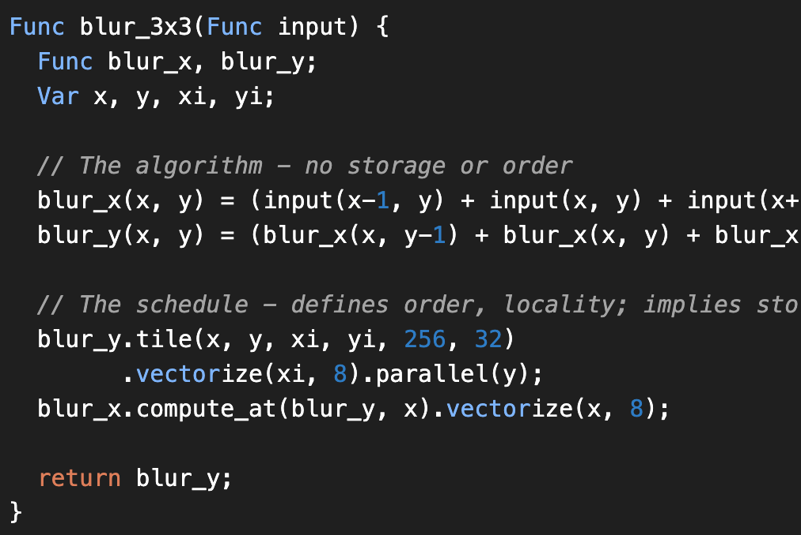

## Introduction

**Halide** is an open-source programming language designed to make it easier to **write and maintain** high-performance image processing or array processing code on modern machines. Halide currently targets
-   Different CPUs
-   Different Operating Systems
-   Diff compute APIs like `CUDA`, `OpenCL`, `OpenGL`, etc.

Rather than being a standalone programming language, Halide is embedded in C++. This means you write C++ code that builds an in-memory representation of a Halide pipeline using Halide's C++ API. You can then compile this representation to an object file, or JIT-compile it and run it in the same process. You can [read more about it at halide-lang.org](https://halide-lang.org).

This article is part of my multi-article effort showcasing different ways to write image processing algorithms in Android. 

<div style="text-align: center; margin-bottom: 10px">
    
    <br>
</div>

For the purpose of evaluating different approaches I took one problem statement and benchmaked performance of different ways I could address the problem. Here's the problem statement

## Problem statement: YUV to RGB conversion

The problem statement is to convert an 8MP (3264x2448) image in a certain format called [YUV_420_888](https://developer.android.com/reference/android/graphics/ImageFormat#YUV_420_888) which has one planar `Y` channel and two semi-planar subsampled `UV` channels to [ARGB_8888](https://developer.android.com/reference/android/graphics/Bitmap.Config#ARGB_8888) format which is commonly supported with [Bitmap](https://developer.android.com/reference/android/graphics/Bitmap) in Android. You can read more about [YUV format on Wikipedia](https://en.wikipedia.org/wiki/YUV). Also, the articles below have a better description of the problem statement.

The reason I chose this as the problem statement, is because `YUV_420_888` is one of the most common OUTPUT formats supported from Android Camera APIs and images are commonly consumed as `Bitmap` in Android - thus making this a fairly common problem statement to address.

I have been experimenting with performance of different frameworks or technologies to understand performance of image processing in Android taking this as the problem statement. Here are some examples of the same using other techniques I have tested:

<div class="post-info" style="border: 1px solid #cfcfcf73;padding: 10px;margin: 10px 0px 0px 0px;">
    <h3 class="post-header"><a class="post-link" href="https://blog.minhazav.dev/processing-images-fast-with-native-code-in-android/">Processing images fast with native code in Android</a></h3>
     <span class="post-description">
       
       In my experience, its both easier and better to handle these complex image processing operations with native code very particularly to keep it performant. This is a very basic article demonstrating how to do image processing with native code in Android. I'll also show by an example that the performance of a very simple and unoptimized C++ code comes very close to fairly optimized Java code for the same problem statement.
     </span>
     <span class="read-more"><a href="https://blog.minhazav.dev/processing-images-fast-with-native-code-in-android/">[.. &nbsp;Read&&nbsp;more&nbsp;]</a></span>
</div>

<div class="post-info" style="border: 1px solid #cfcfcf73;padding: 10px;margin: 10px 0px 0px 0px;">
    <h3 class="post-header"><a class="post-link" href="https://blog.minhazav.dev/how-to-use-renderscript-to-convert-YUV_420_888-yuv-image-to-bitmap/">How to use RenderScript to convert YUV_420_888 YUV Image to Bitmap</a></h3>
     <span class="post-description">
       
       RenderScript turns out to be one of the best APIs for running computationally-intensive code on the CPU or GPU (that too, without having to make use of the NDK or GPU-specific APIs). In this code I have explained how to use ScriptIntrinsicYuvToRGB intrinsic that is available in Android APIs to convert an android.media.Image in YUV_420_888 format to Bitmap.
     </span>
     <span class="read-more"><a href="https://blog.minhazav.dev/how-to-use-renderscript-to-convert-YUV_420_888-yuv-image-to-bitmap/">[.. &nbsp;Read&&nbsp;more&nbsp;]</a></span>
</div>

<div class="post-info" style="border: 1px solid #cfcfcf73;padding: 10px;margin: 10px 0px 0px 0px;">
    <h3 class="post-header"><a class="post-link" href="https://blog.minhazav.dev/faster-image-processing-in-android-java-using-multi-threading/">Faster image processing in Android Java using multi threading</a></h3>
     <span class="post-description">
       
       While I was exploring different ways to do efficient image processing in Android I realized that a simple two-dimensional for-loop when written in Java vs C++ could have very different performance. For example: I have been comparing different ways we
     </span>
     <span class="read-more"><a href="https://blog.minhazav.dev/faster-image-processing-in-android-java-using-multi-threading/">[.. &nbsp;Read&&nbsp;more&nbsp;]</a></span>
</div>
<br>

I plan to write a full series article that explains performance of different approaches. Here are the numbers for the approaches published so far:


In next few sections I'll be explaining the general structure of Halide code, Halide code example for this problem statements, try out different kind of schedules for the target hardare and pick the best one and publish performance numbers. I'll also draw out some conclusions based on the findings towards the end of this article.

## Digging deeper: What is Halide and why it exists
> This section is an optional read, in this section I'll be sharing some more in-depth information on what Halide does and why the project was started. A lot of the content here is derived from the original research paper by Jonathan Ragan-Kelley et. al. on [Halide: Decoupling Algorithms from Schedules for High-Performance Image Processing](https://dl.acm.org/doi/10.1145/3150211)

I think the abstract of the paper tells a lot

> Writing high-performance code on modern machines requires not just locally optimizing inner loops, but globally reorganizing computations to exploit parallelism and locality—doing things such as tiling and blocking whole pipelines to fit in cache. This is especially true for image processing pipelines, where individual stages do much too little work to amortize the cost of loading and storing results to and from off-chip memory. As a result, the performance difference between a naïve implementation of a pipeline and one globally optimized for parallelism and locality is often an order of magnitude. However, using existing programming tools, writing high-performance image processing code requires sacrificing simplicity, portability, and modularity. We argue that this is because traditional programming models conflate the computations defining the algorithm with decisions about intermediate storage and the order of computation, which we call the schedule.
>
> We propose a new programming language for image processing pipelines, called Halide, that separates the algorithm from its schedule. Programmers can change the schedule to express many possible organizations of a single algorithm. The Halide compiler then synthesizes a globally combined loop nest for an entire algorithm, given a schedule. Halide models a space of schedules which is expressive enough to describe organizations that match or outperform state-of-the-art hand-written implementations of many computational photography and computer vision algorithms. Its model is simple enough to do so often in only a few lines of code, and small changes generate efficient implementations for x86, ARM, Graphics Processors (GPUs), and specialized image processors, all from a single algorithm. Halide has been public and open source for over four years, during which it has been used by hundreds of programmers to deploy code to tens of thousands of servers and hundreds of millions of phones, processing billions of images every day.

## General structure of Halide Code
> I'll be covering this topic just at the surface, for learning more please checkout the tutorials at [halide-lang.org/tutorials](https://halide-lang.org/tutorials/tutorial_introduction.html).

A Halide code typically have some `input(s)`, one or more `output(s)`, some expressions that expresses the conversion of `input(s)` to `output(s)` and one or more schedules defining how the algorithm should run. We can define multiple schedules each targetting a different subset of hardware. Also, Halide code typically have three key components:

-   `Func`: A `Func` object represents a pipeline stage. It's a pure function that defines what value each pixel should have. You can think of it as a computed image.
-   `Var`: `Var` objects are names to use as variables in the definition of a Func. They have no meaning by themselves. We generally use `x` and `y` as variables that define the `x axes` and `y axes` of images.
-   `Expr`: `Expr` allows us to define complex expressions using `Var`s.

I'll use the gradient example shared in the tutorials as example here:

```c++
int main(int argc, char **argv) {
  Halide::Func gradient;        // Func defined.
  Halide::Var x, y;             // Vars defined.
  Halide::Expr e = x + y;       // An expression for gradient defined, this is
                                // not really needed in this example, but serves the purpose.
  gradient(x, y) = e;
  // This is the same as writing:
  //   gradient(x, y) = x + y;

  // Run it.
  Halide::Buffer<int32_t> output = gradient.realize({800, 600});
  return 0;
}
```

In Halide we separate our algorithms from 


> Source: [halide-lang.org > tutorials > lesson 1](https://halide-lang.org/tutorials/tutorial_lesson_01_basics.html)

## Halide code for YUV to ARGB generation
As metioned above let's look at the expressions and schedules separately.

### Expressions
TBA

### Schedules
TBA

## Performance comparision
## Personal experiments on Android
I have been learning and testing performance of different ways we can write computational photography algorithms on Android. I have published a series of article on this topic:
 -  
 -   

Here's summary of the performance and it's comparision to Halide counterpart.


{:class="styled-table"}
| Approach | Average | Notes |
| --- | --- | --- |
| [Java](https://blog.minhazav.dev/faster-image-processing-in-android-java-using-multi-threading/)	| 353 ms |	~11.2x slower |
| [Java multithreaded](https://blog.minhazav.dev/faster-image-processing-in-android-java-using-multi-threading/#multi-threaded-java-code) | 53.8 ms |	~1.7x slower |
| [RenderScript](https://medium.com/computational-photography/fast-image-processing-in-android-with-renderscript-4bc6992ba48e) | 31.5 ms |	fastest among these |
| [Native](https://betterprogramming.pub/processing-images-fast-with-native-code-in-android-db8b21001fa9) | 76.4 ms |	~2.4x slower |
| [Native + some compiler directives](https://betterprogramming.pub/guide-the-compiler-to-speed-up-your-code-655c1902b262) | 64.5 ms |	~2x slower |
| Halide implementation | 64.5 ms |	~2x slower |

_Table 1: Performance latency of converting a `8MP (3264x2448)` YUV Image to Bitmap on Pixel 4a device_.

## Conclusions
TBA

## References
-   [Halide - halide-lang.org](https://halide-lang.org/)
-   [Halide tutorials](https://halide-lang.org/tutorials/tutorial_introduction.html)
-   Some of my relevant articles
    -   [Processing images fast with native code in Android](https://blog.minhazav.dev/processing-images-fast-with-native-code-in-android/)
    -   [How to use RenderScript to convert YUV_420_888 YUV Image to Bitmap](https://blog.minhazav.dev/how-to-use-renderscript-to-convert-YUV_420_888-yuv-image-to-bitmap/)
    -   [Faster image processing in Android Java using multi threading](https://blog.minhazav.dev/faster-image-processing-in-android-java-using-multi-threading/)
