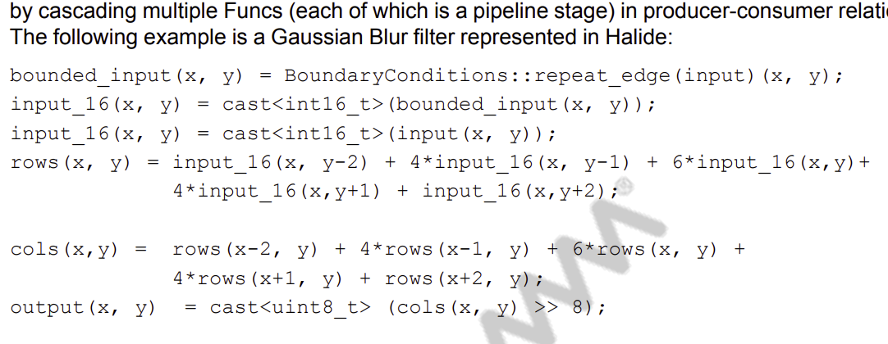
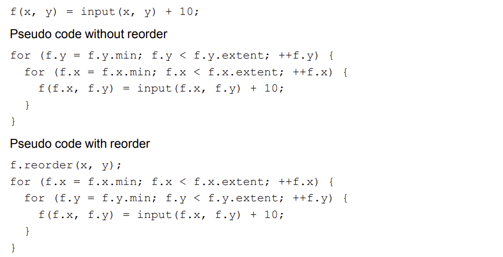
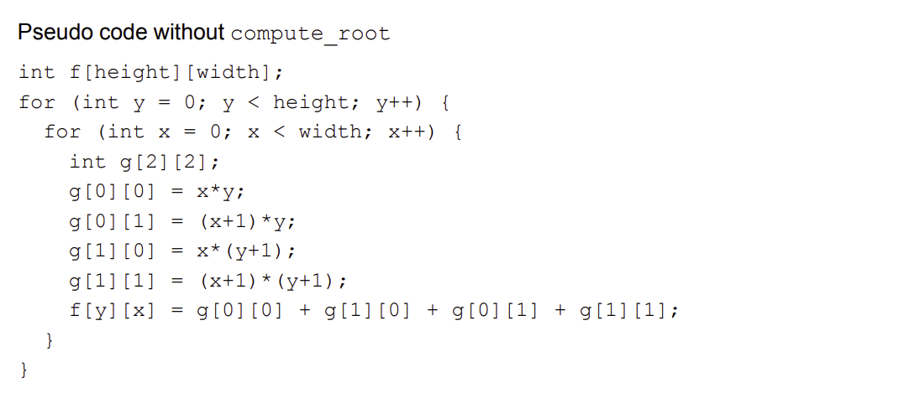

## Introduction

Qualcomm has a user guide called [Halide for HVX](https://developer.qualcomm.com/qfile/34999/80-pd002-1_b_halide_for_hvx_user_guide.pdf) (Hexagon Vector eXtension). The documentation is a great guide to both halide and HVX. I learned many things from the it.

But, besides all the good stuff, I found a couple of mistakes in the documentation which in the beginning confused me. I had to validate some of those to ensure if I had a wrong understanding before. Probably you did too?

I am writing this article, assuming:

1.  If someone goes through the same, they can look it up and find some updates here.
2.  If Qualcomm Hexagon folks read this doc, they can fix the document and let me know.

In this article I'll assume you are aware of Halide and Qualcomm's DSP called Hexagon. Halide has a first class support for generating instructions supported on hexagon called HVX or Hexagon Vector eXtension. If you are not familiar with Halide and are just curious, you can start [here](https://betterprogramming.pub/write-fast-and-maintainable-code-with-halide-part-1-6a5c3a519250).

If you are from Qualcomm and in a position to fix the documentation - please do and let me know. Once again, thanks for the documentation.

## Issues
Here are a few issues observed.

### Additional update in the example
> In page 10, in the description of `Func`.

<div style="text-align: center; margin-bottom: 10px; border: 1px solid #0000001a;padding: 10px 5px;border-radius: 10px;">
    
    <br>
</div>

The `input_16` is assigned twice, the 2nd one seems wrong. It should be like this

```c++
bounded_input(x, y) = BoundaryConditions::repeat_edge(input)(x, y);
input_16(x, y) = cast<int16_t>(bounded_input(x, y));
rows(x, y) = input_16(x, y-2) + 4 * input_16(x, y-1)
   + 6 * input_16(x,y)+ 4 * input_16(x,y+1) + input_16(x,y+2);
// rest of the code.
 ```

### Documentation of reorder()
> In page 12, in the description of `reorder()` directive.

Here, in the section `Pseudo code with reorder` it says

`f.reorder(x, y);` will generate

<div style="text-align: center; margin-bottom: 10px; border: 1px solid #0000001a;padding: 10px 5px;border-radius: 10px;">
    
    <br>
</div>

This is incorrect. The interface is

```c++
reorder(dim_inner, .., dim_outer)
```

Thus `f.reorder(x, y)` will generate opposite of what is shown.

```c++
f.reorder(x, y);

// Pseudocode with reorder()
for (f.y = f.y.min; f.y < f.y.extent; ++f.y) {
  for (f.x = f.x.min; f.x < f.x.extent; ++f.x) {
    f(f.x, f.y) = input(f.x, f.y + 10);
  } 
}
```

To generate the expected pseudocode (with x in outer loop and y in inner loop), the required schedule is:

```c++
f.reorder(y, x);
```

### Documentation of compute_root, compute_at and store_at
> In page 17, in the documentation of `compute_root()`

Its documented that, pesudo code without `compute_root()` for

```c++
Func g("g");
g(x, y) = x*y;
f(x, y) = g(x, y) + g(x, y+1) + g(x+1, y) + g(x+1, y+1);
```

will generate something like

<div style="text-align: center; margin-bottom: 10px;  border: 1px solid #0000001a;padding: 10px 5px;border-radius: 10px;">
    
    <br>
</div>

But without the explict schedule for intermediate `Func` be computed inline, something like

```c++
int f[height][width];
for (int y = 0; y < height; y++) {
  for (int x = 0; x < width; x++) {
    f[y][x] = x*y + (x+1)*y + (x+1)*(y+1) + (x+1)*(y+1);
  }
}
```

> Same issue was observed for `store_at()` in page 18 and `store_root` at page 19.

I have a feeling this is intentionally done to make it easier to understand. Even if this is the case - it's inaccurate.

## Actions taken / Updates
-   `4th May 2022` I have sent emails to `support.cdmatech@qti.qualcomm.com`
/ `halide@quicinc.com.` (reference from the document). I'll update this article in case there is some updates or response. 

## References

-  [Halide for HVX documentation - developer.qualcomm.com](https://developer.qualcomm.com/qfile/34999/80-pd002-1_b_halide_for_hvx_user_guide.pdf)

> All images in this post are screenshots of the pdf captured by the Author on 4th May 2022.