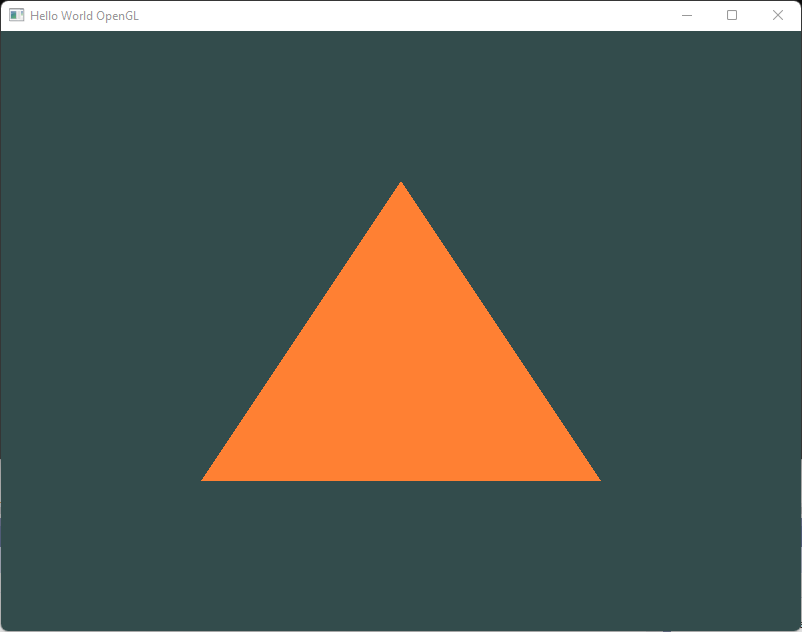
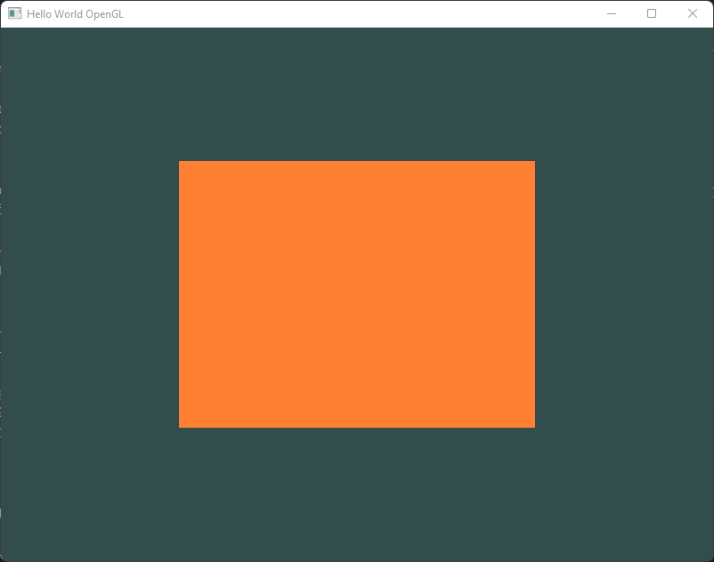

Learning OpenGL has been a long time todo and I have gladly taken a step 1. But I realised it's a lot of steps to just to get to hello world application or in this case I must say - 'Hello Traiangle' application. In the past writing a blog article has helped me get a better grasp of things, have a easy to access notes and maybe help some readers benefit from the same. A lot of the content in this article is derived from [learnopengl.com](https://learnopengl.com/). In this article I'll cover all the steps involved in rendering a triangle with OpenGl excluding the installation steps. For refernece I am using Windows + Visual Studio as my setup.

<div style="text-align: center; margin-bottom: 10px">
    <br>
    <i>Figure: This is what you will get with this excerise. Trust me it's worth it!</i>
</div>

This article will cover:
-   How to render triangle with OpenGL?
-   How to render rectangle with OpenGL?

## Setup
I am not going to cover how to setup the environment in this article. You can find most of the instructions at [learnopengl.com](https://learnopengl.com/Getting-started/Creating-a-window). For Windows TL;DR; is:
-   You need Visual Studio.
-   OpenGL 3.3+ drivers for this example.
-   GLFW library
-   GLAD library

> GLFW is a library, written in C, specifically targeted at OpenGL. GLFW gives us the bare necessities required for rendering goodies to the screen. It allows us to create an OpenGL context, define window parameters, and handle user input, which is plenty enough for our purposes.

A few CMake steps, adding references to the VS project. The direction given in the link above worked for me without pain.

## Rendering a GL Window

The skeleton code looks like this. Check out the code comment for more context.

```c++
#include <glad/glad.h> 
#include <GLFW/glfw3.h>
#include <iostream>

using namespace std;

void framebuffer_size_callback(GLFWwindow* window, int width, int height);
void processInput(GLFWwindow* window);

const unsigned int SCR_WIDTH = 800;
const unsigned int SCR_HEIGHT = 600;

int main()
{
    // Step 1: Initialize the glfw.
    glfwInit();
    glfwWindowHint(GLFW_CONTEXT_VERSION_MAJOR, 3);
    glfwWindowHint(GLFW_CONTEXT_VERSION_MINOR, 3);
    glfwWindowHint(GLFW_OPENGL_PROFILE, GLFW_OPENGL_CORE_PROFILE);
    // glfwWindowHint(GLFW_OPENGL_FORWARD_COMPAT, GL_TRUE);
    // ^ Needed for Mac OS.

    // Step 2: Create a window.
    GLFWwindow* window = glfwCreateWindow(
        SCR_WIDTH, SCR_HEIGHT, "Hello World OpenGL", NULL, NULL);
    if (window == NULL)
    {
        std::cout << "Failed to create GLFW window" << std::endl;
        glfwTerminate();
        return -1;
    }
    glfwMakeContextCurrent(window);
    // Link a callback with frame size change.
    glfwSetFramebufferSizeCallback(window, framebuffer_size_callback);

    // Initialize GLAD.
    if (!gladLoadGLLoader((GLADloadproc)glfwGetProcAddress))
    {
        std::cout << "Failed to initialize GLAD" << std::endl;
        return -1;
    }

    // TODO: Initialize the rendering code.

    // Start rendering infinitely.
    while (!glfwWindowShouldClose(window))
    {
        processInput(window);

        glfwSwapBuffers(window);
        glfwPollEvents();
    }

    // TODO: Cleanup.

    glfwTerminate();
    return 0;
}

/** glfw: whenever the window size changed (by OS or user resize) this callback function executes. */
void framebuffer_size_callback(GLFWwindow* window, int width, int height)
{
    // make sure the viewport matches the new window dimensions; note that width and 
    // height will be significantly larger than specified on retina displays.
    glViewport(0, 0, width, height);
}

/** Process all input: query GLFW whether relevant keys are pressed/released this frame and react accordingly. */
void processInput(GLFWwindow* window)
{
    if (glfwGetKey(window, GLFW_KEY_ESCAPE) == GLFW_PRESS)
    {
        glfwSetWindowShouldClose(window, true);
    }
}
```

## Useful theory

The graphics pipeline takes as input a set of 3D coordinates and transforms these to colored 2D pixels on your screen. The graphics pipeline can be divided into several steps where each step requires the output of the previous step as its input. All of these steps are highly specialized (they have one specific function) and can easily be executed in parallel. Because of their parallel nature, graphics cards of today have thousands of small processing cores to quickly process your data within the graphics pipeline. The processing cores run small programs on the GPU for each step of the pipeline. These small programs are called shaders.

<div style="text-align: center; margin-bottom: 10px">
    <br>
    <i>Figure: The graphics pipeline - <a href="https://learnopengl.com/Getting-started/Hello-Triangle">source: learnopengl.com </a></i>
</div>

### Vertex Shader
The first part of the pipeline is the vertex shader that takes as input a single vertex. The main purpose of the vertex shader is to transform 3D coordinates into different 3D coordinates and the vertex shader allows us to do some basic processing on the vertex attributes.

> The vertex shader is one of the shaders that are programmable by people like us. Modern OpenGL requires that we at least set up a vertex and fragment shader if we want to do some rendering 

The primitive assembly stage takes as input all the vertices (or vertex if GL_POINTS is chosen) from the vertex shader that form a primitive and assembles all the point(s) in the primitive shape given; in this case a triangle.

### Geometry Shader
The output of the primitive assembly stage is passed to the geometry shader. The geometry shader takes as input a collection of vertices that form a primitive and has the ability to generate other shapes by emitting new vertices to form new (or other) primitive(s). In this example case, it generates a second triangle out of the given shape.

### Rasterisation

The output of the geometry shader is then passed on to the rasterization stage where it maps the resulting primitive(s) to the corresponding pixels on the final screen, resulting in fragments for the fragment shader to use. Before the fragment shaders run, clipping is performed. Clipping discards all fragments that are outside your view, increasing performance.

### Fragment Shader
The main purpose of the fragment shader is to calculate the final color of a pixel and this is usually the stage where all the advanced OpenGL effects occur. Usually the fragment shader contains data about the 3D scene that it can use to calculate the final pixel color (like lights, shadows, color of the light and so on).

> The fragment shader is the second and final shader we're going to create for rendering a triangle. The fragment shader is all about calculating the color output of your pixels. To keep things simple the fragment shader will always output an orange-ish color.

### Tests and blending
After all the corresponding color values have been determined, the final object will then pass through one more stage that we call the alpha test and blending stage. This stage checks the corresponding depth (and stencil) value (we'll get to those later) of the fragment and uses those to check if the resulting fragment is in front or behind other objects and should be discarded accordingly. The stage also checks for alpha values (alpha values define the opacity of an object) and blends the objects accordingly. So even if a pixel output color is calculated in the fragment shader, the final pixel color could still be something entirely different when rendering multiple triangles.

### Normalized Device Coordinates (NDC)
Normalized Device Coordinates is a small space where the x, y and z values vary from -1.0 to 1.0. Any coordinates that fall outside this range will be discarded/clipped and won't be visible on your screen.

Your NDC coordinates will then be transformed to screen-space coordinates via the viewport transform using the data you provided with glViewport. The resulting screen-space coordinates are then transformed to fragments as inputs to your fragment shader.

### VBO - Vertex Buffer Objects
We manage this memory via so called vertex buffer objects (VBO) that can store a large number of vertices in the GPU's memory. The advantage of using those buffer objects is that we can send large batches of data all at once to the graphics card, and keep it there if there's enough memory left, without having to send data one vertex at a time. Sending data to the graphics card from the CPU is relatively slow, so wherever we can we try to send as much data as possible at once. Once the data is in the graphics card's memory the vertex shader has almost instant access to the vertices making it extremely fast.

Draw types
-   `GL_STREAM_DRAW`: the data is set only once and used by the GPU at most a few times.
-   `GL_STATIC_DRAW`: the data is set only once and used many times.
-   `GL_DYNAMIC_DRAW`: the data is changed a lot and used many times.

If, for instance, one would have a buffer with data that is likely to change frequently, a usage type of GL_DYNAMIC_DRAW ensures the graphics card will place the data in memory that allows for faster writes.

### VAO  - Vertex Array Object
A vertex array object (also known as VAO) can be bound just like a vertex buffer object and any subsequent vertex attribute calls from that point on will be stored inside the VAO. This has the advantage that when configuring vertex attribute pointers you only have to make those calls once and whenever we want to draw the object, we can just bind the corresponding VAO. This makes switching between different vertex data and attribute configurations as easy as binding a different VAO. All the state we just set is stored inside the VAO.

### EBO - Element Buffer Object
An EBO is a buffer, just like a vertex buffer object, that stores indices that OpenGL uses to decide what vertices to draw. This so called indexed drawing is exactly the solution to our problem. 

## Rendering a triangle

### TL;DR; Flow

1.   Setup the window and viewport as defined so far.
2.   Setup vertex shader.
3.   Setup fragment shader.
4.   Setup the program with the two shaders.
5.   Setup one time allocations for rendering
     -   Define vertices
     -   Define VBO, bind the vertices with it.
     -   Define VAO and enable generic vertex array and bind it
6.   Render the triangle in a loop.
     -   Clear the viewport
     -   Draw elements with `GL_TRIANGLES` mode

### Full Code

```c++
#include <glad/glad.h> 
#include <GLFW/glfw3.h>
#include <iostream>

using namespace std;

void framebuffer_size_callback(GLFWwindow* window, int width, int height);
void processInput(GLFWwindow* window);

const unsigned int SCR_WIDTH = 800;
const unsigned int SCR_HEIGHT = 600;

// Container struct for shaders & programs.
struct ShaderData
{
    unsigned int vertexShader = 0;
    unsigned int fragmentShader = 0;
    unsigned int shaderProgram = 0;
    bool success = false;

    void cleanup() {
        glDeleteShader(vertexShader);
        glDeleteShader(fragmentShader);
        glDeleteProgram(shaderProgram);
    }
};

// Container struct for data associated with setup stage.
struct RenderSetupData
{
    unsigned int VAO;
    unsigned int VBO;

    void cleanup() {
        glDeleteVertexArrays(1, &VAO);
        glDeleteBuffers(1, &VBO);
    }
};

const char* vertexShaderSource = "#version 330 core\n"
"layout (location = 0) in vec3 aPos;\n"
"void main()\n"
"{\n"
"   gl_Position = vec4(aPos.x, aPos.y, aPos.z, 1.0);\n"
"}\0";

const char* fragmentShaderSource = "#version 330 core\n"
"out vec4 FragColor; \n"
"void main() \n"
"{\n"
"    FragColor = vec4(1.0f, 0.5f, 0.2f, 1.0f); \n"
"}\n\0";

unsigned int setupVertexShader()
{
    unsigned int vertexShader = glCreateShader(GL_VERTEX_SHADER);
    glShaderSource(vertexShader, 1, &vertexShaderSource, NULL);
    glCompileShader(vertexShader);

    int success;
    char infoLog[512];
    glGetShaderiv(vertexShader, GL_COMPILE_STATUS, &success);

    if (!success)
    {
        glGetShaderInfoLog(vertexShader, 512, NULL, infoLog);
        std::cout << "ERROR::SHADER::VERTEX::COMPILATION_FAILED\n" << infoLog << std::endl;
        return 0;
    }

    return vertexShader;
}

unsigned int setupFragmentShader()
{
    unsigned int fragmentShader = glCreateShader(GL_FRAGMENT_SHADER);
    glShaderSource(fragmentShader, 1, &fragmentShaderSource, NULL);
    glCompileShader(fragmentShader);

    int  success;
    char infoLog[512];
    glGetShaderiv(fragmentShader, GL_COMPILE_STATUS, &success);

    if (!success)
    {
        glGetShaderInfoLog(fragmentShader, 512, NULL, infoLog);
        std::cout << "ERROR::SHADER::FRAGMENT::COMPILATION_FAILED\n" << infoLog << std::endl;
        return 0;
    }

    return fragmentShader;
}

ShaderData setupShaderProgram()
{
    ShaderData result;
    result.shaderProgram = glCreateProgram();
    result.vertexShader = setupVertexShader();
    result.fragmentShader = setupFragmentShader();

    if (result.vertexShader == 0 || result.fragmentShader == 0)
    {
        return {};
    }

    glAttachShader(result.shaderProgram, result.vertexShader);
    glAttachShader(result.shaderProgram, result.fragmentShader);
    glLinkProgram(result.shaderProgram);

    int  success;
    char infoLog[512];
    glGetProgramiv(result.shaderProgram, GL_LINK_STATUS, &success);
    if (!success) {
        glGetProgramInfoLog(result.shaderProgram, 512, NULL, infoLog);
        std::cout << "ERROR::SHADER::Program::COMPILATION_FAILED\n" << infoLog << std::endl;
        result.cleanup();
        return {};
    }

    result.success = true;
    return result;
}

RenderSetupData setupRendering()
{
    // set up vertex data (and buffer(s)) and configure vertex attributes
    // ------------------------------------------------------------------
    float vertices[] = {
        -0.5f, -0.5f, 0.0f,  // left
         0.5f, -0.5f, 0.0f,  // right
         0.0f,  0.5f, 0.0f   // top
    };

    // ..:: Initialization code (done once (unless your object frequently changes)) :: ..
    // 1. bind Vertex Array Object
    RenderSetupData result;
    glGenVertexArrays(1, &result.VAO);
    glGenBuffers(1, &result.VBO);

    // bind the Vertex Array Object first, then bind and set vertex buffer(s), and then configure vertex attributes(s).
    glBindVertexArray(result.VAO);

    glBindBuffer(GL_ARRAY_BUFFER, result.VBO);
    glBufferData(GL_ARRAY_BUFFER, sizeof(vertices), vertices, GL_STATIC_DRAW);

    glVertexAttribPointer(0, 3, GL_FLOAT, GL_FALSE, 3 * sizeof(float), (void*)0);
    glEnableVertexAttribArray(0);

    // note that this is allowed, the call to glVertexAttribPointer registered VBO as the vertex attribute's bound vertex buffer object so afterwards we can safely unbind
    glBindBuffer(GL_ARRAY_BUFFER, 0);

    // You can unbind the VAO afterwards so other VAO calls won't accidentally modify this VAO, but this rarely happens. Modifying other
    // VAOs requires a call to glBindVertexArray anyways so we generally don't unbind VAOs (nor VBOs) when it's not directly necessary.
    glBindVertexArray(0);

    return result;
}

void render(ShaderData shaderData, unsigned int VAO)
{
    // Set a clear color.
    glClearColor(0.2f, 0.3f, 0.3f, 1.0f);
    glClear(GL_COLOR_BUFFER_BIT);

    // 2. use our shader program when we want to render an object
    glUseProgram(shaderData.shaderProgram);
    glBindVertexArray(VAO);
    glDrawArrays(GL_TRIANGLES, 0, 3);
}

int main()
{
    glfwInit();
    glfwWindowHint(GLFW_CONTEXT_VERSION_MAJOR, 3);
    glfwWindowHint(GLFW_CONTEXT_VERSION_MINOR, 3);
    glfwWindowHint(GLFW_OPENGL_PROFILE, GLFW_OPENGL_CORE_PROFILE);
    // glfwWindowHint(GLFW_OPENGL_FORWARD_COMPAT, GL_TRUE);
    // ^ Needed for Mac OS.

    GLFWwindow* window = glfwCreateWindow(
        SCR_WIDTH, SCR_HEIGHT, "Hello World OpenGL", NULL, NULL);
    if (window == NULL)
    {
        std::cout << "Failed to create GLFW window" << std::endl;
        glfwTerminate();
        return -1;
    }
    glfwMakeContextCurrent(window);
    glfwSetFramebufferSizeCallback(window, framebuffer_size_callback);

    // Initialize GLAD.
    if (!gladLoadGLLoader((GLADloadproc) glfwGetProcAddress))
    {
        std::cout << "Failed to initialize GLAD" << std::endl;
        return -1;
    }

    ShaderData shaderData = setupShaderProgram();
    if (!shaderData.success)
    {
        return -1;
    }

    RenderSetupData renderSetupData = setupRendering();

    // Start rendering infinitely.
    while (!glfwWindowShouldClose(window))
    {
        processInput(window);

        // Render
        render(shaderData, renderSetupData.VAO);

        glfwSwapBuffers(window);
        glfwPollEvents();
    }

    // Clean-up
    shaderData.cleanup();
    renderSetupData.cleanup();

    glfwTerminate();
    return 0;
}

/** glfw: whenever the window size changed (by OS or user resize) this callback function executes. */
void framebuffer_size_callback(GLFWwindow* window, int width, int height)
{
    // make sure the viewport matches the new window dimensions; note that width and 
    // height will be significantly larger than specified on retina displays.
    glViewport(0, 0, width, height);
}

/** Process all input: query GLFW whether relevant keys are pressed/released this frame and react accordingly. */
void processInput(GLFWwindow* window)
{
    if (glfwGetKey(window, GLFW_KEY_ESCAPE) == GLFW_PRESS)
    {
        glfwSetWindowShouldClose(window, true);
    }
}
```

Run this code to get the beutiful orange triangle below.

<div style="text-align: center; margin-bottom: 10px">
    <br>
    <i>Figure: This is what you will get with this excerise. Trust me it's worth it!</i>
</div>

### Element Buffer Objects
If we want to render a rectangle using two triangles, we'd have to define vertices for both of them separately. Something like this

```c++
float vertices[] = {
    // first triangle
     0.5f,  0.5f, 0.0f,  // top right
     0.5f, -0.5f, 0.0f,  // bottom right
    -0.5f,  0.5f, 0.0f,  // top left 
    // second triangle
     0.5f, -0.5f, 0.0f,  // bottom right
    -0.5f, -0.5f, 0.0f,  // bottom left
    -0.5f,  0.5f, 0.0f   // top left
}; z
```

> As you can see, there is some overlap on the vertices specified. We specify bottom right and top left twice! This is an overhead of 50% since the same rectangle could also be specified with only 4 vertices, instead of 6. This will only get worse as soon as we have more complex models that have over 1000s of triangles where there will be large chunks that overlap. What would be a better solution is to store only the unique vertices and then specify the order at which we want to draw these vertices in.


Indexed drawing solution using Element Buffer Objects (EBO) is the solution. You can specify the triangles using the index of the vertices.

```c++
float vertices[] = {
     0.5f,  0.5f, 0.0f,  // top right
     0.5f, -0.5f, 0.0f,  // bottom right
    -0.5f, -0.5f, 0.0f,  // bottom left
    -0.5f,  0.5f, 0.0f   // top left 
};
unsigned int indices[] = {  // note that we start from 0!
    0, 1, 3,   // first triangle
    1, 2, 3    // second triangle
};
```

And then define EBO

```c++
// Define a EBO
unsigned int EBO;
glGenBuffers(1, &EBO);

// Bind the indices to the buffer object
glBindBuffer(GL_ELEMENT_ARRAY_BUFFER, EBO);
glBufferData(GL_ELEMENT_ARRAY_BUFFER, sizeof(indices), indices, GL_STATIC_DRAW);

// ... in loop render
// When using glDrawElements we're going to draw using indices provided in the element buffer object currently bound:
glDrawElements(GL_TRIANGLES, 6, GL_UNSIGNED_INT, 0);
```

This will render us the rectangle

<div style="text-align: center; margin-bottom: 10px">
    <br>
    <i>Figure: This is what you will get with this excerise. Trust me it's worth it!</i>
</div>

## Method references
Calling out the most prominent ones here, rest can be looked up.

-   `glCreateShader`: Creates a shader of a certain type. Example `GL_VERTEX_SHADER` or `GL_FRAGMENT_SHADER`.
-   `glShaderSource`: Replaces the source code in a shader object
-   `glCompileShader`: Compiles the shader object.
-   `glCreateProgram`: Creates an empty program object and returns a non-zero value by which it can be referenced. A program object is an object to which shader objects can be attached. This provides a mechanism to specify the shader objects that will be linked to create a program. [Read More](https://www.khronos.org/registry/OpenGL-Refpages/gl4/html/glCreateProgram.xhtml)
-   `glAttachShader`: Attaches a shader object to a program object. In order to create a complete shader program, there must be a way to specify the list of things that will be linked together. Program objects provide this mechanism. Shaders that are to be linked together in a program object must first be attached to that program object.
-   `glLinkProgram`:  links the program object specified by program. If any shader objects of type GL_VERTEX_SHADER are attached to program, they will be used to create an executable that will run on the programmable vertex processor. If any shader objects of type GL_GEOMETRY_SHADER are attached to program, they will be used to create an executable that will run on the programmable geometry processor. If any shader objects of type GL_FRAGMENT_SHADER are attached to program, they will be used to create an executable that will run on the programmable fragment processor. [Read More](https://www.khronos.org/registry/OpenGL-Refpages/gl4/html/glLinkProgram.xhtml)
-   `glGenVertexArrays`: Enable or disable a generic vertex attribute array
-   `glGenBuffers`: Generate buffer object names
-   `glBindVertexArray`: Binds a vertex array object
-   `glBindBuffer`: Binds a named buffer object
-   `glBufferData`: Creates and initalize a buffer object's data store
-   `glVertexAttribPointer`:  Define an array of generic vertex attribute data
-   `glEnableVertexAttribArray`: Enable or disable a generic vertex attribute array
-   `glBindVertexArray`: Binds a VAO
-   `glClearColor`: Specify clear values for the color buffers
-   `glClear`: Clear buffers to preset values
-   `glUseProgram`:  Installs a program object as part of current rendering state
-   `glDrawArrays`: Render primitives from array data
-   `glDrawElements`: Render primitives from array data
-   `glfwSwapBuffers`: (glfw) This function swaps the front and back buffers of the specified window. If the swap interval is greater than zero, the GPU driver waits the specified number of screen updates before swapping the buffers.
-   `glfwPollEvents`: (glfw) This function processes only those events that are already in the event queue and then returns immediately. Processing events will cause the window and input callbacks associated with those events to be called.

### Clean up functions
-   `glDeleteVertexArrays()`: For VAO
-   `glDeleteBuffers()`: For VBO
-   `glDeleteShader`: For shader objects
-   `glDeleteProgram`: For program object

## References
-   [learnopengl.com](https://learnopengl.com/) 

<!--
## TODOs

 - Go through all of these, to refine your content.
 - Add EBO to bonus
 - Do exercise, share results

 - https://antongerdelan.net/opengl/hellotriangle.html
 - https://open.gl/drawing
 - https://antongerdelan.net/opengl/vertexbuffers.html
-->