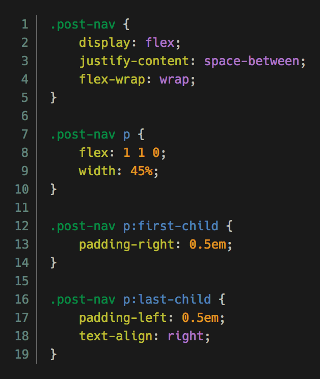

# Nimbus-Pygments

A syntax highlighting theme compatible with [Pygments](http://pygments.org/) and [Rouge](http://rouge.jneen.net/). Based on my Emacs theme [Nimbus](https://github.com/m-cat/nimbus-theme/). Jekyll-compatible.

## Screenshot

## Usage

Simply `@import` the `.scss` file if you're using SASS (recommended) or use the provided `.css` file.
